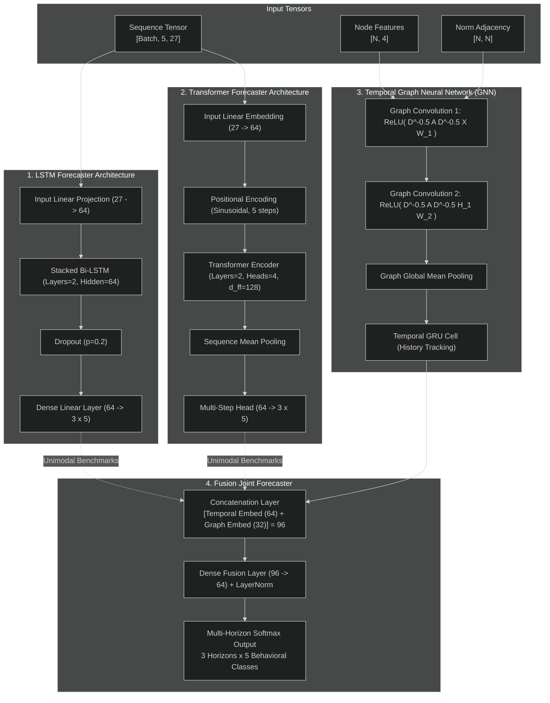
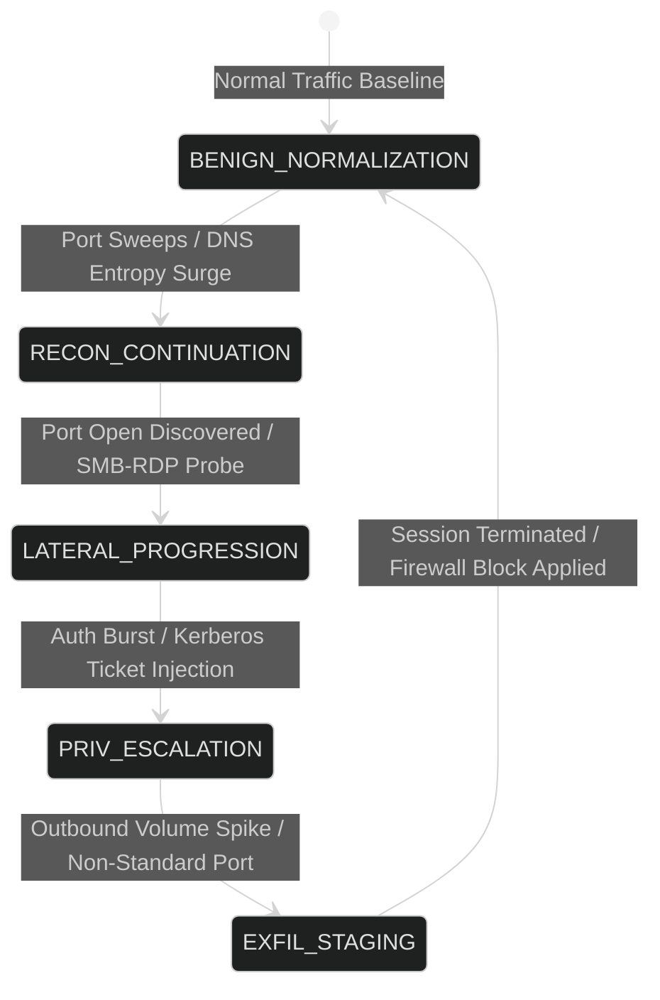
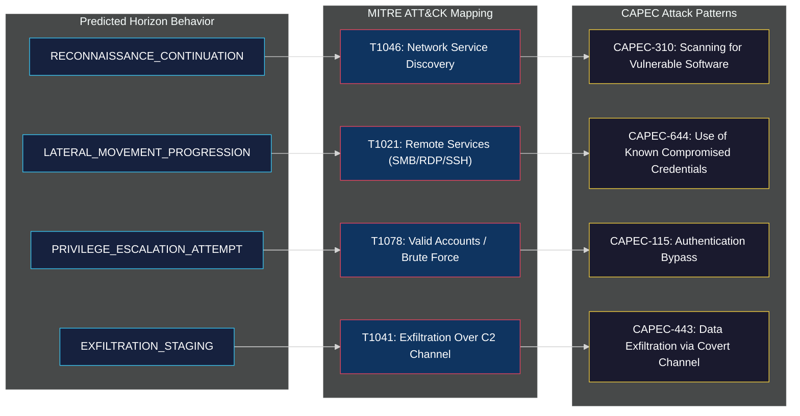
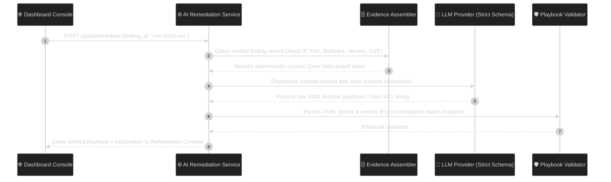

# 🧠 Drishti: AI, Deep Learning & Predictive Forecasting Architecture

> **Document Version:** 1.0.0  
> **Target Release:** Drishti Enterprise v1.0 / Hackathon Championship Edition  
> **Status:** Approved & Active  
> **Core Framework:** PyTorch 2.x · Scikit-Learn · NumPy · SciPy · NetworkX  
> **Model Artifacts:** `server/ml/artifacts/` (`lstm_forecaster.pt`, `transformer_forecaster.pt`, `gnn_forecaster.pt`, `fusion_forecaster.pt`, `scaler.joblib`)

---

## 1. AI Architectural Principles & Ethical Guardrails

Drishti’s AI subsystem is built on five strict architectural principles that set it apart from traditional black-box or hallucination-prone machine learning systems:

1. **Probabilistic Forecast, NEVER Guaranteed Assertion:** Neural predictions are strictly probabilistic representations of future network behavior ($t+1, t+2, t+3$). The platform never asserts that an attack *has definitively occurred* based solely on a predictive model.
2. **Zero Fabrication Contract:** Models operate exclusively on real, observed packet flows and graph topologies. If packet telemetry is missing or insufficient ($< 3\text{ packets}$ or zero flows), the model outputs `INSUFFICIENT_DATA` rather than synthesizing baseline traffic.
3. **Strict Per-Device Context Isolation:** Memory buffers, sliding time-window queues, and recurrent hidden states are isolated per `device_id`. Device A’s traffic patterns never influence Device B’s inference results.
4. **Factual Explainability & Attribution:** Every prediction is paired with explicit feature attribution—highlighting which canonical features (e.g., spike in SYN-to-ACK ratio, surge in flow bytes, or sudden destination entropy increase) triggered the model.
5. **Deterministic Threat Mapping:** The transition from neural predictions to MITRE ATT&CK techniques and CAPEC patterns is governed by strict, verifiable mapping tables (`server/ml/forecasting/mitre_mapping.py`), ensuring that standard network anomalies are not falsely attributed to nation-state APT campaigns.

```mermaid
%%{init: {'theme': 'dark', 'themeVariables': { 'primaryColor': '#1a1a2e', 'primaryTextColor': '#e0e0e0', 'primaryBorderColor': '#38c6f4', 'lineColor': '#38c6f4', 'secondaryColor': '#16213e', 'tertiaryColor': '#0f3460', 'background': '#0a0a1a', 'mainBkg': '#1a1a2e', 'nodeBorder': '#38c6f4', 'clusterBkg': '#0f3460', 'titleColor': '#e94560', 'edgeLabelBackground': '#16213e'}}}%%
flowchart LR
    subgraph SENSORS ["1. Telemetry Sensors"]
        PACKETS["Live Packet Stream<br/>(BPF / AF_PACKET)"]
        TOPOLOGY["Host Reachability Graph<br/>(NetworkX DiGraph)"]
    end

    subgraph PREPROCESSING ["2. Temporal & Spatial Engineering"]
        direction TB
        FLOW_AGG["Bidirectional Flow Aggregator<br/>(5-Tuple State Tracking)"]
        CANON_FEATS["27 Canonical Feature Extractor<br/>(Statistical Flow Profiling)"]
        TIME_SLIDER["Sliding Window Engine<br/>(10s Windows, 5s Stride, Max 5)"]
        GRAPH_NORM["Graph Tensor Constructor<br/>(Normalized Adjacency D^-0.5 A D^-0.5)"]
    end

    subgraph NEURAL_CORE ["3. Multi-Model Neural Core"]
        direction TB
        LSTM_MOD["LSTM Forecaster<br/>(Recurrent Sequence Encoding)"]
        TRANS_MOD["Transformer Forecaster<br/>(Multi-Head Self-Attention)"]
        GNN_MOD["Temporal GNN<br/>(Spatial Topology Embedding)"]
        FUSION_MOD["Fusion Forecaster<br/>(Joint Multi-Modal Embedding)"]
    end

    subgraph REASONING ["4. Semantic Reasoning & Defense"]
        HORIZON["Multi-Step Predictions<br/>(Horizons t+1, t+2, t+3)"]
        MITRE_MAP["MITRE ATT&CK & CAPEC Mapper<br/>(Deterministic Pattern Matching)"]
        COMP_RISK["Composite Dynamic Risk Engine<br/>(Threat Index Formulation)"]
        LLM_REMEDIATE["LLM Remediation Generator<br/>(Ansible & Cisco ACL Engine)"]
    end

    PACKETS --> FLOW_AGG
    FLOW_AGG --> CANON_FEATS
    CANON_FEATS --> TIME_SLIDER
    TIME_SLIDER -->|Sequence Tensor [1, 5, 27]| LSTM_MOD & TRANS_MOD

    TOPOLOGY --> GRAPH_NORM
    FLOW_AGG --> GRAPH_NORM
    GRAPH_NORM -->|Graph Tensors [N, 4] & [N, N]| GNN_MOD

    LSTM_MOD & TRANS_MOD & GNN_MOD --> FUSION_MOD
    FUSION_MOD --> HORIZON
    HORIZON --> MITRE_MAP
    HORIZON --> COMP_RISK
    MITRE_MAP & COMP_RISK --> LLM_REMEDIATE

    classDef senStyle fill:#16213e,stroke:#38c6f4,stroke-width:2px,color:#fff;
    classDef preStyle fill:#0f3460,stroke:#f4d03f,stroke-width:2px,color:#fff;
    classDef neuStyle fill:#1a1a2e,stroke:#e94560,stroke-width:2px,color:#fff;
    classDef reaStyle fill:#0f3460,stroke:#00ffcc,stroke-width:2px,color:#fff;

    class PACKETS,TOPOLOGY senStyle;
    class FLOW_AGG,CANON_FEATS,TIME_SLIDER,GRAPH_NORM preStyle;
    class LSTM_MOD,TRANS_MOD,GNN_MOD,FUSION_MOD neuStyle;
    class HORIZON,MITRE_MAP,COMP_RISK,LLM_REMEDIATE reaStyle;
```

---

## 2. Network Feature Engineering & Sliding Window Pipeline

### 2.1 The 27 Canonical Statistical Traffic Features
Every bidirectional flow ($F = \langle \text{src\_ip}, \text{dst\_ip}, \text{src\_port}, \text{dst\_port}, \text{protocol} \rangle$) is mapped into 27 canonical dimensions derived from the `CICIDS` and `UNSW-NB15` standards:

| Index | Feature Name | Description & Formula | Security Significance |
|---|---|---|---|
| 0 | `flow_duration_s` | Total active lifespan of the flow in seconds. | Identifies long-lived C2 beacons vs short port probes. |
| 1 | `total_fwd_packets` | Total packets transmitted from source to destination. | Volumetric baseline of client requests. |
| 2 | `total_bwd_packets` | Total packets returned from destination to source. | Detects asymmetric exfiltration or lack of server response. |
| 3 | `total_fwd_bytes` | Total payload and header bytes sent forward. | Measures outbound data staging volume. |
| 4 | `total_bwd_bytes` | Total payload and header bytes sent backward. | Measures inbound download/payload retrieval volume. |
| 5 | `fwd_packet_length_max` | Maximum packet size observed in forward direction. | Identifies large file chunks vs single-packet probes. |
| 6 | `fwd_packet_length_min` | Minimum packet size observed in forward direction. | Flags small 0-byte TCP SYN/FIN scanning probes. |
| 7 | `fwd_packet_length_mean` | Arithmetic mean of forward packet sizes. | Characterizes protocol normality. |
| 8 | `fwd_packet_length_std` | Standard deviation of forward packet sizes. | Detects entropy changes indicative of encrypted tunneling. |
| 9 | `bwd_packet_length_max` | Maximum packet size observed in backward direction. | Flags server response buffer size. |
| 10 | `bwd_packet_length_min` | Minimum packet size observed in backward direction. | Detects TCP RST responses from closed ports. |
| 11 | `bwd_packet_length_mean` | Arithmetic mean of backward packet sizes. | Characterizes service response payload distributions. |
| 12 | `bwd_packet_length_std` | Standard deviation of backward packet sizes. | Detects irregular responses from exploited daemons. |
| 13 | `flow_bytes_per_s` | $\frac{\text{total\_bytes}}{\text{flow\_duration\_s}}$ | High throughput flags data exfiltration or DDoS flooding. |
| 14 | `flow_packets_per_s` | $\frac{\text{total\_packets}}{\text{flow\_duration\_s}}$ | Massive packet rates flag SYN floods or rapid port sweeps. |
| 15 | `flow_iat_mean` | Mean inter-arrival time between consecutive packets. | Measures transmission cadence. |
| 16 | `flow_iat_std` | Standard deviation of inter-arrival times. | Distinguishes human jitter from programmatic beacon loops. |
| 17 | `flow_iat_max` | Maximum interval observed between packets. | Identifies dormant/idle intervals in persistent sessions. |
| 18 | `flow_iat_min` | Minimum interval observed between packets. | Microsecond bursts indicate automated script execution. |
| 19 | `fwd_flags_syn` | Count of forward packets with TCP SYN flag asserted. | High SYN counts without ACKs indicate port sweeps. |
| 20 | `fwd_flags_ack` | Count of forward packets with TCP ACK flag asserted. | Validates TCP three-way handshake completion. |
| 21 | `fwd_flags_rst` | Count of forward packets with TCP RST flag asserted. | Sudden connection terminations indicate firewall resets. |
| 22 | `bwd_flags_syn` | Count of reverse packets with TCP SYN flag asserted. | Indicates SYN-ACK replies from listening ports. |
| 23 | `bwd_flags_ack` | Count of reverse packets with TCP ACK flag asserted. | Validates bi-directional session health. |
| 24 | `bwd_flags_rst` | Count of reverse packets with TCP RST flag asserted. | Port rejection indicator (service unavailable/closed). |
| 25 | `destination_entropy` | Shannon entropy of target IP/port distributions. | High entropy denotes horizontal/vertical scanning sweeps. |
| 26 | `flow_count_active` | Number of concurrent active flows on host. | Connection table saturation metric. |

### 2.2 The Sliding Time-Window Engine
To capture temporal dynamics without unbounded memory retention, the time-window engine creates a sequence of 5 overlapping windows:
$$\mathcal{S}_t = \big[ W(t-4), W(t-3), W(t-2), W(t-1), W(t) \big]$$
- **Window Size:** $10.0\text{ seconds}$
- **Window Stride:** $5.0\text{ seconds}$
- **Sequence Dimension:** $[1, 5, 27]$ (Batch size 1, 5 sequence steps, 27 features)
- **Zero-Padding Policy:** If a session has recently started and possesses fewer than 5 windows, the sequence is left-padded with zero vectors ($\mathbf{0}_{27}$) rather than fabricating synthetic historical steps.

---

## 3. Deep Learning Model Architectures



### 3.1 Model 1: Stacked Bidirectional LSTM Forecaster
- **Input Dimension:** 27
- **Hidden Dimension:** 64
- **Layers:** 2 (Stacked with recurrent dropout $p = 0.2$)
- **Output Projection:** Multi-horizon head outputting logits of shape $[B, 3, 5]$, corresponding to 3 future steps across 5 classes.

### 3.2 Model 2: Multi-Head Self-Attention Transformer Forecaster
- **Input Embedding:** $27 \rightarrow 64$ via learned linear transformation.
- **Positional Encoding:** Standard sinusoidal positional embeddings fixed for sequence length 5.
- **Encoder Blocks:** 2 TransformerEncoderLayers with 4 attention heads, feedforward dimension $d_{\text{ff}} = 128$, and pre-layer normalization.
- **Advantage:** Captures non-local dependencies and rapid bursts across non-adjacent time windows.

### 3.3 Model 3: Temporal Graph Neural Network (GNN)
- **Node Input Features (4D):** $[\text{is\_target}, \log(\text{packets}+1), \log(\text{bytes}+1), \text{degree}]$
- **Symmetric Graph Normalization:**
  $$\widetilde{A} = D^{-1/2} A D^{-1/2}$$
- **Graph Convolution Layer:**
  $$H^{(l+1)} = \sigma\left( \widetilde{A} H^{(l)} W^{(l)} \right)$$
- **Spatial Dimension:** $4 \rightarrow 32 \rightarrow 16$
- **Temporal Graph Readout:** Global mean pooling followed by a gated recurrent unit (GRU) cell tracking topological shifts across successive network snapshots.

### 3.4 Model 4: Multi-Modal Fusion Forecaster
- **Concatenation:** Fuses the 64-dimensional temporal sequence embedding with the 32-dimensional spatial graph embedding into a unified 96-dimensional latent representation.
- **Fully Connected Projection:** Multi-layer perceptron (MLP) with GELU activation and LayerNorm projecting into multi-step probability distributions.

---

## 4. Multi-Step Horizon Forecasting Engine

The forecasting engine projects network progression over three discrete future horizons:
- **Horizon $t+1$:** Next 10 seconds ($+10\text{s}$)
- **Horizon $t+2$:** Next 20 seconds ($+20\text{s}$)
- **Horizon $t+3$:** Next 30 seconds ($+30\text{s}$)



### The 5 Progression Classes

```
┌────────────────────────────────────────────────────────────────────────┐
│                        5 BEHAVIORAL PROGRESSION CLASSES                │
├──────────────────────────┬─────────────────────────────────────────────┤
│ 1. BENIGN_NORMALIZATION  │ Traffic trending toward baseline calm       │
│ 2. RECON_CONTINUATION    │ Active scanning, service enumeration probe  │
│ 3. LATERAL_PROGRESSION   │ Traversing subnet boundaries (SMB, SSH, RDP)│
│ 4. PRIV_ESCALATION       │ Credential abuse, exploit payload delivery  │
│ 5. EXFIL_STAGING         │ Compressed outbound transfer, C2 beaconing  │
└──────────────────────────┴─────────────────────────────────────────────┘
```

---

## 5. MITRE ATT&CK & CAPEC Correlation Engine

When a non-benign progression probability exceeds the gating threshold ($\tau \ge 0.45$), the engine correlates the prediction with verified MITRE Enterprise tactics and CAPEC attack patterns (`server/ml/forecasting/mitre_mapping.py`):



---

## 6. Factual Explainability & Composite Risk Formulation

### 6.1 Explainability Algorithm
Instead of opaque neural outputs, Drishti computes normalized feature importance vectors:
$$I_j = \left| \frac{f_j(W_t) - \mu_j}{\sigma_j + \epsilon} \right|$$
Where $f_j(W_t)$ is the observed feature value, and $\mu_j, \sigma_j$ are pre-computed population parameters from the `scaler.joblib` artifact. The top 3 contributing signals are returned to the analyst (e.g., *"Sudden 420% increase in outbound flow bytes"*, *"SYN-to-ACK ratio exceeds 8.2"*, *"Destination entropy indicates horizontal subnet sweep"*).

### 6.2 Composite Risk Index Formulation
The composite risk index ($R_{\text{composite}} \in [0.0, 1.0]$) dynamically unifies the AI behavioral threat with static vulnerability posture:
$$R_{\text{composite}} = \min\left(1.0, \; 0.45 \cdot P_{\text{threat}} + 0.35 \cdot \frac{\text{CVSS}_{\text{max}}}{10.0} + 0.20 \cdot E_{\text{network}}\right)$$
- $P_{\text{threat}}$: Peak forecast probability across non-benign progression classes.
- $\text{CVSS}_{\text{max}}$: Highest verified CVSS score currently active on the target device.
- $E_{\text{network}}$: Network reachability factor ($1.0$ if Internet-exposed, $0.6$ if DMZ, $0.2$ if internal VLAN).

---

## 7. LLM Automated Remediation Pipeline

Drishti utilizes Large Language Model (LLM) providers (Gemini, Claude, or local Ollama) strictly for **structured configuration and playbook generation**.



### Remediation Safeguards
1. **Prompt Containment:** The prompt provides raw CVE evidence, affected asset IP, target port, and software package name. It contains no unverified assumptions.
2. **Deterministic Pre-Validation:** Generated Ansible playbooks and Cisco ACLs must pass strict schema and syntax parsing. Any syntax error immediately marks the remediation `REMEDIATION_REQUIRES_REVIEW` rather than deploying invalid configurations.
3. **Idempotency Requirement:** Playbooks must be idempotent (`state=present` or `state=absent`), ensuring that repeated runs never corrupt target host configurations.
