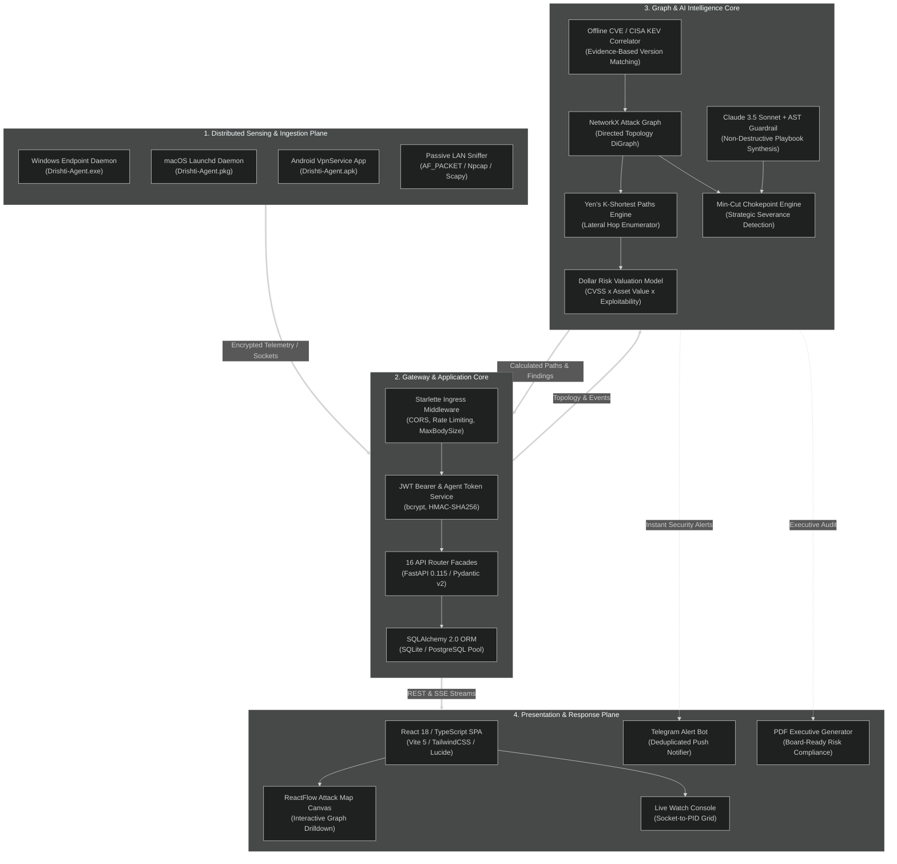
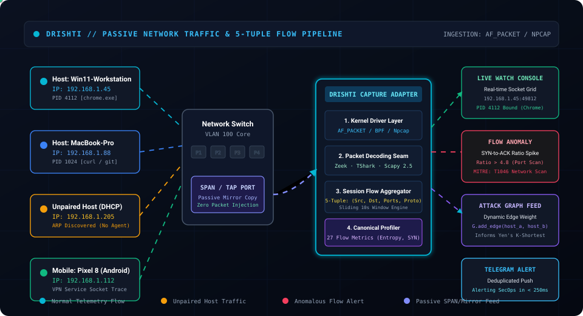
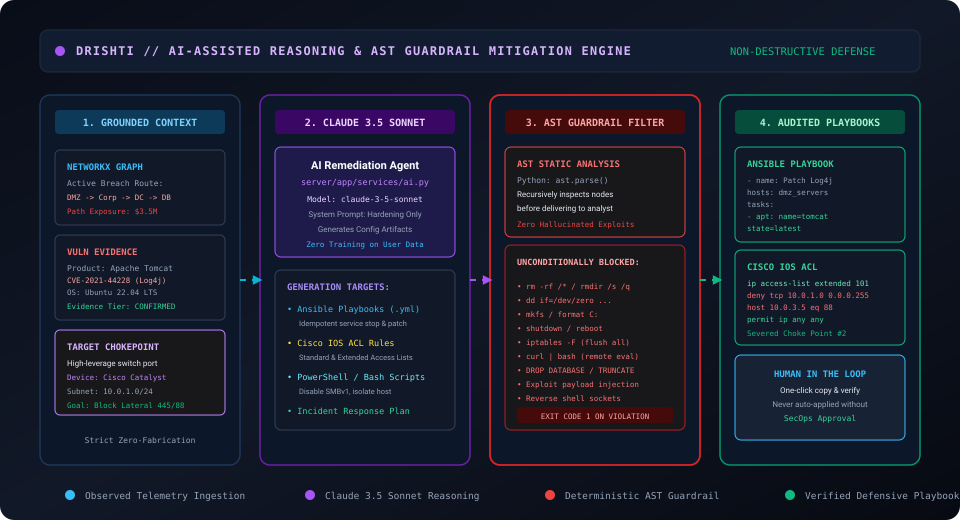

# 🏛️ Drishti: High-Level System Architecture Specification

> **Document Version:** 1.0.0  
> **Target Release:** Drishti Enterprise v1.0 / Hackathon Championship Edition  
> **Architectural Pattern:** Modular Micro-Services Monolith · Event-Driven Ingestion · Graph-Theoretic Analytical Core  
> **Primary References:** [docs/architecture/system-architecture.md](docs/architecture/system-architecture.md) · [TRD.md](TRD.md)

---

## 1. System Overview & Component Planes

Drishti is organized into four decoupled architectural planes designed to separate sensor ingestion, API routing, graph analytics, and user presentation:

---

## 2. Trust Boundaries & Security Enclaves

Drishti models every execution context within an explicit trust boundary:

1. **Boundary 0 (External / Untrusted):**
   - Untrusted internet traffic, phishing URLs, malicious external IPs.
   - External scans terminated at border firewalls.
2. **Boundary 1 (Corporate Workstation Fleet):**
   - Windows, macOS, and Android devices running native Drishti daemons.
   - Agents operate in **user-space least privilege** (no dangerous kernel drivers required).
   - Telemetry batches signed with HMAC-SHA256 agent pairing tokens.
3. **Boundary 2 (Server Gateway & Ingress):**
   - Starlette middleware validates CORS origins, enforces maximum payload size (50MB), and applies rate limiting (120 req/min).
   - JWT tokens verified with active token-version revocation checks.
4. **Boundary 3 (Isolated Analytical Core):**
   - In-memory NetworkX directed graph isolated from external write operations.
   - AST guardrail filters all generated remediation playbooks before delivering them to SecOps.
5. **Boundary 4 (Enterprise Crown Jewel Enclave):**
   - Highly restricted VLAN (e.g. `10.0.3.0/24`) housing production databases, customer PII, and financial ledgers.
   - Evaluated as target sink nodes in graph shortest-path calculations.

---

## 3. Data Flow Lifecycles

### 3.1 Network Traffic Observation Flow

1. **Passive Sniffing:** Local kernel adapter (`AF_PACKET` on Linux, `/dev/bpf*` on macOS, `Npcap` on Windows) copies raw Ethernet frames without injecting packets.
2. **Decapsulation:** Decodes Layer 2 Ethernet, Layer 3 IPv4/IPv6, and Layer 4 TCP/UDP headers.
3. **5-Tuple Aggregation:** Binds packets into bidirectional session flows identified by:
   $$\text{Flow Key} = \text{hash}(\text{src\_ip}, \text{dst\_ip}, \text{src\_port}, \text{dst\_port}, \text{protocol})$$
4. **Feature Profiling:** Computes 27 canonical flow metrics (SYN-to-ACK ratio, inter-arrival time, port entropy, packet length variance).
5. **Detection:** Flagged anomalies update dynamic edge weights in the attack graph.

---

### 3.2 Lateral Attack-Path Computation Flow

1. **Node Insertion:** Discovered assets become vertices $v \in V$ with attributes:
   $$\text{Attributes}(v) = \{\text{IP}, \text{OS}, \text{Criticality}, \text{Exposure Value}, \text{Vulnerabilities}\}$$
2. **Edge Construction:** Network reachability vectors and active socket connections form directed edges $(u, v) \in E$ weighted by exploitability:
   $$W(u, v) = \frac{1}{\max(\text{CVSS}(v), 0.1)} \times \text{Reachability Penalty}$$
3. **Yen's $K$-Shortest Paths:** Computes the top $K$ shortest paths from external internet nodes to internal crown jewels.
4. **Min-Cut Chokepoint Identification:** Evaluates graph bottlenecks where severing a minimal edge cut disconnects the maximum financial risk.

---

### 3.3 AI Remediation & AST Guardrail Flow

1. **Context Extraction:** Serializes graph path, target chokepoint, affected operating systems, and confirmed CVE evidence into a structured prompt.
2. **Claude 3.5 Sonnet Reasoning:** Synthesizes platform-specific remediation scripts (Ansible `.yml`, Cisco IOS ACLs, or PowerShell commands).
3. **AST Guardrail Validation:** Passes output through Python `ast.parse()`, recursively walking AST nodes to verify that no destructive commands (`rm`, `dd`, `mkfs`, `iptables -F`, reverse shells) are present.
4. **Human-in-the-Loop Delivery:** Renders verified playbook in the SOC console for analyst review and execution.

---

## 4. Deep-Dive Sub-Architectures

For detailed specifications of each subsystem, consult the dedicated architecture guides:

- [System Architecture Deep-Dive](docs/architecture/system-architecture.md)
- [Attack-Path Pipeline & Mathematical Formulation](docs/architecture/attack-path-pipeline.md)
- [Network Traffic Pipeline & Session Tracking](docs/architecture/network-traffic-pipeline.md)
- [AI Remediation Pipeline & AST Guardrails](docs/architecture/ai-pipeline.md)
