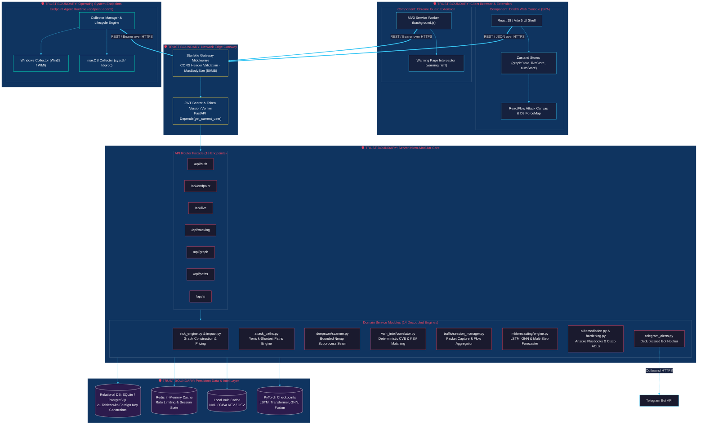
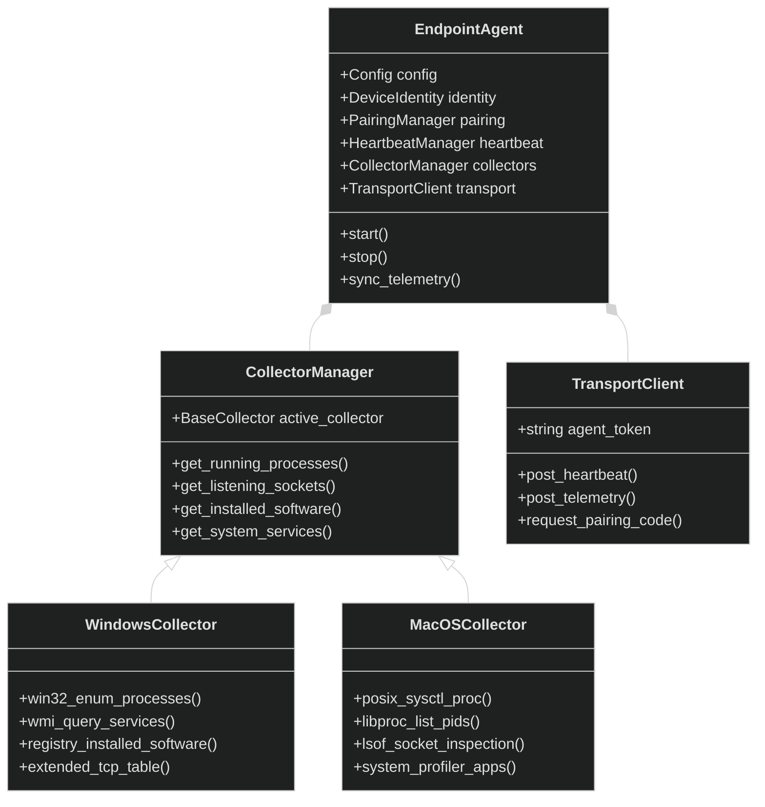
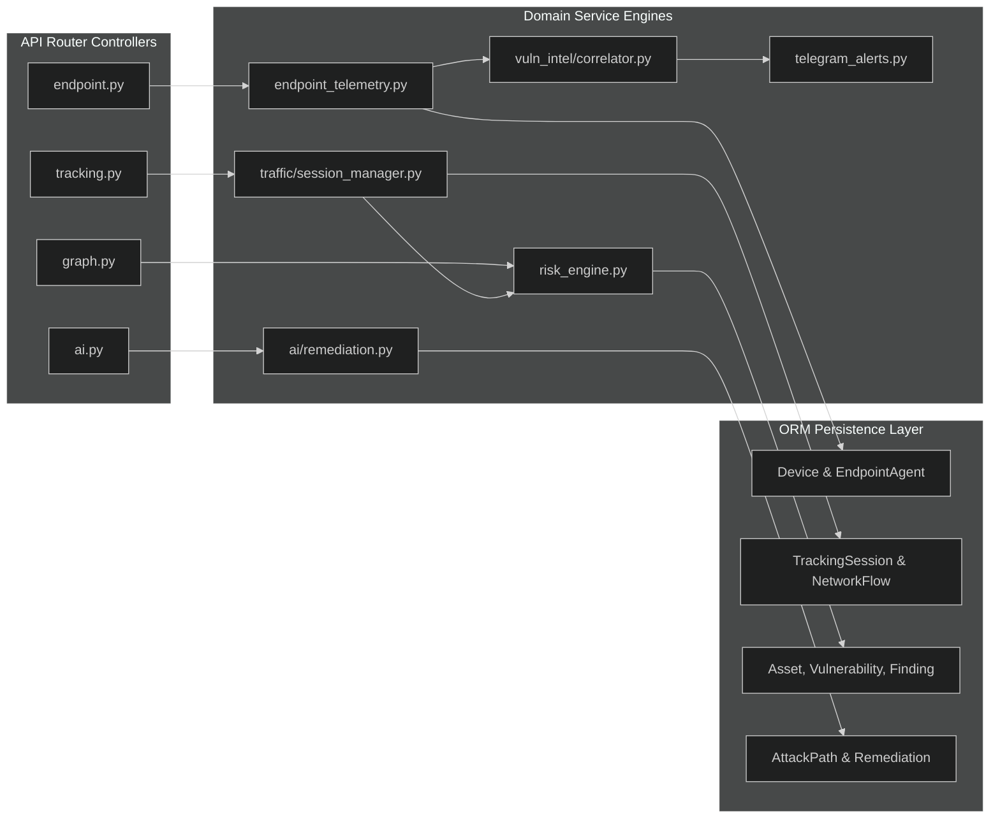
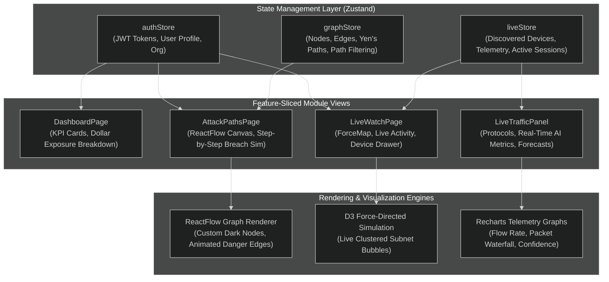
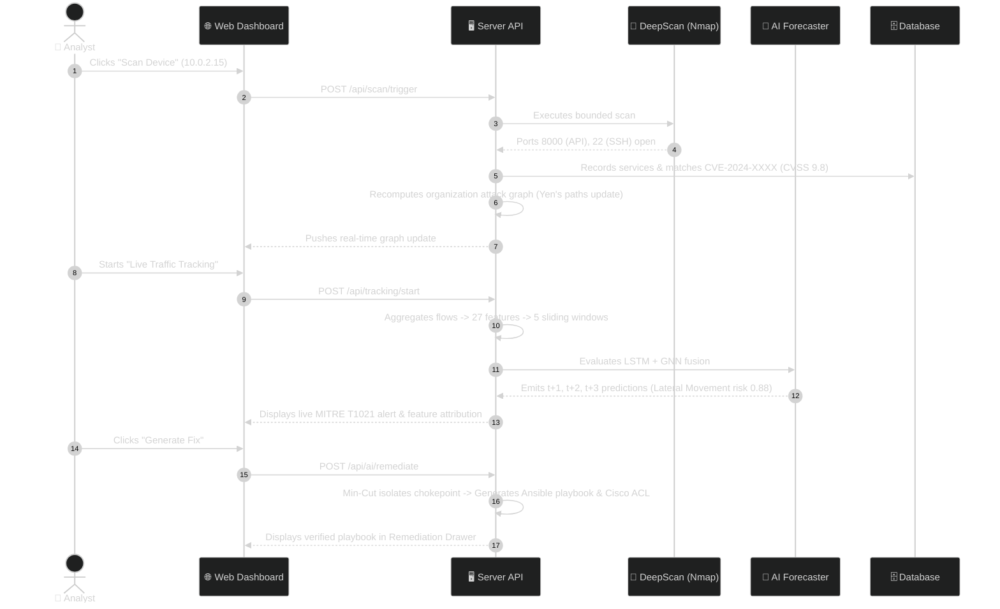

# 🏛️ Drishti: Macro & Micro-Modular Architecture (MACHITECTURE)

> **Document Version:** 1.0.0  
> **Target Release:** Drishti Enterprise v1.0 / Hackathon Championship Edition  
> **Status:** Approved & Active  
> **Architecture Pattern:** Modular Monolithic Micro-Services · Verification-First Archify Topology · Event-Driven Ingestion  
> **Repository Layout:** `server/` (FastAPI backend), `web/` (React/TS frontend), `endpoint-agent/` (cross-platform daemon), `agent/` (passive watchers), `extension/` (Chrome MV3)

---

## 1. Archify System Topology & Verified Component Boundaries

Applying the **Archify verification-first structural topology** principles ([tt-a1i/archify](https://github.com/tt-a1i/archify)), Drishti models every runtime module as a strongly bounded component with explicit communication protocols, trust boundaries, and data-flow invariants.



---

## 2. Endpoint Agent Subsystem (`endpoint-agent/`)

The endpoint agent is a cross-platform daemon built with strict OS abstraction boundaries:



### Module Responsibilities
- **`endpoint-agent/agent.py`:** Core coordinator orchestrating lifecycle, exponential backoff reconnects, and periodic telemetry sweeps.
- **`endpoint-agent/common/identity.py`:** Computes immutable device identities based on machine GUID, hardware MAC, and hostname (never relies solely on volatile DHCP IPs).
- **`endpoint-agent/collectors/manager.py`:** Detects operating system (`platform.system()`) and dynamically initializes the platform-native collector.
- **`endpoint-agent/windows/collectors.py`:** Uses native Win32 APIs via `ctypes` and `winreg` to extract running user apps, Windows Services, and bound TCP ports.
- **`endpoint-agent/macos/collectors.py`:** Uses POSIX `sysctl`, `libproc`, and `lsof` to extract active macOS GUI apps (`/Applications/*`), daemons, and listening sockets.

---

## 3. Backend Micro-Modular Service Decoupling

The FastAPI server (`server/app/`) employs a clean modular monolithic architecture where routers are thin controllers delegating to 14 isolated domain services:



1. **`risk_engine.py`:** Reconstructs the NetworkX `DiGraph` from SQL asset tables, executes Yen's $k$-shortest paths, and computes dollar exposures.
2. **`traffic/session_manager.py`:** Manages live packet capture threads, tracks bidirectional flows, and coordinates with `time_window.py` for feature scaling.
3. **`vuln_intel/correlator.py`:** Evaluates software versions against NVD and CISA KEV caches; enforces exact boundary checks.
4. **`telegram_alerts.py`:** Normalizes security findings into high-visibility Markdown alerts, executing deduplication fingerprints prior to dispatch.

---

## 4. Frontend Web Architecture (`web/src/`)

The user interface is an enterprise-grade React 18 single-page application engineered with a modern SOC aesthetic:



---

## 5. Chrome Guard MV3 Extension Architecture (`extension/`)

The browser extension provides real-time client-side URL defense without compromising private user browsing data:

```mermaid
%%{init: {'theme': 'dark'}}%%
sequenceDiagram
    autonumber
    actor User as 👤 Browser User
    participant Tabs as 🌐 Chrome Tabs API
    participant Worker as 🧩 MV3 Service Worker (background.js)
    participant API as 🖥️ Drishti API (/api/urltrust)
    participant Block as 🚫 Warning Page (warning.html)

    User->>Tabs: Navigates to "http://suspicious-login.xyz"
    Tabs->>Worker: onUpdated / onCommitted tab event
    Worker->>API: POST /api/url-analyzer/analyze {url: "..."}
    API->>API: Evaluates 6-module URL trust heuristic & ML model
    alt URL is Phishing / Malicious (Score > 0.70)
        API-->>Worker: {verdict: "MALICIOUS", risk_score: 0.94, reasons: [...]}
        Worker->>Tabs: chrome.tabs.update(tabId, {url: "warning.html?target=..."})
        Tabs-->>User: Renders red screen warning blocking page load
    else URL is Clean / Benign
        API-->>Worker: {verdict: "BENIGN", risk_score: 0.05}
        Worker->>Tabs: Permits navigation; streams active tab domain to device profile
    end
```

---

## 6. End-to-End System Lifecycle & Execution Sequences

### 6.1 Complete Device Discovery, Scan, AI Track & Remediation Flow


