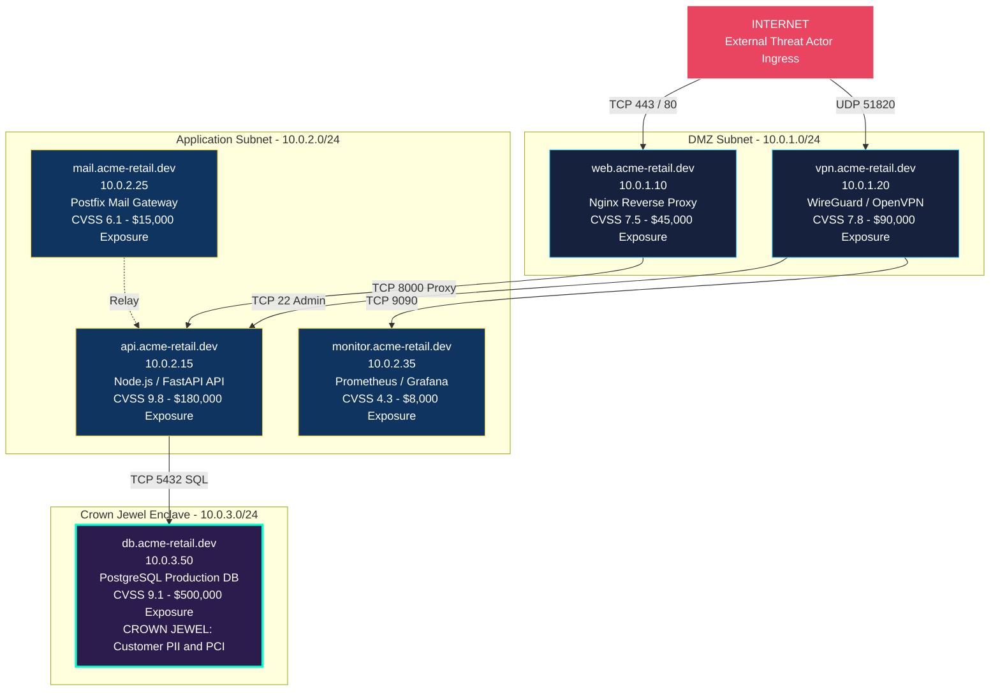
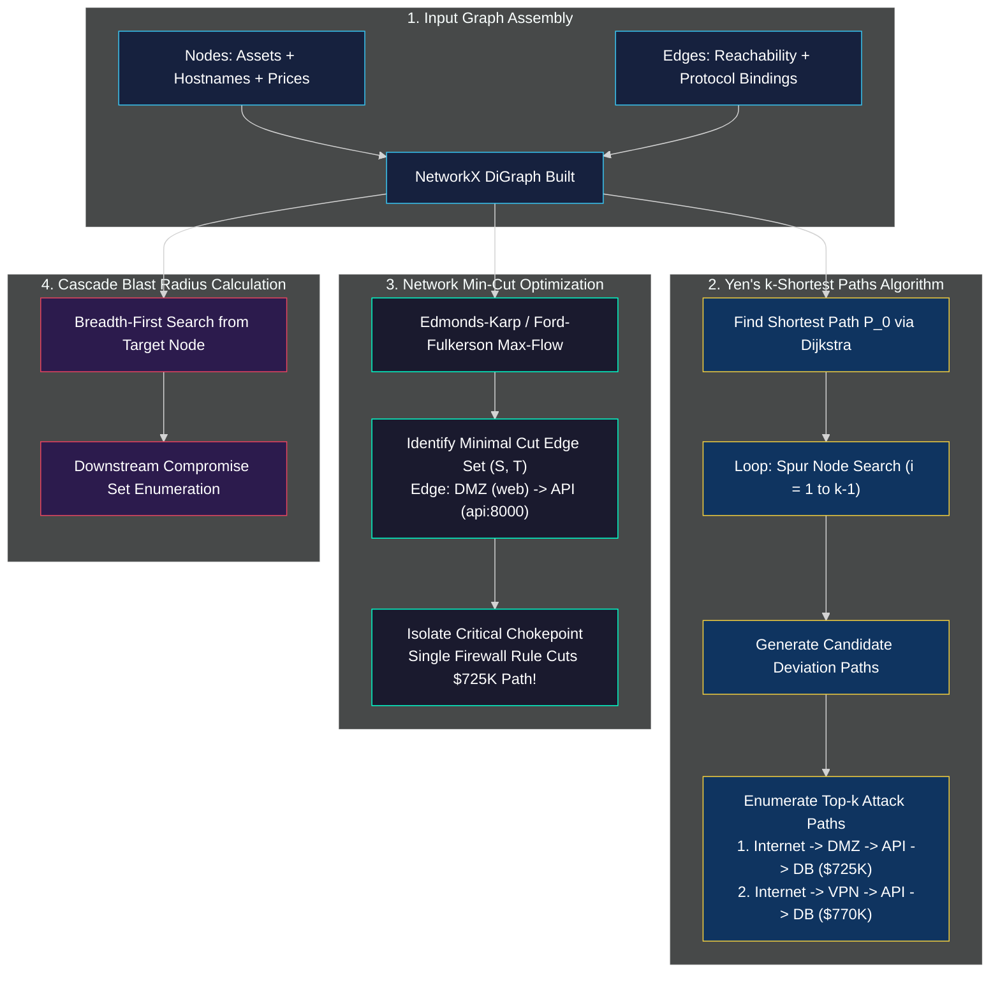
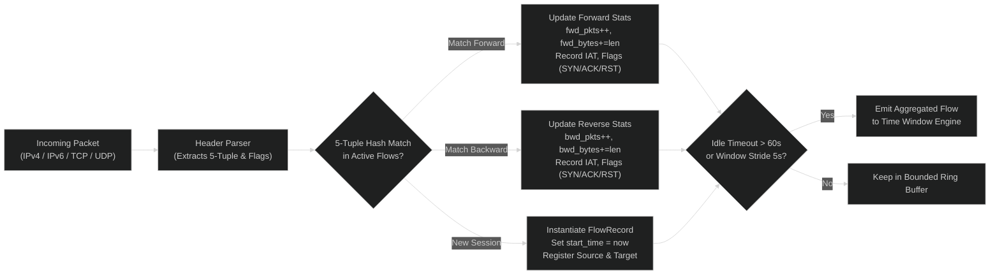

# 🕸️ Drishti: Network Architecture & Graph-Theoretic Engine

> **Document Version:** 1.0.0  
> **Target Release:** Drishti Enterprise v1.0 / Hackathon Championship Edition  
> **Status:** Approved & Active  
> **Core Engine:** NetworkX 3.4 · Python Socket / BPF · Nmap 7.9+ · Cisco IOS ACL Generator  
> **Core Modules:** `server/app/services/` (`risk_engine.py`, `attack_paths.py`, `impact.py`, `traffic/`, `deepscan/`, `netconfig/`)

---

## 1. Network Topography & Multi-Plane Ingestion Architecture

Drishti approaches network security through four interconnected observation planes:
1. **Passive LAN Discovery Plane:** Listens to local broadcast and multicast domains (ARP, reverse DNS, mDNS) with zero packet injection.
2. **Active Autonomous Scanning Plane:** Spawns targeted, rate-limited Nmap sweeps (`-sV -Pn --open --min-rate 1500`) against authorized CIDR ranges.
3. **Live Packet Interception Plane:** Attaches low-level packet capture hooks (macOS BPF / Linux PF_PACKET / Scapy) to track real-time 5-tuple session flows.
4. **Endpoint Socket Correlation Plane:** Streams real OS socket bindings from endpoint agents (`PID -> Local IP:Port <-> Remote IP:Port`).

```mermaid
%%{init: {'theme': 'dark', 'themeVariables': { 'primaryColor': '#1a1a2e', 'primaryTextColor': '#e0e0e0', 'primaryBorderColor': '#38c6f4', 'lineColor': '#38c6f4', 'secondaryColor': '#16213e', 'tertiary[...]
flowchart TB
    subgraph PHYSICAL_LAN ["Physical & Virtual Network Infrastructure"]
        SUBNET_EXT["🌐 External WAN / Internet<br/>0.0.0.0/0"]
        SUBNET_DMZ["🔀 Public DMZ Subnet<br/>10.0.1.0/24 (VLAN 10)"]
        SUBNET_APP["⚙️ Application Tier Subnet<br/>10.0.2.0/24 (VLAN 20)"]
        SUBNET_DATA["💎 Crown Jewel Secure Enclave<br/>10.0.3.0/24 (VLAN 30)"]
        SUBNET_CORP["🏢 Corporate Office LAN<br/>192.168.1.0/24 (VLAN 100)"]
    end

    subgraph SENSING_PLANE ["Ingestion & Capture Sensors"]
        PASSIVE_SENSE["Passive LAN Watcher<br/>ARP cache / mDNS / DNS"]
        NMAP_SENSE["Autonomous DeepScan<br/>Nmap Subprocess Seam"]
        PCAP_SENSE["Packet Capture Adapter<br/>BPF / PF_PACKET Sniffer"]
        AGENT_SENSE["Endpoint Agent Sockets<br/>GetExtendedTcpTable / lsof"]
    end

    subgraph GRAPH_ENGINE ["Graph-Theoretic Attack Engine"]
        DIGRAPH["NetworkX Directed Graph<br/>Nodes = Assets | Edges = Reachability"]
        PRICING["Node & Path Pricing Model<br/>CVSS x Criticality x Exposure x Blast"]
        YEN_ALGO["Yen's k-Shortest Paths<br/>Enumerates Top Breach Routes"]
        MINCUT_ALGO["Network Min-Cut Engine<br/>Identifies Critical Chokepoints"]
    end

    subgraph ENFORCEMENT ["Hardening & Enforcement Engine"]
        CISCO_ACL["Cisco IOS Access Lists<br/>Dynamic Standard & Extended ACLs"]
        ANSIBLE_PB["Ansible Playbook Engine<br/>Idempotent Firewall & Service Fixes"]
    end

    SUBNET_EXT -->|Ingress Traffic| SUBNET_DMZ
    SUBNET_DMZ -->|API Proxies| SUBNET_APP
    SUBNET_APP -->|Database Queries| SUBNET_DATA
    SUBNET_CORP -->|VPN / Admin Access| SUBNET_DMZ & SUBNET_APP

    SUBNET_DMZ & SUBNET_APP & SUBNET_DATA & SUBNET_CORP --> SENSING_PLANE
    SENSING_PLANE --> GRAPH_ENGINE
    GRAPH_ENGINE --> ENFORCEMENT

    classDef lanStyle fill:#16213e,stroke:#38c6f4,color:#fff;
    classDef senStyle fill:#0f3460,stroke:#f4d03f,color:#fff;
    classDef grpStyle fill:#1a1a2e,stroke:#e94560,color:#fff;
    classDef enfStyle fill:#0f3460,stroke:#00ffcc,color:#fff;

    class SUBNET_EXT,SUBNET_DMZ,SUBNET_APP,SUBNET_DATA,SUBNET_CORP lanStyle;
    class PASSIVE_SENSE,NMAP_SENSE,PCAP_SENSE,AGENT_SENSE senStyle;
    class DIGRAPH,PRICING,YEN_ALGO,MINCUT_ALGO grpStyle;
    class CISCO_ACL,ANSIBLE_PB enfStyle;
```

---

## 2. Reference Network Topology: Acme Retail

Drishti includes a pre-configured enterprise reference network representing an omni-channel retail infrastructure (**Acme Retail**):



---

## 3. Graph-Theoretic Attack Engine

The core graph engine (`server/app/services/risk_engine.py` & `attack_paths.py`) models reachability using a NetworkX `DiGraph`:

### 3.1 Node Dollar Pricing Model
Every node $v \in \mathcal{V}$ is assigned an intrinsic dollar exposure value based on four normalized coefficients:
$$\text{Price}(v) = \left( 0.40 \cdot \frac{\text{CVSS}(v)}{10.0} + 0.30 \cdot C(v) + 0.20 \cdot E(v) + 0.10 \cdot B(v) \right) \times \text{BaseAssetValue}(v)$$
Where:
- $\text{CVSS}(v)$: Maximum verified CVSS score among confirmed vulnerabilities on the node.
- $C(v) \in [0.1, 1.0]$: Business Criticality rating ($1.0$ for Crown Jewels, $0.8$ for App Servers, $0.4$ for DMZ proxies, $0.2$ for workstations).
- $E(v) \in [0.1, 1.0]$: Exposure factor ($1.0$ for public IPs, $0.5$ for DMZ, $0.2$ for internal isolated subnets).
- $B(v) \in [0.0, 1.0]$: Blast Radius factor ($|\text{Descendants}(v)| / |\mathcal{V}|$).
- $\text{BaseAssetValue}(v)$: Organizationally configured asset valuation (e.g., Crown Jewel DB = $\$500,000$).

### 3.2 Path Exposure Formulation
An attack path $\mathcal{P} = \langle v_0, v_1, \dots, v_m \rangle$ starts at an external boundary node $v_0$ and terminates at a crown jewel $v_m$. The cumulative dollar price of the path reflects the sum across each node and edge exposure, capturing both direct and chained compromise risk. The path risk is modeled as:
$$\text{Price}(\mathcal{P}) = \sum_{i=1}^{m} \text{Price}(v_i)$$

---

## 4. Graph Algorithms & Remediation Optimization



### 4.1 Yen’s $k$-Shortest Paths Algorithm
Standard Dijkstra only produces a single shortest breach path. In cybersecurity, adversaries pivot when primary routes are blocked. Drishti implements Yen’s algorithm to enumerate the top $k$ alternative compromise routes in order of rising cost.
1. Determine the first shortest path $\mathcal{P}_1$ using Dijkstra’s algorithm weighted by $(10.0 - \text{CVSS})$.
2. To find path $\mathcal{P}_i$, iterate through every node in $\mathcal{P}_{i-1}$ as a *spur node*, temporarily removing subsequent edges to force deviation.
3. Compute spur paths, assemble candidate routes, and select the lowest-cost alternative.

### 4.2 Network Min-Cut Chokepoint Identification
Rather than patching all 50 vulnerabilities on 20 servers, Drishti computes the **Min-Cut** between the external Internet set $S$ and the Crown Jewel set $T$:
$$\text{capacity}(u, v) = \frac{1}{\text{Price}(v) + \epsilon}$$
The minimum capacity cut represents the **cheapest network enforcement point** (e.g., blocking port 8000 from DMZ to API except via mTLS) that eliminates the greatest financial exposure.

---

## 5. Live Packet Capture & Bidirectional Flow Engine

The packet engine (`server/app/services/traffic/flow_aggregator.py`) maintains high-speed flow records:



### 5.1 Capture Backends
- **macOS:** BPF (`/dev/bpf*`) via Scapy/libpcap.
- **Linux:** `AF_PACKET` raw socket stream with memory-mapped ring buffer (`TPACKET_V3`).
- **Windows:** Npcap driver integration via `ctypes` binding.

### 5.2 Flow Lifecycle Management
- **Flow Key:** `(src_ip, dst_ip, src_port, dst_port, protocol)`
- **Reverse Key Matching:** Automatically maps return packets `(dst_ip, src_ip, dst_port, src_port, protocol)` into the backward metrics of the same parent flow.
- **Memory Bounding:** Maximum $10,000$ active flows per session; flows inactive for $> 60\text{s}$ are expired and purged.

---

## 6. Network Hardening & Automated Enforcement

Drishti translates mathematical Min-Cuts directly into vendor-compliant network configuration.

### 6.1 Cisco IOS ACL Generation
When Min-Cut dictates severing the unauthorized path from DMZ (`10.0.1.0/24`) to API (`10.0.2.15:8000`), `server/app/services/netconfig/` generates verified Cisco IOS commands:

```cisco
! ==========================================================
! DRISHTI AUTONOMOUS DEFENSE POLICY: POLICY-CHOKEPOINT-01
! Target: Acme Retail Core Switch / Edge Gateway
! Action: Sever Ingress Attack Path to Crown Jewel Enclave
! ==========================================================
ip access-list extended DRISHTI_CHOKEPOINT_BLOCK
 deny   tcp 10.0.1.0 0.0.0.255 host 10.0.2.15 eq 8000 log
 permit ip 10.0.1.0 0.0.0.255 host 10.0.2.15 eq 443
 permit ip any any
!
interface GigabitEthernet0/1
 ip access-group DRISHTI_CHOKEPOINT_BLOCK in
!
```

### 6.2 Ansible Hardening Playbooks
For host-level remediation, Drishti emits idempotent Ansible tasks:
```yaml
---
- name: Drishti Automated Attack Surface Hardening
  hosts: dmz_gateways
  become: yes
  tasks:
    - name: Block unauthorized lateral movement to API tier
      ansible.builtin.iptables:
        chain: FORWARD
        source: 10.0.1.0/24
        destination: 10.0.2.15
        protocol: tcp
        destination_port: 8000
        jump: DROP
        comment: "Drishti Min-Cut Isolation"
      notify: Save iptables
```
