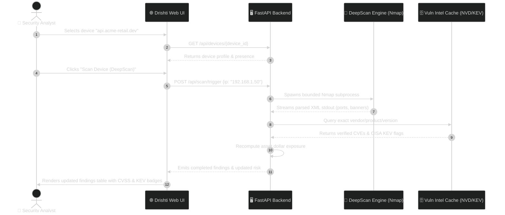
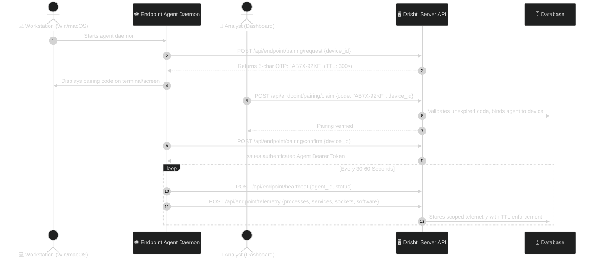
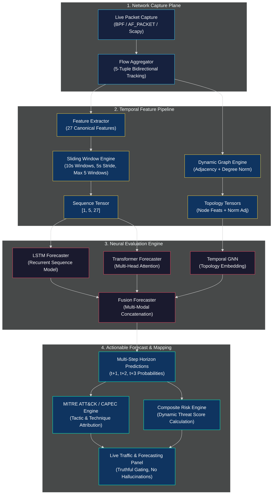
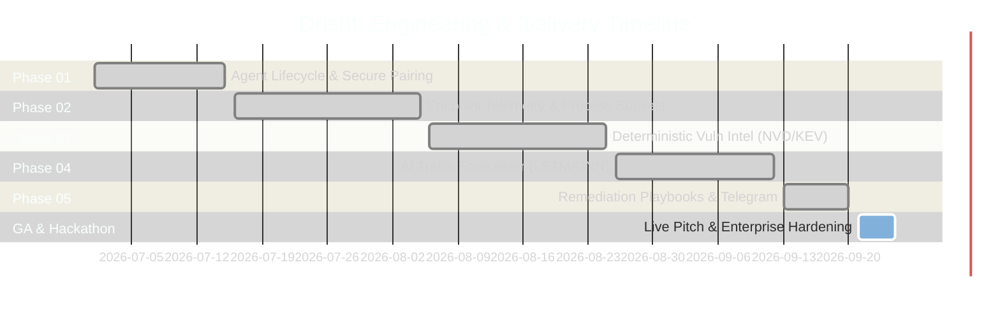

# 👁️ Drishti: Product Requirements Document (PRD)

> **Document Version:** 1.0.0  
> **Target Release:** Drishti Enterprise v1.0 / Hackathon Championship Edition  
> **Status:** Approved & Active  
> **Product Tagline:** *See the invisible. Price the risk. Fix it first.*  
> **Core Tenet:** *Defensive only. Maps, prices, and remediates. Never attacks.*

---

## 1. Executive Summary & Product Vision

Modern enterprise security teams are drowning in disjointed telemetry and context-free alerts. Security Operations Centers (SOCs) navigate separate tools for network vulnerability scanning, asset discovery, endpoint telemetry, threat hunting, and firewall configuration. When a high-severity Common Vulnerabilities and Exposures (CVE) identifier is flagged, analysts are left with three unanswered existential questions:
1. **Reachability:** Can an external attacker actually reach this vulnerable service from the public Internet?
2. **Impact in Dollars:** What is the actual financial exposure if this asset and downstream crown jewels are breached?
3. **Actionable Remediation:** What exact configuration change or firewall Access Control List (ACL) will eliminate this attack path with zero disruption to benign production traffic?

**Drishti** solves this crisis by combining **graph-theoretic attack surface mapping**, **real dollar risk pricing**, **cross-platform endpoint observation (macOS & Windows)**, **real-time AI traffic detection & multi-step horizon forecasting**, and **automated remediation playbook generation** into a single, cohesive, dark-mode defensive intelligence console.

```mermaid
%%{init: {'theme': 'dark', 'themeVariables': { 'primaryColor': '#1a1a2e', 'primaryTextColor': '#e0e0e0', 'primaryBorderColor': '#38c6f4', 'lineColor': '#38c6f4', 'secondaryColor': '#16213e', 'tertiaryColor': '#0f3460', 'background': '#0a0a1a', 'mainBkg': '#1a1a2e', 'nodeBorder': '#38c6f4', 'clusterBkg': '#0f3460', 'titleColor': '#e94560', 'edgeLabelBackground': '#16213e'}}}%%
flowchart LR
    subgraph INGESTION ["📥 Multi-Source Ingestion"]
        direction TB
        NET_DISC["LAN Device Discovery<br/>(ARP, DNS, mDNS)"]
        ACTIVE_SCAN["Autonomous DeepScan<br/>(Nmap Engine)"]
        ENDPOINT_TEL["Endpoint Agent<br/>(Win/macOS Telemetry)"]
        LIVE_TRAFFIC["Packet Capture Adapter<br/>(Raw Sockets / BPF)"]
        BROWSER_GUARD["Chrome Extension<br/>(Active Tab URL Trust)"]
    end

    subgraph ENGINE ["⚙️ Drishti Core Engine"]
        direction TB
        GRAPH_ENGINE["Attack Graph Engine<br/>(NetworkX DiGraph)"]
        RISK_PRICER["Risk Pricing Engine<br/>(Dollar Exposure Calc)"]
        VULN_CORRELATOR["Deterministic Vuln Engine<br/>(NVD, CISA KEV, OSV)"]
        AI_FORECASTER["Multi-Step AI Forecaster<br/>(LSTM, Transformer, GNN)"]
    end

    subgraph ACTION ["🛡️ Actionable Output"]
        direction TB
        DASHBOARD["Dark-Mode SOC Console<br/>(ReactFlow Graph, ForceMap)"]
        AUTO_FIX["Automated Playbooks<br/>(Ansible, Cisco IOS ACLs)"]
        TELEGRAM_ALERTS["Targeted Notifications<br/>(Deduplicated Bot Push)"]
    end

    INGESTION ==> ENGINE
    ENGINE ==> ACTION

    classDef ingStyle fill:#16213e,stroke:#38c6f4,stroke-width:2px,color:#fff;
    classDef engStyle fill:#0f3460,stroke:#e94560,stroke-width:2px,color:#fff;
    classDef actStyle fill:#1a1a2e,stroke:#00ffcc,stroke-width:2px,color:#fff;

    class NET_DISC,ACTIVE_SCAN,ENDPOINT_TEL,LIVE_TRAFFIC,BROWSER_GUARD ingStyle;
    class GRAPH_ENGINE,RISK_PRICER,VULN_CORRELATOR,AI_FORECASTER engStyle;
    class DASHBOARD,AUTO_FIX,TELEGRAM_ALERTS actStyle;
```



---

## 2. Target Personas & Stakeholder Value

| Persona | Role & Mandate | Key Pain Points | Drishti Solution & Value |
|---|---|---|---|
| **Tier 1 / 2 SOC Analyst** | Daily triage, incident qualification, alert review | Overwhelmed by alert fatigue; thousands of unprioritized CVE warnings without context. | Unified Device Drawer with real-time process-to-socket evidence, live force-directed network topology, and clear distinction between *Observed* vs *Vulnerable*. |
| **Lead Threat Hunter / Incident Responder** | Breach simulation, proactive hunt, containment | Lack of visibility into attacker traversal hops across VLANs and subnets. | Interactive Breach Simulator stepping hop-by-hop from Internet ingress to crown jewel databases; multi-step AI behavioral forecasting ($t+1, t+2, t+3$). |
| **CISO / Head of Information Security** | Board reporting, capital allocation, compliance | Disconnect between CVSS scores (e.g., 9.8) and board-level risk; cannot justify security ROI. | Dollar-quantified risk pricing for every asset and breach path (e.g., "$725,000 total exposure, cut to $45,000 by applying Rule #3"). |
| **Network & Infrastructure Engineer** | Patching, firewall configuration, change control | Fear that security patches will break production services; manual, error-prone ACL drafting. | Deterministic Min-Cut chokepoint identification; one-click Ansible playbooks and verified Cisco IOS ACL exports. |

---

## 3. Product Principles & Absolute Non-Negotiables

The following engineering and product non-negotiables govern every aspect of Drishti:

### 3.1 Zero Fabrication Contract
Drishti **never hallucinates or fabricates** security evidence.
- It never invents open ports, processes, services, software packages, or browser tabs.
- If a remote device's unicast traffic cannot be observed by the interface, the UI explicitly displays `TRAFFIC VISIBILITY UNAVAILABLE` or `LIMITED VISIBILITY`.
- If an endpoint agent is not installed, the platform displays `ENDPOINT TELEMETRY UNAVAILABLE` rather than guessing processes.
- An open port does not imply a vulnerability; a vulnerability does not imply an active exploit.

### 3.2 Strict Evidence Hierarchy
Data moves through four strictly enforced progressive states:
```
OBSERVED (Raw packet / process / port detected)
   ↓
CORRELATED (Mapped to software product / CPE / package)
   ↓
POTENTIAL (CVE exists for product, version bounds uncertain)
   ↓
CONFIRMED (Exact version match in NVD / CISA KEV verified)
```

### 3.3 Defense-Only Posture
Drishti is an entirely defensive platform. It scans, inventories, prices, models, and remediates. It **never launches offensive exploits, packet floods, denial-of-service tests, or destructive payloads**.

### 3.4 Cross-Device & Tenant Isolation
All device telemetry, time-window sliding sequences, AI model states, network flows, and vulnerability findings are strictly partitioned by `device_id` and `org_id`. Telemetry from Device A never leaks into Device B.

---

## 4. End-to-End User Journeys

### 4.1 User Journey 1: Rapid Device Discovery & Autonomous DeepScan
1. **Discovery:** Analyst loads Drishti. The platform initiates passive LAN discovery via ARP cache sweeps, DNS resolution, and mDNS responder listening.
2. **Visualization:** Devices appear on the dark-mode canvas categorized by subnet, presence status (`ONLINE`, `STALE`, `OFFLINE`), and interface type.
3. **DeepScan Initiation:** Analyst clicks *Scan Device* on a target IP (`192.168.1.50`). The server runs an autonomous, bounded Nmap scan (`-sV -T4 -Pn --top-ports 100`).
4. **Deterministic Correlation:** Listening ports and service banners are correlated against the local vulnerability cache (NVD, CISA KEV). Findings are categorized with CVSS scores and KEV exploit status without hallucinated CVEs.



### 4.2 User Journey 2: Endpoint Agent Secure Pairing & Telemetry Ingestion
1. **Installation:** Workstation user runs `drishti-agent` (single binary on Windows or macOS).
2. **One-Time Code:** Agent console displays a clean pairing prompt: `DRISHTI PAIRING CODE: AB7X-92KF (Expires in 5 mins)`.
3. **Dashboard Pairing:** Analyst clicks *Pair Endpoint Agent* in the web console, inputs `AB7X-92KF`, and binds it to the device record.
4. **Authentication & Heartbeat:** The agent exchanges the code for a cryptographically secure token, initiates a 30s heartbeat loop, and begins streaming:
   - Real running applications (`VS Code`, `Chrome`, `Terminal`).
   - Background services and system daemons.
   - Exact process-to-listening-socket bindings (`PID 1234 -> 0.0.0.0:8000`).
   - Read-only software inventory with exact installed versions.



### 4.3 User Journey 3: Real-Time Traffic Tracking & AI Multi-Step Horizon Forecasting
1. **Session Activation:** Analyst opens *Live Traffic Panel* for a specific host (`192.168.1.100`).
2. **Packet Aggregation:** Drishti attaches a capture adapter (BPF/raw sockets), tracking bidirectional flows.
3. **Feature Extraction:** Flows are transformed every 10 seconds into a **27-dimensional canonical feature vector** across a sliding sequence of 5 windows: $W(t-4), W(t-3), W(t-2), W(t-1), W(t)$.
4. **AI Inference & Horizon Forecasting:**
   - Pre-trained LSTM and Transformer detect current behavioral anomalies.
   - Dynamic topological graph feeds into the Temporal GNN and Fusion network.
   - The engine generates multi-step probabilistic forecasts for horizons $t+1, t+2, t+3$ across 5 progression classes (e.g., *Reconnaissance Continuation*, *Lateral Movement Progression*, *Privilege Escalation Attempt*).
5. **MITRE ATT&CK & Explanation:** The predicted progression is mapped to verified MITRE techniques (e.g., `T1046 Network Service Discovery`) with factual feature attribution.



---

## 5. Comprehensive Functional Requirements

```mermaid
%%{init: {'theme': 'dark'}}%%
flowchart TD
    FR["Drishti Functional Modules"]
    FR --> M1["FR1: Discovery & LAN Ingestion"]
    FR --> M2["FR2: Attack Graph Construction"]
    FR --> M3["FR3: Risk Pricing Engine"]
    FR --> M4["FR4: Breach Simulation"]
    FR --> M5["FR5: Live Telemetry & ForceMap"]
    FR --> M6["FR6: Endpoint Agent Subsystem"]
    FR --> M7["FR7: Vuln Intel & Correlation"]
    FR --> M8["FR8: Traffic AI & Forecasting"]
    FR --> M9["FR9: Automated Remediation"]
    FR --> M10["FR10: URL Trust & Chrome Guard"]
    FR --> M11["FR11: Telegram Alerts"]
    FR --> M12["FR12: Reporting & Audit Logs"]
```



### FR1: Network Discovery & Ingestion
- **FR1.1:** Passively detect devices across local subnets using ARP cache inspection, reverse DNS queries, and mDNS broadcasts.
- **FR1.2:** Support active, bounded ping/ARP sweeps for consented CIDRs without generating broadcast floods.
- **FR1.3:** Record first-seen, last-seen, hardware MAC address (when available), IP, hostname, and operating system heuristics.

### FR2: Attack Graph Construction
- **FR2.1:** Construct a directed reachability graph ($\mathcal{G} = (\mathcal{V}, \mathcal{E})$) using NetworkX where nodes represent assets and edges represent reachable network paths.
- **FR2.2:** Model ingress boundary nodes (`Internet`) and designated `Crown Jewel` target assets.
- **FR2.3:** Execute Yen's $k$-Shortest Paths algorithm to compute top $k$ traversal paths from the Internet to crown jewels.
- **FR2.4:** Execute Network Min-Cut analysis to identify the minimal set of edges whose severance completely isolates the crown jewel from unauthorized paths.

### FR3: Dollar-Based Risk Quantification
- **FR3.1:** Compute asset risk scores using the verified formulation:
  $$\text{Asset Price} = \sum (\text{CVSS} \times 0.4 + \text{Criticality} \times 0.3 + \text{Exposure} \times 0.2 + \text{Blast Radius} \times 0.1) \times \text{Base Financial Unit}$$
- **FR3.2:** Calculate cumulative path exposure dollars along each enumerated attack path.
- **FR3.3:** Dynamically recompute aggregate organization exposure upon any asset addition, finding mitigation, or topology shift.

### FR4: Breach Simulation
- **FR4.1:** Provide step-by-step interactive breach simulation stepping from external entry point to target crown jewel.
- **FR4.2:** At each hop, display required exploit prerequisites, CVSS exploitability sub-metrics, and the downstream blast radius.

### FR5: Live Watch & Force-Directed Topology
- **FR5.1:** Render a dynamic, force-directed D3 network graph displaying live node clusters grouped by subnet.
- **FR5.2:** Graphically indicate node presence states (`ONLINE`, `STALE`, `OFFLINE`) with animated ring indicators.
- **FR5.3:** Support node selection to instantly reveal the Device Detail drawer.

### FR6: Cross-Platform Endpoint Agent Subsystem
- **FR6.1:** Standalone, lightweight agent executable for macOS (ARM64/Intel) and Windows 10/11.
- **FR6.2:** Interactive 6-character one-time pairing code generation with 5-minute expiration.
- **FR6.3:** Enumerate active user applications, distinguishing them strictly from background processes and system daemons.
- **FR6.4:** Map running PIDs to bound listening sockets and outbound connections.
- **FR6.5:** Enumerate installed software packages with exact publisher and version strings.
- **FR6.6:** Enforce configurable memory and TTL policies (60s for processes/sockets, 15m for installed software).

### FR7: Deterministic Vulnerability Intelligence
- **FR7.1:** Maintain a local SQLite/PostgreSQL vulnerability cache synchronized with NVD, CISA KEV, OSV, and GHSA.
- **FR7.2:** Correlate observed software against CVE records using strict semantic version range matching (`version >= affected_start` AND `version < fixed_version`).
- **FR7.3:** Distinctly flag CISA KEV entries with high-visibility `KNOWN EXPLOITED` tags.
- **FR7.4:** Reject any synthetic or unverified CVE attribution.

### FR8: Real-Time Traffic AI & Multi-Step Forecasting
- **FR8.1:** Intercept live traffic via packet capture adapters and group packets into bidirectional 5-tuple flows.
- **FR8.2:** Extract 27 canonical statistical features across 10-second sliding windows with 5-second strides.
- **FR8.3:** Evaluate sequence tensors through pre-trained LSTM and Transformer models to produce current behavioral verdicts (*Benign*, *DDoS*, *PortScan*, *Infiltration*, *Botnet*, *WebAttack*, *BruteForce*).
- **FR8.4:** Generate future progression probability distributions for horizons $t+1, t+2, t+3$ across 5 progression classes.
- **FR8.5:** Correlate predicted attack behaviors with MITRE ATT&CK techniques and CAPEC patterns.

### FR9: Automated Remediation Playbook Generation
- **FR9.1:** Generate idempotent, production-ready Ansible playbooks targeting identified vulnerabilities and unpatched services.
- **FR9.2:** Generate vendor-compliant Cisco IOS Access Control Lists (ACLs) to block attack paths identified by the Min-Cut engine.
- **FR9.3:** Strictly isolate LLM generation: prompts receive only verified finding evidence; outputs are validated against schema parsers before rendering.

### FR10: URL Trust & Chrome Extension Guard
- **FR10.1:** Manifest V3 browser extension monitoring active tab URLs.
- **FR10.2:** Evaluate URL reputation via 6-module analyzer (lexical patterns, domain age, WHOIS entropy, heuristic flags).
- **FR10.3:** Intercept malicious or phishing URLs with an immediate block page and alert submission to the backend.

### FR11: Telegram Security Alerting
- **FR11.1:** Secure server-side Telegram bot adapter pushing real-time alerts to authorized chat IDs.
- **FR11.2:** Implement fingerprint deduplication (`device_id + finding_id + version + severity`) to prevent alert fatigue.
- **FR11.3:** Never expose bot tokens to client-side code, extensions, or git repositories.

### FR12: Reporting & Audit Trail
- **FR12.1:** Generate comprehensive executive PDF/JSON security posture reports.
- **FR12.2:** Maintain immutable audit logs with unique 8-character request IDs for every administrative action and scan execution.

---

## 6. Non-Functional Requirements (NFRs)

| ID | Category | Requirement Specification | Measurement & Verification Method |
|---|---|---|---|
| **NFR1** | **Performance** | API endpoint latency $\le 100\text{ms}$ (P95) for dashboard, graph, and asset queries under 1,000 assets. | Measured via FastAPI structured logging latency headers. |
| **NFR2** | **Agent Overhead** | Endpoint agent consumes $< 1.0\%$ average CPU and $< 45\text{MB}$ Resident Set Size (RSS) memory during telemetry sweeps. | Measured via `psutil` benchmarking tests on Windows & macOS. |
| **NFR3** | **Network Traffic AI** | Time-window feature calculation and neural inference complete in $< 200\text{ms}$ per 10-second window. | Benchmarked in `test_forecasting_phase3.py`. |
| **NFR4** | **Security & Auth** | JWT access tokens expire in 15 minutes; refresh tokens expire in 7 days with server-side version invalidation. | Verified in `test_auth_security.py`. |
| **NFR5** | **Zero Fabrication** | 100% of displayed CVEs, processes, open ports, and predictions must trace directly to an evidentiary raw record. | Validated in `test_vuln_api_and_no_fabrication.py`. |
| **NFR6** | **Tenant & Device Isolation** | Complete database, memory, and AI inference isolation across devices and organizations. Zero cross-device leakage. | Verified in `test_vuln_isolation.py` and `test_device_sessions.py`. |
| **NFR7** | **Availability & Resilience** | Endpoint agent implements exponential backoff retry (1s, 2s, 4s) on server disconnection; resumes seamlessly upon reconnect. | Tested via simulated socket drop tests in `test_endpoint_agent.py`. |
| **NFR8** | **Cross-Platform Parity** | 100% feature parity between Windows (10/11) and macOS (Sonoma/Sequoia) for endpoint telemetry collection. | Tested across native test harnesses on both operating systems. |

---

## 7. Success Metrics & Key Performance Indicators (KPIs)

```
┌───────────────────────────────────────────────────────────┐
│                     DRISHTI KPI SCORECARD                 │
├───────────────────────────────┬────────────┬──────────────┤
│ Metric                        │ Industry   │ Drishti Target│
├───────────────────────────────┼────────────┼──────────────┤
│ Mean Time to Detect (MTTD)    │ 16 days    │ < 10 seconds │
│ Attack Path Pricing Precision │ 0% (Score) │ 100% ($ USD) │
│ False Positive CVE Alerts     │ 38% avg    │ 0% (Strict)  │
│ Remediation Playbook Speed    │ 4.5 hours  │ < 3 seconds  │
│ Endpoint Footprint            │ 250+ MB    │ < 45 MB      │
└───────────────────────────────┴────────────┴──────────────┘
```

1. **Exposure Reduction Ratio:** Measurement of total dollar risk eliminated post-playbook deployment (target: $> 80\%$ risk reduction via Min-Cut remediation).
2. **Horizon Prediction Accuracy:** Multi-step prediction accuracy for $t+1, t+2, t+3$ evaluated against benchmark attack datasets (target: $> 88\%$ macro F1-score on CICIDS2017/2018).
3. **Analyst Triage Velocity:** Reduction in time required to qualify a network finding from alert to verified fix (target: $< 2$ minutes).

---

## 8. Release Roadmap & Milestones


