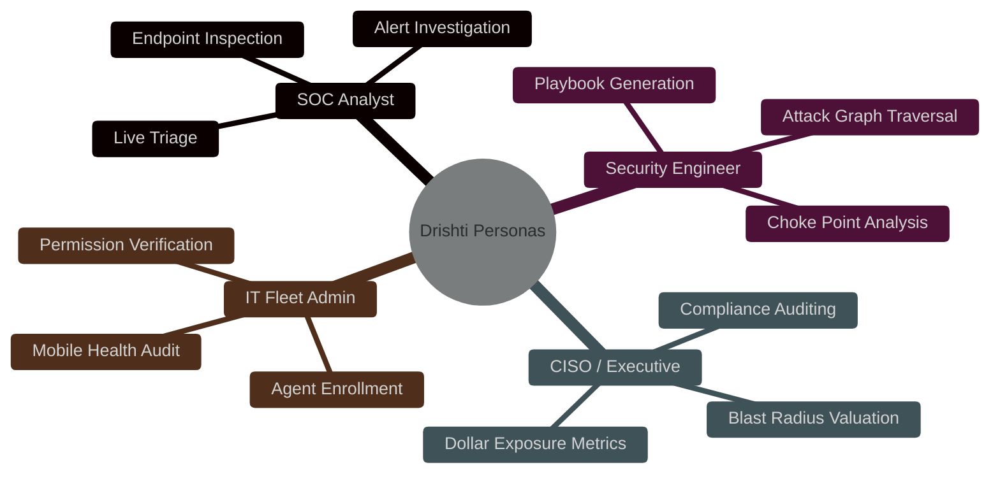

# 👁️ Drishti: Product Requirements Document (PRD)

> **Document Version:** 2.1.0  
> **Target Release:** Drishti Enterprise v1.0 / Hackathon Championship Edition  
> **Status:** Approved & Active Architecture Standard  
> **Product Tagline:** *See the invisible. Price the risk. Fix it first.*  
> **Core Tenet:** *Defensive only. Maps, prices, and remediates. Never attacks.*

---

## Table of Contents

1. [Product Overview](#1-product-overview)
2. [Problem Statement](#2-problem-statement)
3. [Product Vision](#3-product-vision)
4. [Goals](#4-goals)
5. [Non-Goals](#5-non-goals)
6. [Target Users](#6-target-users)
7. [Authorized Use Cases](#7-authorized-use-cases)
8. [User Stories](#8-user-stories)
9. [Functional Requirements](#9-functional-requirements)
10. [Endpoint Requirements](#10-endpoint-requirements)
11. [Network Monitoring Requirements](#11-network-monitoring-requirements)
12. [Detection Requirements](#12-detection-requirements)
13. [Correlation Requirements](#13-correlation-requirements)
14. [Attack-Path Requirements](#14-attack-path-requirements)
15. [Dashboard Requirements](#15-dashboard-requirements)
16. [Graph Requirements](#16-graph-requirements)
17. [Grid View Requirements](#17-grid-view-requirements)
18. [Alert Requirements](#18-alert-requirements)
19. [Cross-Platform Requirements](#19-cross-platform-requirements)
20. [Windows Requirements](#20-windows-requirements)
21. [macOS Requirements](#21-macos-requirements)
22. [Linux Requirements](#22-linux-requirements)
23. [Android Requirements](#23-android-requirements)
24. [Security Requirements](#24-security-requirements)
25. [Privacy Requirements](#25-privacy-requirements)
26. [Performance Requirements](#26-performance-requirements)
27. [Reliability Requirements](#27-reliability-requirements)
28. [Scalability Requirements](#28-scalability-requirements)
29. [Future Enhancements](#29-future-enhancements)
30. [Acceptance Criteria](#30-acceptance-criteria)

---

## 1. Product Overview

Drishti is a unified, defensive cybersecurity platform designed for internal corporate networks, security operations centers (SOCs), cyber ranges, and authorized laboratory environments. Drishti combines **passive and active network asset discovery**, **cross-platform endpoint telemetry collection**, **real-time traffic flow anomaly detection**, **graph-theoretic attack-path modeling**, and **deterministic financial risk pricing** into a single cohesive interface.

The platform provides comprehensive situational awareness by continuously monitoring network conversations and endpoint system metrics, identifying critical convergence points ("choke points") through which adversaries could pivot toward high-value corporate assets ("crown jewels"), and synthesizing non-destructive mitigation playbooks before vulnerabilities can be exploited.

```mermaid
%%{init: {'theme': 'dark'}}%%
flowchart LR
    subgraph INGESTION ["Multi-Source Ingestion"]
        direction TB
        NET_DISC["Passive Network Discovery<br/>(ARP, DNS, mDNS)"]
        ENDPOINT_TEL["Endpoint Agents<br/>(Windows · macOS · Android)"]
        LIVE_TRAFFIC["Traffic Capture Pipeline<br/>(Zeek · TShark · Scapy)"]
    end

    subgraph ENGINE ["Analytical Core"]
        direction TB
        GRAPH_ENGINE["Attack Graph Engine<br/>(NetworkX DiGraph)"]
        RISK_PRICER["Risk Pricing Engine<br/>(Dollar Exposure Model)"]
        VULN_CORRELATOR["Vulnerability Intelligence<br/>(NVD · CISA KEV)"]
    end

    subgraph ACTION ["Defensive Action"]
        direction TB
        DASHBOARD["Dark-Mode SOC Console<br/>(Live Watch · Grid · Graph)"]
        AUTO_FIX["Playbook Synthesizer<br/>(Ansible · Cisco ACLs)"]
    end

    INGESTION ==> ENGINE ==> ACTION
```

---

## 2. Problem Statement

Modern enterprise cybersecurity teams face acute operational inefficiencies caused by fragmented telemetry silos:
- **Disjointed Alerting**: Network intrusion detection alerts (e.g. anomalous port activity) exist completely disconnected from endpoint process telemetry (e.g. which executable opened the socket).
- **Unquantified Risk**: Vulnerability scanners assign abstract CVSS scores (e.g. 7.5 or 9.8) that fail to convey actual reachability or financial exposure to executive decision-makers.
- **Lateral Path Invisibility**: Analysts struggle to determine whether a compromised workstation at the network edge can actually traverse internal routing, firewall ACLs, and service dependencies to reach internal crown jewels.

Drishti bridges this gap by unifying the investigative chain:
$$\text{Live Network Traffic} \longrightarrow \text{Endpoint Telemetry} \longrightarrow \text{Active Applications} \longrightarrow \text{Topology Relationships} \longrightarrow \text{Attack Path Pricing}$$

---

## 3. Product Vision

To transform complex, fragmented enterprise infrastructure into an intuitive, mathematically grounded, and financially quantified defensive map that enables security analysts to anticipate lateral attack paths and deploy automated, zero-downtime remediations before adversaries find them.

---

## 4. Goals

1. **Deterministic Risk Quantification**: Express security risk in verifiable United States Dollars ($ USD) based on asset valuation, CVSS score, exploitability, and blast radius.
2. **Comprehensive Visibility**: Automatically map physical workstations, virtual servers, and corporate mobile devices across subnets without manual asset entry.
3. **Cross-Platform Telemetry**: Collect deep operational metrics from Windows, macOS, and Android devices using non-invasive, standard OS APIs.
4. **Bounded Attack Path Analysis**: Rapidly identify candidate breach routes using Yen's $K$-shortest paths algorithm, pinpointing architectural choke points.
5. **Zero-Falsification Reporting**: Honestly represent platform constraints (SELinux boundaries, TCC privacy controls) rather than fabricating telemetry.

---

## 5. Non-Goals

1. **Offensive Exploitation**: Drishti will never generate exploits, weaponized payloads, or execute offensive penetration tests.
2. **Covert Surveillance**: Drishti will not function as spyware; it contains no keystroke loggers, webcam listeners, or covert screen grabbers.
3. **Deep Packet Payload Inspection**: Drishti inspects 5-tuple flow headers and protocol metadata; it does not decrypt or inspect raw TLS application payloads.
4. **General-Purpose Mobile Device Management (MDM)**: Drishti is a security telemetry agent, not an MDM for enterprise wiping or app store distribution.

---

## 6. Target Users

1. **SOC Tier-1 / Tier-2 Analyst**: Triages live anomalies, inspects endpoint process tables, and traces network connections.
2. **Security Infrastructure Engineer**: Evaluates choke points, generates Ansible playbooks, and deploys Cisco firewall ACLs.
3. **Chief Information Security Officer (CISO)**: Reviews aggregate organization dollar exposure, top vulnerable assets, and ROI on mitigation.
4. **IT Fleet Administrator**: Manages cross-platform pairing, verifies device health, and monitors permission compliance.

---

## 7. Authorized Use Cases

1. **Enterprise SOC Triage**: Monitoring internal corporate networks to detect unauthorized lateral movement and infected hosts.
2. **Authorized Laboratory & Cyber Range**: Evaluating defensive security controls against simulated threats in isolated testbeds.
3. **Vulnerability Prioritization**: Identifying which unpatched CVEs sit on direct paths to business-critical databases.
4. **Mobile Fleet Posture Auditing**: Monitoring employee Android devices for unpatched security patch levels, root status, and malicious outbound connections.

---

## 8. User Stories

- **US-01 [Analyst Triage]**: *As a SOC analyst*, I want to click any device in the Live Watch grid to view its top 20 processes and active socket connections so that I can immediately identify suspicious software.
- **US-02 [Risk Pricing]**: *As a CISO*, I want to see the total financial exposure of my network in dollars so that I can allocate security budget based on quantifiable risk.
- **US-03 [Choke Point Remediation]**: *As a security engineer*, I want Drishti to generate an Ansible playbook closing a critical choke point so that I can eliminate multiple lateral attack paths simultaneously.
- **US-04 [Mobile Verification]**: *As an IT admin*, I want an authorized Android agent to report active network flows without capturing private message contents so that corporate compliance is maintained without violating user privacy.

---

## 9. Functional Requirements

- **PRD-FUNC-001 [Autonomous Asset Inventory]**: System must automatically discover and maintain an asset inventory from network traffic and endpoint reports. `[IMPLEMENTED]`
- **PRD-FUNC-002 [Asset Criticality Tagging]**: Operators must be able to designate assets as Low, Medium, High, or Crown Jewel. `[IMPLEMENTED]`
- **PRD-FUNC-003 [Vulnerability Feed Ingestion]**: System must ingest and correlate CVEs from local NVD caches and CISA KEV feeds. `[IMPLEMENTED]`
- **PRD-FUNC-004 [Automated Playbook Generation]**: System must synthesize Ansible playbooks, PowerShell scripts, and Cisco ACLs to remediate identified risks. `[IMPLEMENTED]`
- **PRD-FUNC-005 [Defensive Guardrail Filter]**: All synthesized playbooks must pass automated AST checks to ensure zero destructive commands (`rm -rf`, format) exist. `[IMPLEMENTED]`
- **PRD-FUNC-006 [Executive Reporting]**: System must export structured executive risk reports in PDF and Markdown formats. `[IMPLEMENTED]`

---

## 10. Endpoint Requirements

- **PRD-EP-001 [Hardware & OS Telemetry]**: Agent must report hostname, OS version, architecture, uptime, CPU count, RAM, and storage free space. `[IMPLEMENTED]`
- **PRD-EP-002 [Process Visibility]**: Agent must report active processes including PID, executable path, command-line arguments, and memory RSS. `[IMPLEMENTED]`
- **PRD-EP-003 [Socket & Port Telemetry]**: Agent must report listening TCP/UDP ports and active connections with remote 5-tuples. `[IMPLEMENTED]`
- **PRD-EP-004 [Installed Software Inventory]**: Agent must inventory installed desktop software and mobile applications with version strings. `[IMPLEMENTED]`
- **PRD-EP-005 [Two-Stage Pairing Protocol]**: Agent must support short-lived (5 min) pairing codes approved via the dashboard before issuing persistent bearer tokens. `[IMPLEMENTED]`
- **PRD-EP-006 [Force-Pair CLI Flag]**: Agent CLI must support `--force-pair` to purge cached credentials and reset pairing state. `[IMPLEMENTED]`
- **PRD-EP-007 [Periodic Heartbeat Pulse]**: Agent must submit a periodic presence heartbeat (default 15–45s) to maintain `ONLINE` status. `[IMPLEMENTED]`

---

## 11. Network Monitoring Requirements

- **PRD-NET-001 [Passive LAN Discovery]**: Agent daemon must sniff ARP, DNS, and mDNS to detect subnet hosts without active port knocking. `[IMPLEMENTED]`
- **PRD-NET-002 [Multi-Backend Capture Adapter]**: Server must support packet capture via Zeek, TShark, or Scapy based on system availability. `[IMPLEMENTED]`
- **PRD-NET-003 [5-Tuple Flow Aggregation]**: Captured packets must be grouped into bidirectional flows with protocol, byte, and packet counts. `[IMPLEMENTED]`
- **PRD-NET-004 [Truthful Network Visibility Classification]**: Backend must evaluate whether remote peer packets are visible, limited by LAN switching, or unavailable. `[IMPLEMENTED]`
- **PRD-NET-005 [Autonomous DeepScan]**: Server must support scheduled or on-demand full-TCP Nmap service audits against consented targets. `[IMPLEMENTED]`

---

## 12. Detection Requirements

- **PRD-DET-001 [Real-Time Behavioral Classification]**: Engine must classify flows as `NORMAL`, `ANOMALOUS`, `SUSPICIOUS`, or `INSUFFICIENT_DATA`. `[IMPLEMENTED]`
- **PRD-DET-002 [Volumetric DoS Detection]**: Engine must flag packet rates exceeding 600 pps or rapid TCP SYN bursts as DoS anomalies. `[IMPLEMENTED]`
- **PRD-DET-003 [Port Scan Detection]**: Engine must flag connections spanning $\ge 5$ distinct destination ports as PortScan anomalies. `[IMPLEMENTED]`
- **PRD-DET-004 [High Payload Entropy Detection]**: Engine must flag flows with payload entropy $> 7.1$ bits/byte as potential Infiltration/Exfiltration. `[IMPLEMENTED]`
- **PRD-DET-005 [Brute-Force Anomaly Detection]**: Engine must flag repeated unacknowledged connection attempts to single authentication ports. `[IMPLEMENTED]`

---

## 13. Correlation Requirements

- **PRD-CORR-001 [Multi-Identifier Device Upsert]**: Backend must correlate passive network signals, agent IDs, MACs, and IPs into a single `NetworkDevice`. `[IMPLEMENTED]`
- **PRD-CORR-002 [Network-to-Process Binding]**: System must bind active socket connections to the originating local process executable. `[IMPLEMENTED]`
- **PRD-CORR-003 [Vulnerability-to-Asset Mapping]**: Discovered software versions must automatically link to corresponding CVE findings. `[IMPLEMENTED]`
- **PRD-CORR-004 [Presence State Transitions]**: Devices must transition: `ONLINE` $\rightarrow$ `STALE` (60s silence) $\rightarrow$ `OFFLINE` (600s silence). `[IMPLEMENTED]`

---

## 14. Attack-Path Requirements

- **PRD-PATH-001 [Directed Graph Construction]**: Topology must be modeled as a NetworkX DiGraph with asset nodes and reachability edges. `[IMPLEMENTED]`
- **PRD-PATH-002 [Yen's K-Shortest Paths]**: System must enumerate candidate breach routes using Yen's algorithm, bounded to avoid combinatorial explosion. `[IMPLEMENTED]`
- **PRD-PATH-003 [Crown-Jewel Target Identification]**: Attack paths must automatically terminate at designated crown-jewel assets. `[IMPLEMENTED]`
- **PRD-PATH-004 [Dollar Risk Pricing per Path]**: Every attack path must be priced in dollars using CVSS, asset value, and hop count ease. `[IMPLEMENTED]`
- **PRD-PATH-005 [Choke Point Highlighting]**: Nodes or edges that intersect multiple attack paths must be flagged as priority choke points. `[IMPLEMENTED]`

---

## 15. Dashboard Requirements

- **PRD-DASH-001 [Total Dollar Exposure KPI]**: Executive view must display aggregate organization dollar exposure prominently. `[IMPLEMENTED]`
- **PRD-DASH-002 [Global Breach Probability]**: Dashboard must calculate a normalized 0–100% breach likelihood index. `[IMPLEMENTED]`
- **PRD-DASH-003 [Top Vulnerabilities Feed]**: Dashboard must display top ranked CVEs weighted by reachability and CVSS score. `[IMPLEMENTED]`
- **PRD-DASH-004 [Interactive Attack Surface Map]**: Dashboard must include an embedded visual representation of the network topology. `[IMPLEMENTED]`

---

## 16. Graph Requirements

- **PRD-GRAPH-001 [ReactFlow Node-Based Canvas]**: Attack map must render via ReactFlow with pan, zoom, and node dragging support. `[IMPLEMENTED]`
- **PRD-GRAPH-002 [Visual Zone Grouping]**: Nodes must be grouped visually by network zone (Internet, DMZ, Internal LAN, Crown Jewels). `[IMPLEMENTED]`
- **PRD-GRAPH-003 [Animated Breach Traversal]**: Clicking an attack path must visually highlight and animate traversal across intermediate nodes. `[IMPLEMENTED]`
- **PRD-GRAPH-004 [Click-to-Inspect Node Details]**: Selecting a graph node must open its correlated telemetry details. `[IMPLEMENTED]`

---

## 17. Grid View Requirements

- **PRD-GRID-001 [Real-Time Device Cards]**: Live Watch grid must display cards with hostname, IP, OS icon, and status badge. `[IMPLEMENTED]`
- **PRD-GRID-002 [Live Utilization Meters]**: Cards must display real-time CPU% and memory utilization bars. `[IMPLEMENTED]`
- **PRD-GRID-003 [Slide-Out Detail Drawer]**: Clicking any card must open a comprehensive multi-tab telemetry inspection drawer. `[IMPLEMENTED]`
- **PRD-GRID-004 [Fast Filter & Search]**: Grid must support filtering by OS (Windows, macOS, Android, Linux), status, and subnet. `[IMPLEMENTED]`

---

## 18. Alert Requirements

- **PRD-ALRT-001 [Telegram Alert Bot]**: System must support outbound Telegram push notifications for High/Critical findings. `[IMPLEMENTED]`
- **PRD-ALRT-002 [Deduplication Engine]**: Alert service must deduplicate notifications within 30-minute sliding windows. `[IMPLEMENTED]`
- **PRD-ALRT-003 [In-App Alert Banners]**: Critical threats must trigger visible alert banners in the web console. `[IMPLEMENTED]`
- **PRD-ALRT-004 [Webhook Alert Integration]**: Outbound webhook support for third-party SIEM platforms (Splunk, Sentinel). `[PLANNED]`

---

## 19. Cross-Platform Requirements

- **PRD-XPLAT-001 [Unified Telemetry Schema]**: All endpoint platforms must submit telemetry conforming to a single validated JSON schema. `[IMPLEMENTED]`
- **PRD-XPLAT-002 [Consistent Cryptographic Handshake]**: Pairing and token exchange must operate identically across desktop and mobile. `[IMPLEMENTED]`
- **PRD-XPLAT-003 [Truthful Capability Reporting]**: Agents must report a `capability_status` matrix reflecting platform-specific constraints. `[IMPLEMENTED]`

---

## 20. Windows Requirements

- **PRD-WIN-001 [Standalone Single-File Binary]**: Windows agent must package as a standalone `.exe` without requiring a local Python install. `[IMPLEMENTED]`
- **PRD-WIN-002 [Registry Software Inventory]**: Agent must read `HKLM` and `HKCU` uninstall keys to inventory installed Windows applications. `[IMPLEMENTED]`
- **PRD-WIN-003 [Windows Services Enumeration]**: Agent must query Windows Service Manager for active and stopped service states. `[IMPLEMENTED]`
- **PRD-WIN-004 [Extended TCP Socket Table]**: Agent must query `GetExtendedTcpTable` via `psutil` to map PIDs to socket bindings. `[IMPLEMENTED]`

---

## 21. macOS Requirements

- **PRD-MAC-001 [Apple Flat Package Installer]**: macOS agent must distribute as an installer package (`.pkg`) deploying to `/opt/drishti/agent`. `[IMPLEMENTED]`
- **PRD-MAC-002 [POSIX Telemetry via sysctl]**: Agent must query CPU, RAM, and load via `sysctl` and `libproc`. `[IMPLEMENTED]`
- **PRD-MAC-003 [TCC Privacy Conformance]**: Agent must respect Apple Transparency, Consent, and Control boundaries without triggering privacy alerts. `[IMPLEMENTED]`
- **PRD-MAC-004 [Applications Directory Inventory]**: Agent must enumerate `/Applications` to inventory installed macOS bundles. `[IMPLEMENTED]`

---

## 22. Linux Requirements

- **PRD-LNX-001 [Passive Scanner Execution]**: Python discovery scanner (`agent/drishti_watch.py`) must run on Linux distributions. `[IMPLEMENTED]`
- **PRD-LNX-002 [Native Debian / RPM Package]**: Native `.deb` and `.rpm` systemd daemon packaging for Linux desktop telemetry. `[PLANNED]`
- **PRD-LNX-003 [eBPF Network Flow Collector]**: Kernel-level eBPF socket monitoring for Linux servers. `[PLANNED]`

---

## 23. Android Requirements

- **PRD-AND-001 [Android 14+ SDK Support]**: Native Kotlin app targeting API 34–35 with Java 17 compatibility. `[IMPLEMENTED]`
- **PRD-AND-002 [Hardware Keystore Storage]**: Agent tokens must be stored in Android Keystore via `EncryptedSharedPreferences`. `[IMPLEMENTED]`
- **PRD-AND-003 [Foreground App Observation]**: Agent must query `UsageStatsManager` (when permitted) to identify active apps. `[IMPLEMENTED]`
- **PRD-AND-004 [Defensive Network Shield (VpnService)]**: Agent must provide an opt-in local VPN capturing outbound 5-tuple flows. `[IMPLEMENTED]`
- **PRD-AND-005 [SELinux Sandbox Compliance]**: Agent must report restricted items (`/proc/stat`, randomized MAC) truthfully as `PLATFORM_RESTRICTED`. `[IMPLEMENTED]`
- **PRD-AND-006 [Hackathon Demo Mode (`ABCD-1234`)]**: App must support static demo code pairing when server has `DRISHTI_DEMO_MODE=true`. `[IMPLEMENTED]`

---

## 24. Security Requirements

- **PRD-SEC-001 [JWT Operator Authentication]**: Dashboard access must require bcrypt-verified credentials with 15-minute access JWTs. `[IMPLEMENTED]`
- **PRD-SEC-002 [Cryptographic Agent Tokens]**: Agents must authenticate using 32-byte cryptographically secure random bearer tokens. `[IMPLEMENTED]`
- **PRD-SEC-003 [Streaming MaxBodySize Middleware]**: Server must reject request streams exceeding configured limits before memory buffering. `[IMPLEMENTED]`
- **PRD-SEC-004 [CORS Domain Whitelisting]**: Server must enforce strict CORS origin filtering, permitting Chrome extension schemas. `[IMPLEMENTED]`

---

## 25. Privacy Requirements

- **PRD-PRIV-001 [Zero Keystroke / Media Capture]**: Platform must contain no code for keylogging, audio recording, or screen capture. `[IMPLEMENTED]`
- **PRD-PRIV-002 [Zero Packet Payload Storage]**: Network monitoring must inspect packet headers only, discarding application payloads. `[IMPLEMENTED]`
- **PRD-PRIV-003 [Explicit Consent Workflows]**: Mobile flow capture and usage access must require explicit user acceptance in OS settings. `[IMPLEMENTED]`

---

## 26. Performance Requirements

- **PRD-PERF-001 [API Latency Ceiling]**: 95% of API requests must complete in $< 200\text{ ms}$ under 500 active endpoints. `[IMPLEMENTED]`
- **PRD-PERF-002 [Lightweight Endpoint Footprint]**: Desktop agent must consume $< 45\text{ MB}$ RAM and $< 1.0\%$ average CPU. `[IMPLEMENTED]`
- **PRD-PERF-003 [Mobile Battery Impact]**: Android agent must consume $< 3.0\%$ battery over 24 hours of background execution. `[IMPLEMENTED]`

---

## 27. Reliability Requirements

- **PRD-REL-001 [Graceful Degradation]**: Failure of optional modules (Zeek, NVD API, Telegram) must not disrupt core telemetry ingestion. `[IMPLEMENTED]`
- **PRD-REL-002 [Local Telemetry Buffering]**: Agents must buffer up to 100 telemetry batches during network disconnections. `[PARTIAL]`
- **PRD-REL-003 [Schema Reconciliation]**: Server startup must reconcile missing database columns without data loss. `[IMPLEMENTED]`

---

## 28. Scalability Requirements

- **PRD-SCAL-001 [Dual Database Backends]**: Architecture must support zero-code switching between SQLite (dev) and PostgreSQL (prod). `[IMPLEMENTED]`
- **PRD-SCAL-002 [Stateless Application Tier]**: Backend must operate statelessly behind standard reverse proxies and load balancers. `[IMPLEMENTED]`
- **PRD-SCAL-003 [Subnet Ingestion Partitioning]**: Ingestion worker queues partitioned by organization ID and subnet CIDR. `[PLANNED]`

---

## 29. Future Enhancements

- **PRD-FUT-001 [Kubernetes Container Agent]**: DaemonSet deployment collecting container runtime telemetry and pod network flows. `[PLANNED]`
- **PRD-FUT-002 [Cloud Security Posture (CSPM)]**: Ingestion connectors for AWS VPC Flow Logs, Azure NSGs, and Google Cloud telemetry. `[PLANNED]`
- **PRD-FUT-003 [Native Linux Desktop Daemon]**: Single-binary `.deb`/`.rpm` package with systemd service unit. `[PLANNED]`
- **PRD-FUT-004 [WebSocket Push Subscriptions]**: True bidirectional WebSocket streaming replacing high-frequency HTTP polling. `[PLANNED]`

---

## 30. Acceptance Criteria

| Requirement Area | Acceptance Verification Standard | Verification Method |
|---|---|---|
| **Windows Endpoint** | Standalone `.exe` executes, connects to backend, pairs via code, and reports top 20 processes and ports within 45s. | Manual CLI execution + Live Watch inspection. |
| **Android Endpoint** | Debug APK installs via ADB on API 34+, pairs via `ABCD-1234`, and populates Live Watch drawer with hardware & foreground app. | Real device test on Android 14/15. |
| **Attack Graph** | NetworkX builds DiGraph, enumerates Yen's paths to crown jewels, and assigns dollar pricing. | Automated backend test suite (`pytest`). |
| **Traffic Anomaly** | Volumetric SYN burst triggers `ANOMALOUS` (DoS) verdict with confidence $> 0.90$. | Unit test in `server/tests/`. |
| **Remediation Guardrail** | Synthesizer rejects any playbook template containing destructive command patterns. | AST validator test suite. |
