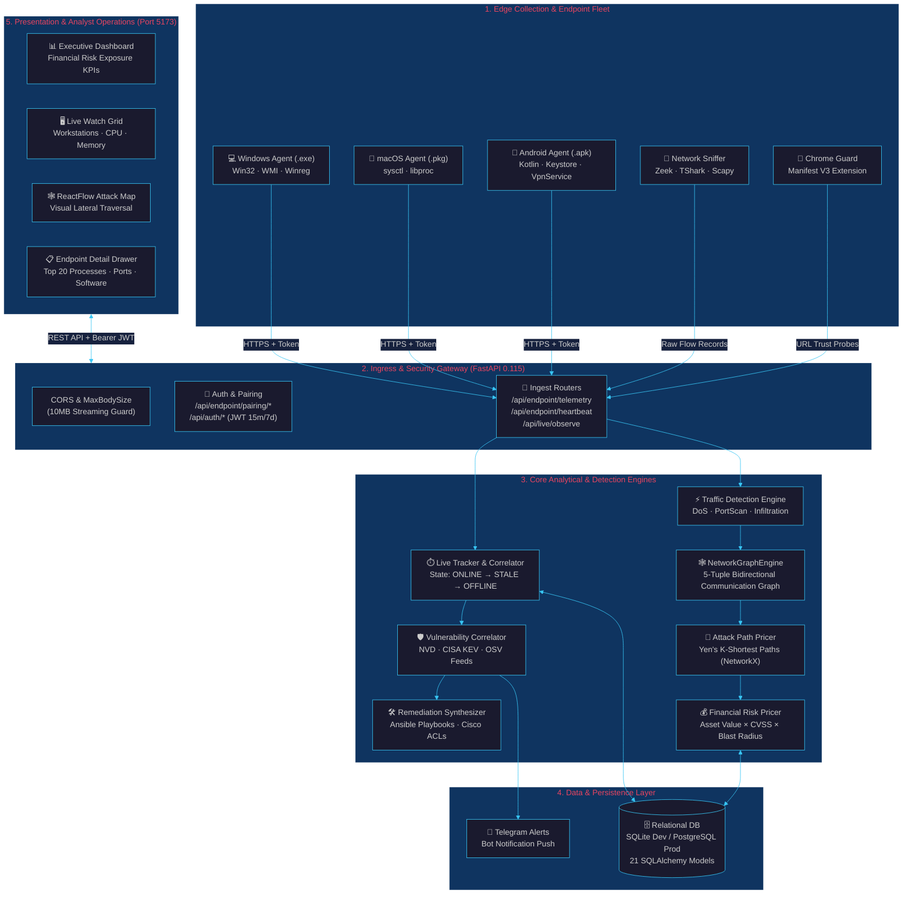

# 👁️ Drishti

> **See the invisible. Price the risk. Fix it first.**  
> *Defensive only. Maps, prices, and remediates. Never attacks.*

---

<div align="center">

[](https://python.org)
[](https://fastapi.tiangolo.com)
[](https://react.dev)
[](https://www.typescriptlang.org)
[-3DDC84?logo=android&logoColor=white)](https://developer.android.com)
[](https://networkx.org)
[](https://tailwindcss.com)

</div>

---

## 📑 Table of Contents

1. [Project Overview](#1-project-overview)
2. [Problem Statement](#2-problem-statement)
3. [Objectives](#3-objectives)
4. [Key Features](#4-key-features)
5. [Architecture](#5-architecture)
6. [User Interface & Console Layout](#6-user-interface--console-layout)
7. [Technology Stack](#7-technology-stack)
8. [Open Source Components](#8-open-source-components)
9. [Supported Platforms Matrix](#9-supported-platforms-matrix)
10. [Security Model & Consent Guardrails](#10-security-model--consent-guardrails)
11. [Quick Start](#11-quick-start)
12. [Documentation Status](#12-documentation-status)

---

## 1. Project Overview

**Drishti** is a modern, defensive cybersecurity intelligence platform designed for authorized enterprise environments, laboratory testbeds, and internal security operations centers (SOCs). Drishti bridges the gap between passive network traffic observation, active asset discovery, and endpoint-level operational telemetry.

By fusing **real-time network packet capture**, **cross-platform endpoint observation (Windows, macOS, Android)**, **graph-theoretic attack path modeling**, and **deterministic financial risk pricing**, Drishti enables security teams to:

- **Attain Complete Network Visibility**: Auto-discover physical, virtual, and mobile devices across subnets without manual data entry.
- **Ingest Rich Endpoint Telemetry**: Observe CPU utilization, memory pressure, running process trees, installed software, listening ports, and active 5-tuple socket connections.
- **Detect Anomalous Traffic in Real-Time**: Classify live packet streams using behavioral indicators for DoS bursts, horizontal/vertical port scans, payload entropy shifts, and brute-force anomalies.
- **Correlate Multi-Source Security Events**: Unify network flow records with specific endpoint identities, running applications, and known vulnerabilities (NVD, CISA Known Exploited Vulnerabilities).
- **Price Financial Exposure**: Transform abstract CVSS vulnerability scores into quantifiable dollar valuations based on asset criticality, business value, and blast radius.
- **Generate Non-Destructive Remediation**: Synthesize verified Ansible playbooks, Cisco IOS ACLs, PowerShell commands, and Bash scripts to isolate compromised nodes and patch vulnerabilities.

---

## 2. Problem Statement

Modern enterprise defense operations are severely impaired by fragmented telemetry silos:

```text
┌─────────────────────────┐          ┌─────────────────────────┐
│   NETWORK SCANNER ALERTS│          │  ENDPOINT AGENT LOGS    │
│  "Port 445 Open on IP"  │          │ "Process PID 4128 Active"│
└────────────┬────────────┘          └────────────┬────────────┘
             │                                    │
             └───────────────┬────────────────────┘
                             ▼
              [ Context Vacuum & Alert Fatigue ]
              - Is the target actually reachable?
              - What application owns the socket?
              - What is the financial risk in dollars?
              - How does an attacker reach our crown jewels?
```

When an alert fires in isolation, SOC analysts cannot determine:
1. **Lateral Reachability**: Can an external or compromised peer actually traverse intermediate network hops to reach this vulnerable port?
2. **Contextual Binding**: Which local OS process, background service, or mobile app is actively listening on or transmitting through that socket?
3. **Quantifiable Financial Impact**: What is the dollar impact if this specific asset and its downstream dependencies are breached?

### The Drishti Correlation Paradigm

Drishti directly connects the disjointed chain into an unbroken investigative line:

$$\text{Live Network Traffic} \longrightarrow \text{Endpoint Identity} \longrightarrow \text{Host Activity} \longrightarrow \text{Topology Relationships} \longrightarrow \text{Attack Path Pricing}$$

---

## 3. Objectives

The current Drishti codebase implements the following operational objectives:

1. **Non-Invasive Observation**: Observe network traffic and endpoint state through passive sniffing, standard OS APIs, and user-consented mobile services without kernel rootkits or destabilizing agents.
2. **Deterministic Risk Pricing**: Calculate monetary loss projections ($ USD) using transparent mathematical formulas combining CVSS scores, asset criticality factors, and downstream blast radius.
3. **Bounded Path Enumeration**: Eliminate combinatorial explosion in complex enterprise graphs by using Yen's $K$-shortest paths algorithm to discover candidate breach paths to critical assets.
4. **Cross-Platform Telemetry Collection**: Deploy tailored collectors for Windows workstations (`.exe`), macOS laptops (`.pkg`), and Android 14+ mobile devices (`.apk`).
5. **Truthful Platform Boundaries**: Transparently report operating system sandbox constraints (such as Android SELinux restrictions and macOS TCC protections) rather than synthesizing fake data.
6. **Defensive Guardrails**: Ensure that all generated remediation scripts (Ansible, firewall rules) pass strict AST and command injection filters before presentation to operators.

---

## 4. Key Features

Every feature listed below is verified against the active Drishti codebase and explicitly categorized by implementation status:

| Feature | Category | Description | Status |
|---|---|---|---|
| **Live Network Traffic Capture** | Network | Sniffs live packets on monitored interfaces filtered by target IP using Scapy, TShark, or Zeek. | **IMPLEMENTED** |
| **Zeek / TShark Capture Adapter** | Network | Auto-detects local Zeek, TShark (`tshark.exe`), and Scapy binaries; falls back gracefully. | **IMPLEMENTED** |
| **5-Tuple Flow Aggregation** | Network | Aggregates raw packet streams into bidirectional flow records with TCP flag tracking and entropy. | **IMPLEMENTED** |
| **Traffic Anomaly Detection** | Detection | Real-time classification: `NORMAL`, `ANOMALOUS`, `SUSPICIOUS` (DoS, PortScan, Infiltration, BruteForce). | **IMPLEMENTED** |
| **Endpoint Telemetry Pipeline** | Endpoint | Ingests structured JSON telemetry batches over HTTP/HTTPS with cryptographic bearer token auth. | **IMPLEMENTED** |
| **Windows Workstation Agent** | Endpoint | Standalone `.exe` collecting CPU, RAM, top 20 processes, software, listening ports, services. | **IMPLEMENTED** |
| **Android Mobile Agent (API 34+)** | Endpoint | Native Kotlin app with Keystore auth, hardware specs, thermal status, battery %, and foreground app. | **IMPLEMENTED** |
| **Android Defensive VPN Shield** | Endpoint | `DrishtiVpnService` capturing outbound destination IP/port flows and DNS queries with user consent. | **IMPLEMENTED** |
| **macOS Agent Flat Package** | Endpoint | Apple `.pkg` package collecting load, RAM, disk, POSIX processes via `sysctl`/`libproc`. | **IMPLEMENTED** |
| **Linux Native Packaged Daemon** | Endpoint | Native `.deb` / `.rpm` systemd daemon for Linux desktop telemetry. | **PLANNED** |
| **Passive LAN Discovery** | Discovery | `agent/drishti_watch.py` discovers subnet hosts via ARP sweeps, mDNS, and DNS reverse lookups. | **IMPLEMENTED** |
| **Autonomous DeepScan (Nmap)** | Scanning | Scheduled or on-demand full-TCP `-p-` and `-sV` audit of consented LAN targets. | **IMPLEMENTED** |
| **Vulnerability Correlator** | Threat Intel | Correlates discovered software against local NVD datasets, CISA KEV (Known Exploited), and OSV. | **IMPLEMENTED** |
| **Attack Graph Engine** | Analytics | NetworkX-powered directed graph mapping assets, access edges, and network zones. | **IMPLEMENTED** |
| **Yen's $K$-Shortest Attack Paths** | Analytics | Bounded path enumeration discovering highest-risk lateral traversal routes to crown jewels. | **IMPLEMENTED** |
| **Financial Risk Pricing Model** | Analytics | Deterministic dollar risk calculation per node and attack path based on CVSS and asset values. | **IMPLEMENTED** |
| **Interactive Attack Map (ReactFlow)** | Frontend | Interactive visual canvas showing asset nodes, zone boundaries, and breach trajectories. | **IMPLEMENTED** |
| **Live Watch Grid View** | Frontend | Real-time cards displaying online/stale status, OS badges, CPU meters, and detail drawers. | **IMPLEMENTED** |
| **Slide-Out Endpoint Detail Drawer** | Frontend | Comprehensive telemetry inspection: processes, software, ports, services, Android specs. | **IMPLEMENTED** |
| **Automated Playbook Generation** | Remediation | Synthesizes Ansible playbooks, Cisco IOS ACLs, PowerShell, and Bash firewall commands. | **IMPLEMENTED** |
| **Telegram Security Alert Bot** | Alerts | Push notifications dispatched to Telegram chat on High/Critical findings or active threats. | **IMPLEMENTED** |
| **Chrome Web Guard Extension** | Extension | Manifest V3 extension checking active tab URLs against the URL Trust Analyzer backend. | **IMPLEMENTED** |
| **Realtime Push WebSockets** | Realtime | Server-sent events or WebSocket stream for sub-second UI updates (currently uses high-frequency React Query polling). | **PARTIALLY IMPLEMENTED** |

---

## 5. Architecture

Drishti is structured as a decoupled, multi-tier platform connecting edge collectors to a centralized analytical engine and web console.



---

## 6. User Interface & Console Layout

The Drishti Web SOC Console (`web/`) is organized into dedicated operational views:

### 1. Executive Security Dashboard (`/dashboard`)
- **Monetary Exposure Metric**: Real-time display of total enterprise dollar risk (e.g. `$725,000`).
- **Breach Probability Meter**: Global likelihood index based on perimeter accessibility and unpatched CVEs.
- **Top Vulnerabilities Bar**: Ranked overview of high-severity CVEs actively exposed on reachable nodes.

### 2. Live Watch Grid & Topology (`/live`)
- **Device Grid View**: Card layout grouping all discovered devices by operating system with status badges (`ONLINE` green, `STALE` yellow, `OFFLINE` gray).
- **Interactive Force-Directed Topology Map**: Canvas visualization showing active communication links between hosts and external domains.
- **Pair Endpoint Modal**: Streamlined dialog for entering 8-character agent pairing codes or enabling fast demo authorization.

### 3. Endpoint Telemetry Detail Drawer (`/live?device_id=...`)
- **Hardware & Identity Header**: Hostname, IP, MAC, OS version, Agent version, Manufacturer, and Model.
- **CPU & Thermal Status**: Real-time CPU core count, clock frequencies, utilization meter, and hardware thermal zone status.
- **Memory & Storage**: Physical RAM utilization, swap usage, internal flash storage, and external storage metrics.
- **Top 20 Processes Table**: Real-time process listing with PID, PPID, executable name, command-line arguments, user account, CPU%, and RSS memory consumption.
- **Installed Software / Apps Inventory**: Complete list of installed applications, package names, version strings, install dates, and requested permissions.
- **Listening Ports & Socket Connections**: Local port bindings, protocols (`TCP`/`UDP`), state (`LISTEN`/`ESTABLISHED`), and remote IP/port endpoints.
- **Windows Services**: Windows service names, display names, execution state (`RUNNING`/`STOPPED`), and startup types (`AUTO_START`/`DEMAND_START`).
- **Android Defensive VPN Flows**: Live log of outbound destination IPs, destination ports, protocols, and DNS queries captured by the local shield.
- **Platform Capability Matrix**: Honest indicators of platform-specific sandbox boundaries (`SUPPORTED`, `SANDBOXED`, `PLATFORM_RESTRICTED`).

### 4. Attack Paths & Breach Simulation (`/paths`)
- **Yen's Path Traversal**: Step-by-step visual hop-by-hop breakdown from Internet entry points to internal crown-jewel databases.
- **Path Pricing Card**: Quantified financial exposure and likelihood percentage per candidate attack path.
- **Breach Simulator**: Interactive slider allowing analysts to simulate node compromise and visualize downstream lateral reachability.

### 5. Remediation Console (`/remediation`)
- **Ansible Playbook Generator**: Synthesizes verified YAML playbooks to patch packages or modify configurations.
- **Firewall Isolation Rules**: Produces copy-pasteable Cisco IOS ACLs, Linux `iptables`, and Windows `New-NetFirewallRule` commands.

---

## 7. Technology Stack

| Component | Technology | Version | Purpose | Open Source? |
|---|---|---|---|---|
| **Backend Framework** | FastAPI | 0.115.x | High-performance asynchronous REST API server | Yes (MIT) |
| **ASGI Server** | Uvicorn | 0.30.x | Lightning-fast ASGI HTTP/WebSocket server | Yes (BSD) |
| **Database ORM** | SQLAlchemy | 2.0.x | Relational mapping, connection pooling, and migrations | Yes (MIT) |
| **Graph Algorithms** | NetworkX | 3.4.x | DiGraph topology modeling, Yen's $K$-shortest paths | Yes (BSD-3) |
| **Frontend Framework** | React | 18.3.x | Reactive user interface component architecture | Yes (MIT) |
| **Frontend Build Tool** | Vite | 5.4.x | Fast modern frontend bundler and dev server | Yes (MIT) |
| **Type System** | TypeScript | 5.5.x | End-to-end static type safety across web console | Yes (Apache 2.0) |
| **Interactive Graphs** | ReactFlow | 11.11.x | Node-based interactive attack graph rendering | Yes (MIT) |
| **UI Styling** | Tailwind CSS | 3.4.x | Utility-first responsive dark-mode SOC layout | Yes (MIT) |
| **State & Cache** | TanStack React Query | 5.51.x | Server-state caching, background re-fetching, polling | Yes (MIT) |
| **Desktop Telemetry** | psutil | 6.0.x | Cross-platform system and process telemetry | Yes (BSD-3) |
| **Binary Packaging** | PyInstaller | 6.5.x | Single-file Windows `.exe` compiler | Yes (GPL 2.0 with exception) |
| **Mobile Runtime** | Kotlin | 1.9.24 | Native Android endpoint agent programming language | Yes (Apache 2.0) |
| **Mobile SDK** | Android SDK | API 34–35 | Modern Android APIs (UsageStats, Keystore, VpnService)| Yes (Apache 2.0) |
| **Packet Inspection** | Scapy / TShark / Zeek | 2.5.x / 4.x | Layer 2–4 packet capture and protocol decoding | Yes (GPL/BSD) |

---

## 8. Open Source Components

Drishti incorporates verified open-source libraries:

1. **FastAPI & Starlette**: Core web microframework powering all REST endpoints (`server/app/main.py`).
2. **SQLAlchemy & Alembic**: Relational persistence engine mapping 21 ORM models (`server/app/models/`).
3. **NetworkX**: In-memory graph processing powering `server/app/services/attack_paths.py` and Yen's algorithm.
4. **psutil**: Hardware and process collector powering `endpoint-agent/windows/collectors.py`.
5. **ReactFlow**: Canvas rendering library powering the Attack Surface visualizer (`web/src/features/graph/`).
6. **Lucide React**: Vector cybersecurity iconography across the web console.
7. **Pydantic v2**: High-speed JSON schema parsing and contract enforcement for telemetry batches.
8. **Scapy**: Packet manipulation engine utilized in `server/app/services/traffic/capture_adapter.py`.

---

## 9. Supported Platforms Matrix

| Platform | Controller / Backend | Endpoint Agent | Telemetry Capabilities | Production Status |
|---|---|---|---|---|
| **Windows 10 / 11 (x64)** | Fully Supported | Standalone `.exe` (`dist/Drishti-Endpoint-Agent-Windows.exe`) | Full CPU, RAM, Top 20 Processes, Installed Software, Ports, Windows Services | **IMPLEMENTED** |
| **macOS (Intel & ARM64)** | Fully Supported | Native `.pkg` (`dist/Drishti-Endpoint-Agent-macOS.pkg`) | System Load, RAM, Disk, POSIX Processes, Network Interfaces (TCC-Respecting) | **IMPLEMENTED** |
| **Android 14+ (API 34–35)**| Supported Client | Native `.apk` (`dist/Drishti-Android-Agent-debug.apk`) | Hardware specs, Thermal status, Battery %, Foreground App, 5-tuple VPN flows | **IMPLEMENTED** |
| **Linux (Ubuntu / Debian)** | Fully Supported (Native) | Script Fallback (`agent/drishti_watch.py`) | Passive ARP/DNS scanning, network flow monitoring; **packaged daemon planned** | **PARTIAL / PLANNED** |

---

## 10. Security Model & Consent Guardrails

> [!IMPORTANT]
> **Defensive Mandate**: Drishti endpoint monitoring is designed solely for environments where the operator possesses explicit administrative authorization (enterprise fleets, authorized lab evaluations, and cyber defense training ranges).

### 1. Authentication & Ingress Security
- **Role-Based Access Control (RBAC)**: Web console operators authenticate via bcrypt-hashed credentials (`/api/auth/login`) receiving signed JWT access tokens (15-minute TTL) and refresh tokens (7-day TTL).
- **Endpoint Agent Bearer Authentication**: Endpoint agents authenticate using 256-bit cryptographic bearer tokens issued strictly during authorized pairing sessions.
- **Maximum Request Guard**: Incoming payload size is bounded by raw ASGI streaming middleware (`MaxBodySizeMiddleware`, default 1 MB, expandable to 10 MB) to neutralize pre-auth buffer overflow attempts.

### 2. Pairing & Identity Assurance
- **Short-Lived Pairing Sessions**: Endpoint pairing codes (e.g. `AB7X-92KF`) expire after 5 minutes.
- **Cryptographic Hashing**: Raw pairing codes and agent tokens are never stored in plaintext within the database; only SHA-256 hashes are persisted.
- **One-Time Token Release**: The raw agent token is released once over TLS when the agent detects pairing completion; the server immediately clears the cleartext token from memory and database session tables.

### 3. Endpoint Privacy Boundaries
- **Zero Spyware Capabilities**: Drishti contains no code for keylogging, audio recording, webcam activation, or screen captures.
- **Truthful Sandbox Conformance**: On Android, the agent respects SELinux restrictions, reporting `SANDBOXED` or `PLATFORM_RESTRICTED` rather than attempting privilege escalations.
- **Defensive Network Shield Consent**: Mobile packet flow observation requires explicit user consent via the standard Android VPN dialog.

---

## 11. Quick Start

For comprehensive, beginner-friendly instructions, consult **[`SETUP.md`](file:///d:/Drishti-Innofusion/SETUP.md)**.

### Fast 3-Step Local Boot

#### Step 1: Start Backend Controller
```powershell
cd server
python -m venv venv
.\venv\Scripts\Activate.ps1
pip install -r requirements.txt
uvicorn app.main:app --host 0.0.0.0 --port 8000 --reload
```

#### Step 2: Start Web SOC Console
```powershell
cd web
npm install
npm run dev
```
Open **`http://localhost:5173`** in your browser.

#### Step 3: Launch Windows Agent
```powershell
.\dist\Drishti-Endpoint-Agent-Windows.exe --server http://localhost:8000
```
Enter the displayed pairing code into **Live Watch → Pair Endpoint**.

---

## 12. Documentation Status

| Document | File Path | Focus & Scope | Last Verified Against Codebase |
|---|---|---|---|
| **README.md** | [`README.md`](file:///d:/Drishti-Innofusion/README.md) | Platform Overview, Verified Features, Architecture & Tech Stack | **VERIFIED (Active)** |
| **SETUP.md** | [`SETUP.md`](file:///d:/Drishti-Innofusion/SETUP.md) | Step-by-Step Installation, Firewall, Endpoint Setup & Troubleshooting | **VERIFIED (Active)** |
| **PRD.md** | [`PRD.MD`](file:///d:/Drishti-Innofusion/PRD.MD) | Product Requirements Document (30 Formal Specifications) | **VERIFIED (Active)** |
| **TRD.md** | [`TRD.MD`](file:///d:/Drishti-Innofusion/TRD.MD) | Technical Requirements Document (System Architecture & Engine Internals) | **VERIFIED (Active)** |
