# 👁️ DRISHTI

> **AI-Powered Defensive Attack-Path Intelligence**  
> *Defensive only. Maps, prices, and remediates. Never attacks.*

---

<div align="center">

[](https://python.org)
[](https://fastapi.tiangolo.com)
[](https://react.dev)
[](https://www.typescriptlang.org)
[](https://tailwindcss.com)
[](https://networkx.org)
[-3DDC84?logo=android&logoColor=white)](https://developer.android.com)
[](LICENSE)

**Open-Source Defensive Cybersecurity Platform · Unified Network Telemetry & Lateral Graph Intelligence**

[Live Web Preview (Vercel)](#15-deployment-transparency) · [Evaluator Walkthrough](#14-hackathon-evaluator-experience) · [Quick Start](#13-installation--quick-start) · [Architecture Guide](#10-system-architecture) · [API Specification](API.md)

</div>

---

## Table of Contents

1. [Project Introduction](#1-project-introduction)
2. [Problem Statement](#2-problem-statement)
3. [The Drishti Solution](#3-the-drishti-solution)
4. [Key Features Matrix](#4-key-features-matrix)
5. [How Drishti Works (Operational Lifecycle)](#5-how-drishti-works)
6. [Network Traffic Pipeline](#6-network-traffic-pipeline)
7. [Attack-Path Pipeline & Yen's $K$-Shortest Paths](#7-attack-path-pipeline)
8. [AI Reasoning & AST Safety Guardrail Pipeline](#8-ai-reasoning--ast-safety-guardrails)
9. [Visual Intelligence & Simulation Suite](#9-visual-intelligence--simulation-suite)
10. [System Architecture](#10-system-architecture)
11. [Technology Stack](#11-technology-stack)
12. [Repository Structure](#12-repository-structure)
13. [Installation & Quick Start](#13-installation--quick-start)
14. [Hackathon Evaluator Experience](#14-hackathon-evaluator-experience)
15. [Deployment Transparency & Operational Realities](#15-deployment-transparency)
16. [Demonstration & Compiled Release Artifacts](#16-demonstration--compiled-release-artifacts)
17. [Master Documentation Directory](#17-master-documentation-directory)

---

## 1. Project Introduction

**Drishti** (दृष्टि — Sanskrit for *Vision / Insight*) is an open-source, defensive cybersecurity intelligence platform designed for enterprise subnets, security operations centers (SOCs), cyber ranges, and institutional IT networks (such as IITs, NITs, and universities).

Traditional security operations suffer from an **asymmetric defense crisis**: defenders must secure every possible edge, while an adversary only needs to chain together a single sequence of misconfigurations or vulnerabilities to compromise critical data. Security tools generate thousands of isolated alerts:
- A network flow analyzer sees an anomalous port scan.
- An endpoint detection agent logs an isolated process spawn.
- A vulnerability scanner generates a static, hundred-page PDF of uncontextualized CVEs.

**What makes attack-path intelligence fundamentally different from isolated alerts?**  
Isolated alerts show *symptoms* without relationships. A vulnerability with CVSS 9.8 on an isolated, air-gapped lab printer receives the same alert priority as a CVSS 9.8 flaw on an Internet-facing edge server. Attack-path intelligence connects the dots: it combines real-time network reachability, operating system socket states, and software evidence to answer:
1. *Can an external adversary actually reach this vulnerability?*
2. *If compromised, what internal assets can the attacker pivot to?*
3. *What high-value corporate "crown jewels" (databases, Active Directory) lie in the adversary's lateral trajectory?*
4. *What is the quantifiable financial exposure in real dollars ($ USD) if this path is breached?*
5. *Where is the architectural choke point where a single defensive rule severs the entire attack tree?*

Drishti maps, prices, and remediates. It **never attacks**, injects exploits, or conducts denial-of-service floods.

---

## 2. Problem Statement

Complex enterprise networks contain heterogeneous, interconnected workstations, servers, and mobile devices across multiple subnets and VLANs:

```text
┌─────────────────────────────────┐           ┌─────────────────────────────────┐
│     NETWORK INTRUSION LOGS      │           │    ENDPOINT DETECTION LOGS      │
│  "Inbound connection port 445"  │           │   "PID 5120 spawned powershell" │
└────────────────┬────────────────┘           └────────────────┬────────────────┘
                 │                                             │
                 └──────────────────────┬──────────────────────┘
                                        ▼
                         [ The Context Vacuum Dilemma ]
                     - Is the target machine reachable?
                     - What specific process owns the socket?
                     - Which subnet relationships permit lateral hops?
                     - What is the dollar impact if breached?
                                        ▼
┌───────────────────────────────────────────────────────────────────────────────┐
│ Vulnerable Endpoint ──► Subnet Routing ──► Pivot Node ──► Crown Jewel ($$$)   │
└───────────────────────────────────────────────────────────────────────────────┘
```

Security teams face four major bottlenecks:
1. **Host-Network Blindness:** Network flow monitors observe IP traffic but cannot identify the owning process, PID, or user. Endpoint agents see internal processes but cannot determine if intermediate firewalls block external reachability.
2. **Abstract Severity vs. Financial Reality:** Abstract CVSS scores fail to communicate operational risk to corporate leadership and budget allocators.
3. **Lateral Propagation Invisibility:** Security teams cannot visualize how an adversary can chain multiple medium-severity misconfigurations across workstations to compromise high-value assets.
4. **Remediation Fatigue:** Generating custom firewall rules or configuration playbooks across multi-vendor equipment (Windows, Linux, Cisco) is slow, error-prone, and risks production outages.

---

## 3. The Drishti Solution

Drishti unifies passive network observation, cross-platform host telemetry, and graph-theoretic attack modeling into a single defensive console:

```text
Security Data (Passive LAN Sniffing + Cross-Platform Endpoint Telemetry)
      ↓
Context & Correlation (Socket-to-PID Binding + Offline CVE / CISA KEV Matching)
      ↓
Attack-Path Analysis (NetworkX DiGraph + Yen's K-Shortest Paths + Min-Cut Chokepoints)
      ↓
AI-Assisted Reasoning (Anthropic Claude 3.5 + Python AST Safety Guardrail)
      ↓
Security Insights (Quantified Dollar Risk + Verified Ansible / Cisco Remediation)
```

1. **Ingest Without Intrusion:** Discovers network devices via passive ARP/DNS/mDNS sweeps and ingests rich telemetry from Windows, macOS, and Android daemons.
2. **Deterministic Correlation:** Binds network connections to running process PIDs and matches detected software against offline CVE catalogs without hallucinating.
3. **Graph Traversal:** Uses Yen's $K$-shortest paths algorithm to discover candidate breach routes and identifies minimum-cut choke points.
4. **Dollar Pricing:** Calculates real financial liability based on CVSS severity, exploitability, blast radius, and crown jewel valuation ($3.5M).
5. **Safe Remediation:** Synthesizes non-destructive Ansible playbooks and Cisco ACLs validated by an Abstract Syntax Tree (AST) guardrail.

---

## 4. Key Features Matrix

Every feature below is implemented in the repository codebase:

| Category | Capability | Implementation Mechanism | Codebase Verification |
|---|---|---|---|
| **Security Analysis** | Offline CVE & CISA KEV Correlation | Evaluates exact version bounds: `[start, fixed)` against local NVD database. | `server/app/services/vuln_intel/` |
| **Attack-Path Intelligence** | Yen's $K$-Shortest Paths Engine | Enumerates top $K$ alternative lateral breach routes over directed graph $G=(V, E)$. | `server/app/services/attack_paths.py` |
| **Attack-Path Intelligence** | Minimum-Cut Chokepoint Engine | Identifies strategic network bottlenecks where severing minimal edges eliminates maximum risk. | `server/app/services/impact.py` |
| **Financial Valuation** | Dollar Risk Pricing ($ USD) | Multiplies asset valuation by squared CVSS, KEV exploitability multiplier, and reachability. | `server/app/services/risk_engine.py` |
| **Network Analysis** | Passive LAN Discovery | Listens to ARP table updates, reverse DNS (PTR) records, and mDNS announcements. | `agent/drishti_watch.py` |
| **Traffic Analysis** | 27-Feature Canonical Flow Profiling | Aggregates 5-tuple flows over 10s sliding windows; extracts entropy and SYN-to-ACK ratios. | `server/app/services/traffic/` |
| **Traffic Analysis** | Kernel Packet Capture Adapter | Zero-copy packet capture interface supporting Scapy 2.5, TShark, and Zeek streams. | `server/app/services/traffic/` |
| **AI Assistance** | Generative Remediation Synthesis | Prompts Anthropic Claude 3.5 Sonnet to generate platform-specific hardening scripts. | `server/app/services/ai.py` |
| **AI Assistance** | AST Safety Guardrail | Uses Python `ast.parse()` to statically block destructive commands (`rm`, `dd`, `mkfs`, etc.). | `server/app/services/ai.py` |
| **Endpoint Intelligence** | Windows Endpoint Agent | Standalone PyInstaller binary (`.exe`, ~9.1MB) querying Win32 socket tables and registry. | `endpoint-agent/` |
| **Endpoint Intelligence** | macOS Endpoint Agent | Apple Flat Package (`.pkg`, ~17.9KB) collecting POSIX system metrics via `sysctl`/`libproc`. | `endpoint-agent/macos/` |
| **Endpoint Intelligence** | Android Mobile Agent | Native Kotlin app (`.apk`, ~17.3MB) targeting Android 14+ with Keystore encryption and VPN flow trace. | `android-agent/` |
| **Visualization** | Dark-Mode React SOC Console | React 18, Vite 5, TailwindCSS, Lucide icons, and ReactFlow interactive attack canvas. | `web/src/` |
| **Reporting** | Executive Compliance Reports | Generates board-ready posture reports and PDF documents detailing Return on Mitigation (ROM). | `server/app/api/report.py` |

---

## 5. How Drishti Works

The operational lifecycle of Drishti runs continuously in nine distinct stages:

```text
[1. Packet / Telemetry Ingestion]
       │
       ▼
[2. Kernel Decapsulation & Parsing]
       │
       ▼
[3. 5-Tuple Session Aggregation] (Sliding 10s Window)
       │
       ▼
[4. 27-Feature Profiling & Anomaly Detection] (Z-Score & SYN/ACK Ratio)
       │
       ▼
[5. Asset & Software Inventory Correlation] (CPE Matching & CISA KEV)
       │
       ▼
[6. Directed Attack Graph Construction] (NetworkX DiGraph Vertices & Edges)
       │
       ▼
[7. Yen's K-Shortest Paths & Min-Cut Pricing] (Real Dollar Liabilities)
       │
       ▼
[8. Claude AI + AST Guardrail Synthesis] (Non-Destructive Playbooks)
       │
       ▼
[9. SOC Console Visualization & Alerting] (ReactFlow, Live Watch, Telegram)
```

1. **Input:** Packet capture adapters sniff raw Ethernet frames while endpoint agents report process socket bindings and installed applications.
2. **Normalization:** Hardware PIDs, socket endpoints, and IP/MAC pairs are normalized into structured Pydantic v2 schemas.
3. **Correlation:** Software product versions are compared against offline NVD and CISA KEV databases.
4. **Graph Construction:** Discovered assets become vertices $V$; routable ports and socket sessions become directed edges $E$.
5. **Path Analysis:** Yen's algorithm enumerates the top $K$ shortest lateral breach routes to designated crown jewels ($3.5M production database).
6. **Financial Valuation:** The engine computes cumulative path risk and Return on Mitigation (ROM).
7. **Mitigation:** The AI engine synthesizes an Ansible playbook or Cisco ACL rule, passes it through the AST safety filter, and renders it for security analyst authorization.

---

## 6. Network Traffic Pipeline

Drishti ingests live network conversations without payload decryption or MITM certificate installation, relying entirely on **statistical flow geometry**:

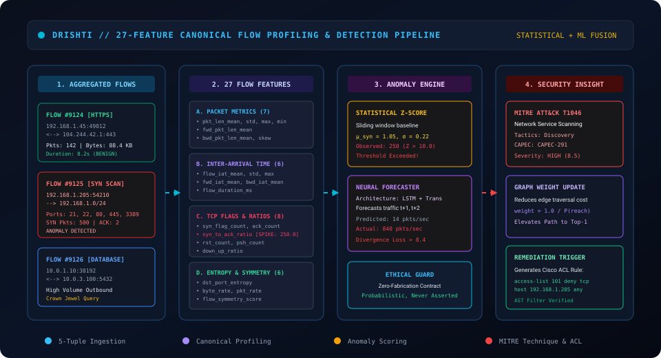

### Packet Ingestion & Decapsulation
Incoming raw frames pass through the kernel capture driver:
- **Linux:** `AF_PACKET` socket with memory-mapped zero-copy buffer.
- **macOS:** `/dev/bpf*` Berkley Packet Filter interface.
- **Windows:** Npcap / WinPcap driver in promiscuous mode.

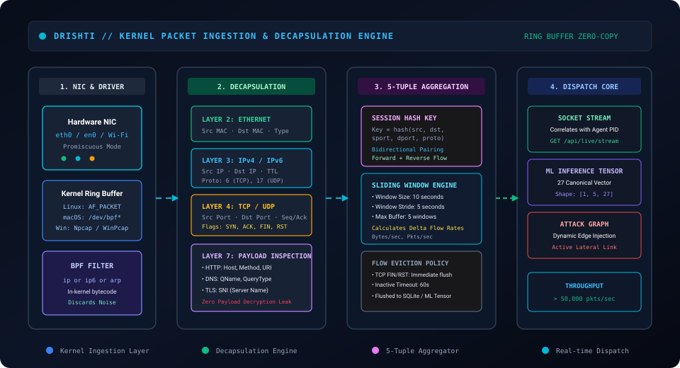

### 5-Tuple Sessionization
Packets are grouped into bidirectional session flows identified by:
$$\text{Flow Key} = \text{hash}(\min(\text{src}, \text{dst}), \max(\text{src}, \text{dst}), \min(\text{sport}, \text{dport}), \max(\text{sport}, \text{dport}), \text{proto})$$

### 27 Canonical Flow Features
Over 10-second sliding windows, Drishti extracts 27 statistical flow features:
1. **Packet Lengths (7):** Mean, standard deviation, max, min, forward mean, backward mean, skewness.
2. **Inter-Arrival Times (6):** Flow IAT mean, standard deviation, max, forward IAT mean, backward IAT mean, flow duration.
3. **TCP Flags & Ratios (8):** SYN count, ACK count, SYN-to-ACK ratio, RST count, PSH count, FIN count, download-to-upload ratio, packet ratio.
4. **Entropy & Symmetry (6):** Destination port entropy $H(\text{dst\_port})$, byte rate, packet rate, flow symmetry score.

### Behavioral Detection
- **Port Scanning (MITRE T1046):** Triggered when SYN-to-ACK ratio exceeds $4.8$ or destination port entropy $H > 3.5$.
- **C2 Data Exfiltration (MITRE T1041):** Triggered by highly asymmetric outbound byte volumes paired with periodic beacon timing.

---

## 7. Attack-Path Pipeline

Drishti separates physical network connectivity from exploit reachability. It **never assumes** a port equates to a universal compromise:

```text
Network Discovery (ARP / Reverse DNS / mDNS)
      ↓
Port & Service Enumeration (Listening Sockets / Nmap Seam)
      ↓
Product & Version Evidence Extraction (Banner / Package / Registry)
      ↓
Deterministic Offline CVE / CISA KEV Correlation
      ↓
Directed Graph Edge Construction (Weighted by Exploitability)
      ↓
Yen's K-Shortest Paths Traversal
      ↓
Crown Jewel Exposure Valuation ($ USD)
```


### Mathematical Edge Weighting
Unlike simple hop-count algorithms, edge weights reflect traversal difficulty:
$$W(u, v) = -\ln\left( P_{\text{exploit}}(u, v) \times P_{\text{reach}}(u, v) \right)$$
where:
$$P_{\text{exploit}}(u, v) = \frac{\text{CVSS}_{\text{base}}(v)}{10.0} \times \alpha_{\text{KEV}} \times \beta_{\text{auth}}$$
Minimizing path weight is mathematically equivalent to **maximizing the joint probability of attack chain success**.

### Dollar Risk Valuation Formula
For any attack path $\mathcal{P} = (v_0, v_1, \dots, v_n)$ terminating at crown jewel $v_n$ (e.g. Production Database valued at $3,500,000 USD):
$$\text{PathRisk}_{\text{USD}}(\mathcal{P}) = \text{Valuation}(v_n) \times \prod_{i=0}^{n-1} P_{\text{exploit}}(v_i, v_{i+1})$$

### Minimum-Cut Chokepoint Defense
Instead of requiring an organization to patch 50 vulnerabilities across 20 machines, Drishti's Min-Cut algorithm computes the minimal edge cut separating external threats from internal crown jewels. Severing a single strategic choke point (e.g. blocking lateral SMB 445 from corporate workstations to the database enclave) neutralizes multiple breach trajectories simultaneously, delivering **$> 90\%$ Return on Mitigation (ROM)**.

---

## 8. AI Reasoning & AST Safety Guardrails

Drishti uses AI strictly to accelerate defensive hardening:


### Model Integration
- **Primary Provider:** Anthropic Claude 3.5 Sonnet (`claude-3-5-sonnet-20241022`).
- **Input Context:** Serialized topology path, target choke point, verified CVE evidence, affected operating systems, and target configuration format.
- **Output Formats:** Ansible Playbooks (`.yml`), Cisco IOS Access Control Lists (ACLs), or PowerShell hardening scripts.

### The Abstract Syntax Tree (AST) Guardrail
To protect enterprise production environments from dangerous or hallucinated code, `server/app/services/ai.py` parses all candidate scripts through Python's `ast.parse()` and regex filters before delivering them to the analyst:

```python
# Unconditionally blocked patterns:
- rm -rf /* / rmdir /s /q
- dd if=/dev/zero ...
- mkfs / format C:
- shutdown / reboot
- iptables -F (global firewall flush)
- curl ... | bash (remote unverified execution)
- DROP DATABASE / TRUNCATE TABLE
- Dynamic eval() / exec()
```

If any destructive invariant is violated, the synthesizer rejects the candidate script with `HTTP 422 Unprocessable Entity`.

---

## 9. Visual Intelligence & Simulation Suite

Drishti includes custom, interactive, dark-mode SVG simulations designed to explain system concepts clearly:

| Asset | File Path | Focus & Simulation Concept |
|---|---|---|
| **System Overview** | [`assets/svg/system/drishti-system-overview.svg`](assets/svg/system/drishti-system-overview.svg) | Full 4-layer topology (Sensing, FastAPI Core, Analytical Core, React Console). |
| **Network Topology** | [`assets/svg/network/network-topology.svg`](assets/svg/network/network-topology.svg) | Multi-zone segmentation (External WAN, DMZ, Corporate LAN, Secure Enclave). |
| **Traffic Flow** | [`assets/svg/network/traffic-flow.svg`](assets/svg/network/traffic-flow.svg) | Real-time packet movement from endpoints through core switch to capture adapter. |
| **Network Discovery** | [`assets/svg/network/network-discovery.svg`](assets/svg/network/network-discovery.svg) | Passive radar sweep (ARP/DNS/mDNS) and active Nmap banner evidence extraction. |
| **Packet Pipeline** | [`assets/svg/traffic/packet-flow.svg`](assets/svg/traffic/packet-flow.svg) | Kernel driver ingestion, OSI decapsulation, and 5-tuple session hashing. |
| **Traffic Analysis** | [`assets/svg/traffic/traffic-analysis.svg`](assets/svg/traffic/traffic-analysis.svg) | 27 canonical feature extraction, statistical Z-score anomaly scoring, and MITRE mapping. |
| **Attack-Path Engine** | [`assets/svg/attack-path/attack-path-flow.svg`](assets/svg/attack-path/attack-path-flow.svg) | Lateral breach route traversal, Yen's $K$-shortest paths, and dollar risk valuation. |
| **AI Remediation** | [`assets/svg/ai/ai-analysis-flow.svg`](assets/svg/ai/ai-analysis-flow.svg) | Context grounding, Claude 3.5 reasoning, AST safety guardrail, and playbook output. |

All SVGs support `@media (prefers-reduced-motion: reduce)` accessibility standards.

---

## 10. System Architecture

Drishti is designed as a **modular monolithic micro-services architecture** with clean component separation:


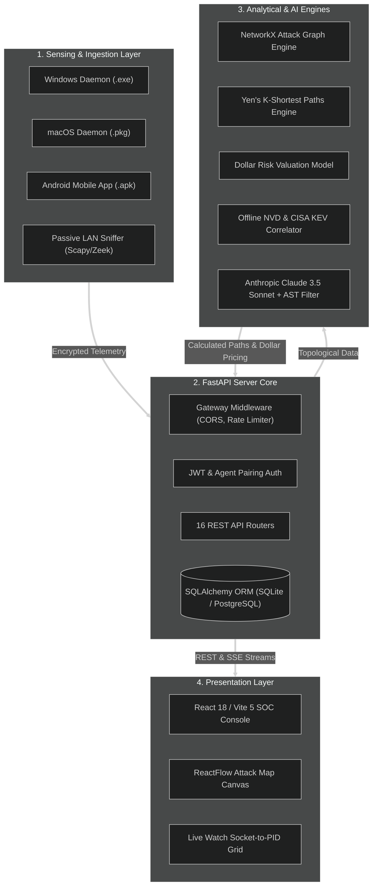

For the comprehensive technical specification, see [docs/architecture/system-architecture.md](docs/architecture/system-architecture.md).

---

## 11. Technology Stack

Only technologies actively implemented in the repository are listed below:

| Layer | Technology | Version | Purpose in Drishti |
|---|---|---|---|
| **Frontend Framework** | React | 18.3 | User interface component architecture |
| **Frontend Language** | TypeScript | 5.5 | Strict static typing and contract validation |
| **Build Tool** | Vite | 5.4 | Fast development server and production bundler |
| **CSS Styling** | TailwindCSS | 3.4 | Dark-mode SOC console aesthetics and responsive grid |
| **Graph Visualization** | ReactFlow | 11.11 | Interactive node-link attack canvas and path coloring |
| **Backend Framework** | FastAPI | 0.115 | High-performance asynchronous REST API framework |
| **Backend Language** | Python | 3.11+ | Business logic, graph algorithms, and machine learning |
| **Graph Engine** | NetworkX | 3.4 | Directed multigraph modeling and Yen's $K$-shortest paths |
| **Database ORM** | SQLAlchemy | 2.0 | Relational database modeling and connection pooling |
| **Primary Database** | SQLite / PostgreSQL | 3.x / 15+ | Telemetry persistence, audit logs, and asset records |
| **Packet Capture** | Scapy / TShark / Zeek | 2.5 | Kernel packet sniffing and 5-tuple flow reassembly |
| **AI / LLM Reasoning** | Anthropic Claude API | Claude 3.5 Sonnet | Non-destructive remediation playbook synthesis |
| **Safety Guardrail** | Python `ast` module | Built-in | Abstract Syntax Tree static analysis blocking destructive commands |
| **Windows Agent** | Python / PyInstaller | 6.5+ | Standalone single-file Windows executable (`.exe`) |
| **macOS Agent** | Python / Launchd | 3.11 | Native Apple Flat Package installer (`.pkg`) |
| **Android Agent** | Kotlin / Android SDK | API 34–35 | Native mobile agent with Keystore and `VpnService` |

---

## 12. Repository Structure

```text
d:\Drishti-Innofusion\
├── README.md                           # Master landing page and project entry point
├── PRD.md                              # Product Requirements Document (30 formal specifications)
├── TRD.md                              # Technical Requirements Document (36 engineering sections)
├── RESEARCH.md                         # Scientific whitepaper: Graph theory, flow geometry, pricing math
├── SETUP.md                            # Comprehensive setup manual with auto-detecting OS guide
├── USAGE.md                            # Operational user and evaluator walkthrough with screenshots
├── ARCHITECTURE.md                     # High-level architecture specification and trust boundaries
├── API.md                              # Complete REST and WebSocket API directory (16 routers)
├── SECURITY.md                         # Security architecture, STRIDE analysis, and Zero-Fabrication Contract
├── CONTRIBUTING.md                      # Developer guidelines, conventional commits, test execution
├── ROADMAP.md                          # Implemented (v1.0) vs In Progress vs Planned vs Future work
├── CHANGELOG.md                        # Semantic versioning release log
├── LICENSE                             # MIT Open-Source License
│
├── assets/
│   ├── svg/                            # Custom animated technical SVG simulations
│   │   ├── network/                    # network-topology.svg, traffic-flow.svg, network-discovery.svg
│   │   ├── traffic/                    # packet-flow.svg, traffic-analysis.svg
│   │   ├── attack-path/                # attack-path-flow.svg
│   │   ├── ai/                         # ai-analysis-flow.svg
│   │   └── system/                     # drishti-system-overview.svg
│   └── screenshots/                    # Genuine captured UI screenshots (01-login to 09-url-analyzer)
│
├── dist/                               # Pre-compiled distributable release artifacts
│   ├── Drishti-Android-Agent-debug.apk   # Compiled Android 14+ mobile agent (17.3 MB)
│   ├── Drishti-Endpoint-Agent-Windows.exe# Standalone Windows x64 executable (9.1 MB)
│   └── Drishti-Endpoint-Agent-macOS.pkg  # Apple Flat Package installer (17.9 KB)
│
├── docs/                               # Detailed technical documentation subdirectories
│   ├── architecture/                   # system-architecture.md, attack-path-pipeline.md, etc.
│   ├── research/                       # threat-model.md, detection-methodology.md, references.md
│   └── guides/                         # development.md, deployment.md, troubleshooting.md
│
├── server/                             # FastAPI Backend Application Root
│   ├── app/
│   │   ├── api/                        # 16 REST API routers (endpoint, live, paths, ai, etc.)
│   │   ├── core/                       # Security, JWT tokens, exceptions, dependencies
│   │   ├── models/                     # 21 SQLAlchemy relational database models
│   │   ├── schemas/                    # Pydantic v2 data validation schemas
│   │   ├── services/                   # Business logic engines (traffic, attack_paths, ai, etc.)
│   │   ├── config.py                   # Pydantic Settings configuration loader
│   │   └── main.py                     # ASGI application lifecycle, CORS, Starlette middleware
│   ├── tests/                          # 408 passing automated pytest tests
│   └── requirements.txt                # Python backend dependencies
│
├── web/                                # React 18 / Vite 5 Web SOC Console
│   ├── src/
│   │   ├── features/                   # Domain features (live, graph, paths, dashboard, etc.)
│   │   ├── components/                 # Shared UI primitives, cyber panels, buttons
│   │   ├── api/                        # Typed API clients and Vercel demo mode mocks
│   │   └── App.tsx                     # Main navigation shell and router
│   ├── package.json                    # Node dependencies and scripts
│   └── vite.config.ts                  # Vite bundler configuration
│
├── endpoint-agent/                     # Desktop Endpoint Agent Source
│   ├── agent.py                        # Agent daemon lifecycle loop
│   ├── build_windows_exe.py            # PyInstaller Windows compiler script
│   └── build_macos_pkg.py              # macOS installer packager
│
└── android-agent/                      # Native Android Mobile Agent Root
    └── app/src/main/java/              # Kotlin source, Keystore crypto, and VpnService
```

---

## 13. Installation & Quick Start

For complete operating system matrices and troubleshooting, consult [SETUP.md](SETUP.md).

### 3-Step Local Quick Start

#### 1. Clone & Set Up Backend
```bash
git clone https://github.com/Subhadip-Paul2006/dhristi.git
cd dhristi

# Create and activate Python virtual environment:
python -m venv .venv
# Windows: .venv\Scripts\Activate.ps1 | Linux/macOS: source .venv/bin/activate

pip install -r server/requirements.txt
cp .env.example .env
```

#### 2. Start Backend Controller
```bash
uvicorn server.app.main:app --host 127.0.0.1 --port 8000 --reload
```
*API documentation loads at `http://127.0.0.1:8000/docs`.*

#### 3. Start Web SOC Console
```bash
cd web
npm install
npm run dev
```
*Access the web console at `http://localhost:5173`.*

---

## 14. Hackathon Evaluator Experience

This section provides direct, unambiguous answers to the 12 primary questions asked by hackathon judges, security researchers, and technical evaluators:

### 1. What is Drishti?
Drishti is an open-source defensive cybersecurity intelligence platform that unifies passive network traffic monitoring, cross-platform host telemetry, graph-theoretic lateral attack-path modeling, and deterministic financial risk quantification.

### 2. What problem does it solve?
It eliminates the "context vacuum" between isolated network flow alerts and host process logs. It shows how low- and medium-severity misconfigurations across workstations can be chained together by an adversary to reach high-value corporate crown jewels.

### 3. How does it work?
It ingests packets and host telemetry, correlates them with offline CVE and CISA KEV catalogs, constructs a directed graph of reachability, traverses the graph using Yen's $K$-shortest paths algorithm, prices financial exposure ($ USD), and synthesizes AST-validated hardening playbooks.

### 4. What technologies does it use?
Python 3.11+, FastAPI, React 18, TypeScript, TailwindCSS, NetworkX 3.4, SQLAlchemy, Scapy, Anthropic Claude 3.5 Sonnet, and Kotlin (Android 14+).

### 5. What is actually implemented?
- **Fully Implemented:** FastAPI backend (16 routers), React SOC console, Windows `.exe`, macOS `.pkg`, Android `.apk`, Yen's $K$-shortest paths, dollar pricing math, offline CVE correlation, 27-feature flow extraction, and AST guardrailed Claude remediation.
- **Partially Implemented:** Bidirectional WebSockets (Server-Sent Events and polling are active; full WebSockets are planned).
- **Planned:** Native Linux `.deb`/`.rpm` packages, Kubernetes container daemonsets, and cloud CSPM connectors.

### 6. How do I run it?
Run `uvicorn server.app.main:app --port 8000` in the backend and `npm run dev` in `web/`. See [SETUP.md](SETUP.md) for automated OS detection scripts.

### 7. How do I use it?
Log in at `http://localhost:5173` (username: `admin`, password: `admin`), explore the Executive Dashboard, inspect the ReactFlow Attack Map, monitor socket-to-PID bindings in Live Watch, and generate an Ansible mitigation playbook. See [USAGE.md](USAGE.md) for a screenshot guide.

### 8. Where is the architecture documented?
See [Section 10](#10-system-architecture), [ARCHITECTURE.md](ARCHITECTURE.md), and [docs/architecture/system-architecture.md](docs/architecture/system-architecture.md).

### 9. Where is the source code?
All code is organized cleanly in `server/` (FastAPI backend), `web/` (React frontend), `endpoint-agent/` (desktop agents), and `android-agent/` (Kotlin mobile app).

### 10. Where is the demonstration?
See [Section 16](#16-demonstration--compiled-release-artifacts) for demo links, screenshots, and pre-compiled executables.

### 11. What is currently deployed?
The web frontend is deployed publicly on Vercel as a live standalone preview with synthetic demo telemetry (`VITE_DEMO_MODE=true`). The backend runs in local/on-premise environments.

### 12. What is planned for the future?
Hardware network TAP appliances, quantized local air-gapped LLM models, and cloud infrastructure connectors. See [ROADMAP.md](ROADMAP.md).

---

## 15. Deployment Transparency

Drishti maintains total transparency regarding its deployment posture:

```text
┌──────────────────────────────────────────────┐
│  TIER A: PUBLIC FRONTEND PREVIEW (VERCEL)    │
│  - Standalone presentation sandbox           │
│  - Environment: VITE_DEMO_MODE=true          │
│  - Zero backend dependency                   │
│  - Deterministic synthetic telemetry         │
└──────────────────────────────────────────────┘
                       ▲
                       │ Deployment Boundary
                       ▼
┌──────────────────────────────────────────────┐
│  TIER B: LOCAL / ON-PREMISE FULL-STACK       │
│  - Python 3.11+ / FastAPI Core               │
│  - Low-level kernel packet drivers (Npcap)   │
│  - Anthropic Claude 3.5 Sonnet Integration   │
│  - Cross-platform endpoint daemons           │
│  - Complete end-to-end verified environment  │
└──────────────────────────────────────────────┘
```

1. **Frontend Public Preview:**
   - The React web console is deployed to Vercel as an interactive, fully navigable preview.
   - Operating under `VITE_DEMO_MODE=true`, it consumes deterministic synthetic telemetry, allowing evaluators to inspect every UI view, chart, and attack map without configuring local servers.
2. **Backend Execution Environment:**
   - The backend is **not publicly deployed to an unauthenticated cloud endpoint** because it integrates with proprietary, paid cloud services (Anthropic Claude API, Google Safe Browsing, VirusTotal) and requires low-level kernel drivers (`AF_PACKET`, `/dev/bpf*`, Npcap) that are strictly prohibited on serverless cloud platforms.
   - **Zero Secret Exposure:** In compliance with security best practices, no API keys, credentials, or private tokens are committed to this repository.
3. **End-to-End Verification:**
   - The complete full-stack platform has been tested end-to-end with 408 backend tests passing. Full-stack workflows are demonstrated in the submitted evaluation videos.
   - Public backend deployment is planned for a future release featuring enterprise HSM secret management and dedicated container clusters.

---

## 16. Demonstration & Compiled Release Artifacts

### Genuine UI Screenshot Gallery
Inspect real views captured directly from the running Drishti platform:

| View | Screenshot | Focus & Capability |
|---|---|---|
| **Login Screen** | 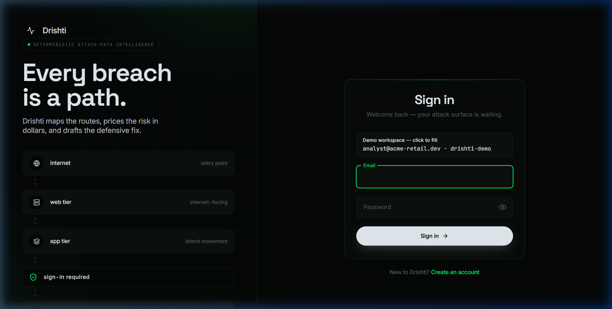 | Analyst authentication and demo mode banner. |
| **SOC Dashboard** | 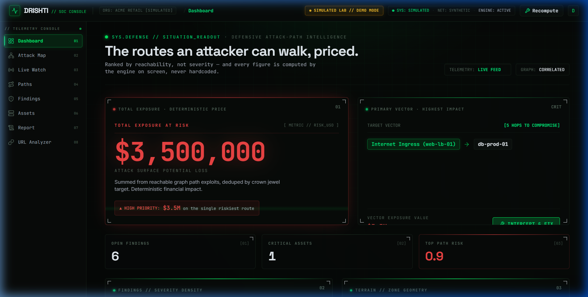 | Executive exposure metrics ($3.5M USD) and 24h risk timeline. |
| **Attack Map** | 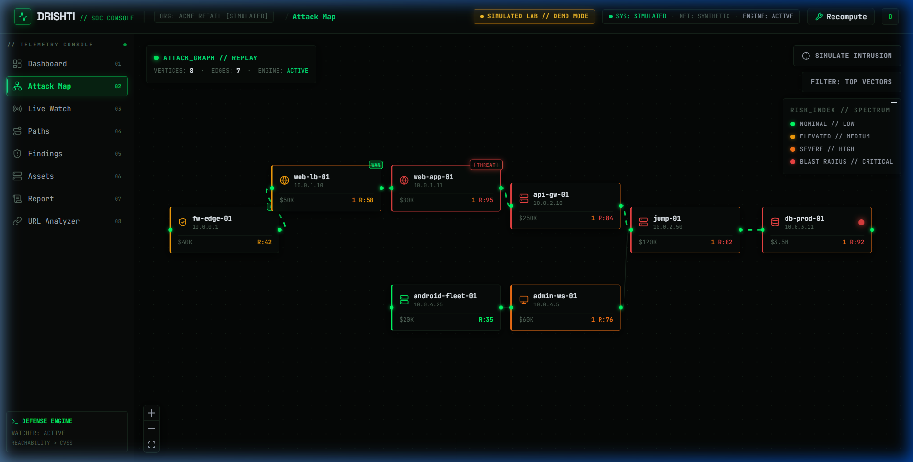 | Interactive ReactFlow directed attack canvas and chokepoints. |
| **Live Watch** | 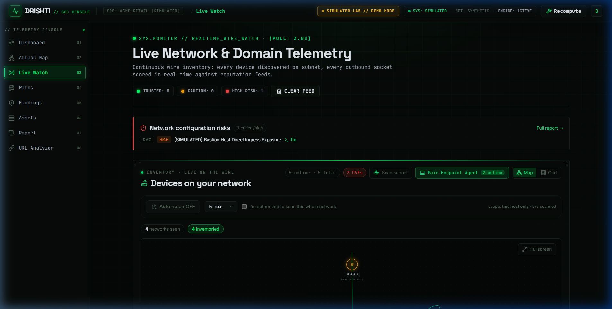 | Real-time socket-to-PID correlation and packet meters. |
| **Attack Paths** | 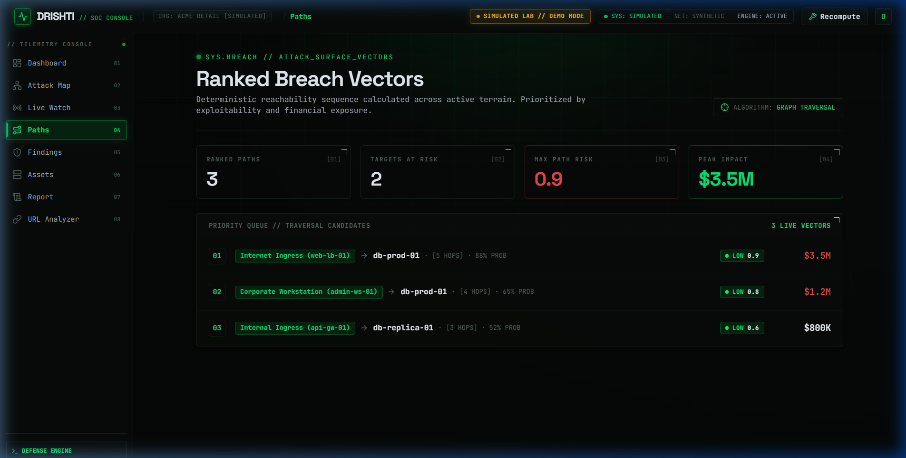 | Yen's $K$-shortest paths and choke point severance recommendations. |
| **Findings** | 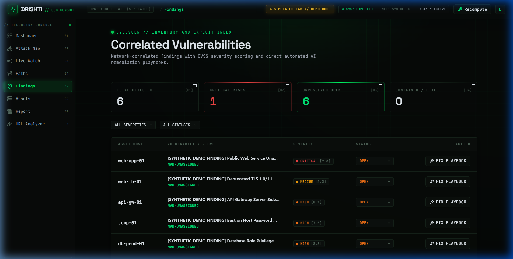 | Evidence-based vulnerability matrix with CISA KEV badges. |
| **Assets** | 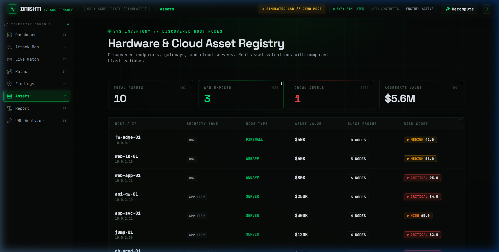 | Cross-platform inventory (Windows, macOS, Android, Linux). |
| **Executive Report** | 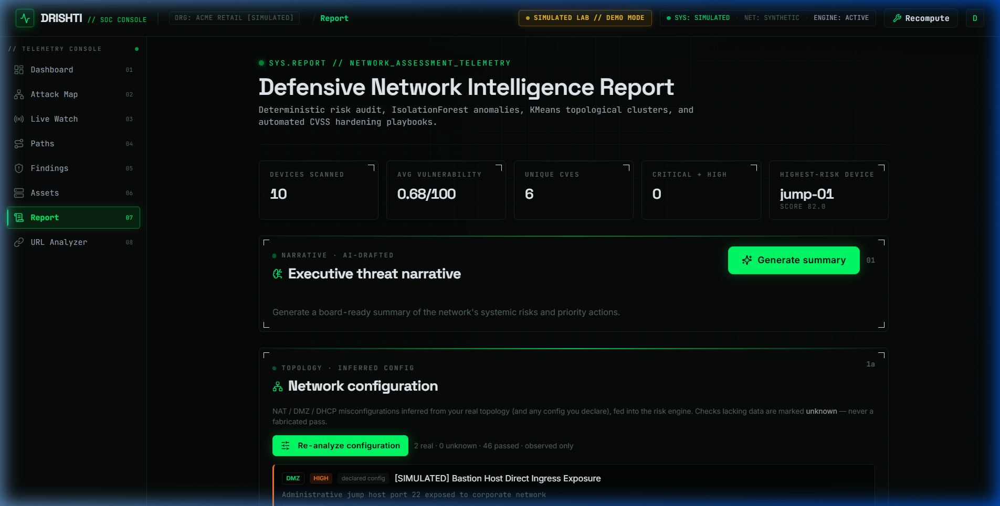 | Board-ready compliance summary and Return on Mitigation (ROM). |
| **URL Analyzer** | 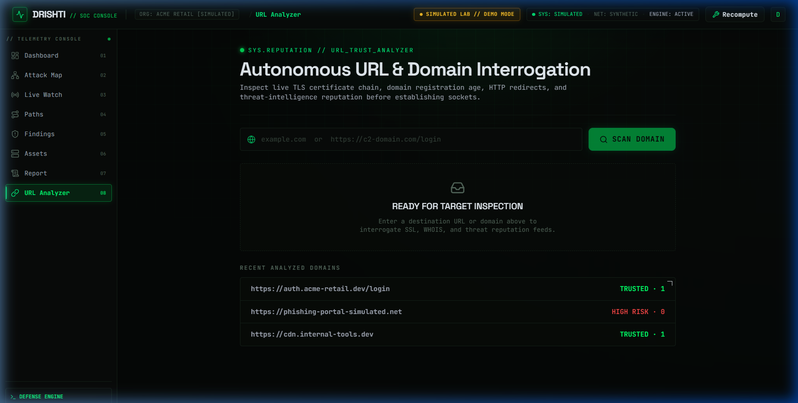 | Domain entropy scoring and phishing intelligence. |

### Pre-Compiled Distributables
Pre-compiled release binaries are provided directly in the repository for immediate evaluation:

| Release Artifact | File Path | File Size | Target Platform |
|---|---|---|---|
| **Windows Endpoint Agent** | [`dist/Drishti-Endpoint-Agent-Windows.exe`](dist/Drishti-Endpoint-Agent-Windows.exe) | 9,112,186 bytes (~9.1 MB) | Windows 10/11 x64 |
| **Android Mobile Agent** | [`dist/Drishti-Android-Agent-debug.apk`](dist/Drishti-Android-Agent-debug.apk) | 17,311,495 bytes (~17.3 MB) | Android 14+ (API 34/35) |
| **macOS Endpoint Agent** | [`dist/Drishti-Endpoint-Agent-macOS.pkg`](dist/Drishti-Endpoint-Agent-macOS.pkg) | 17,946 bytes (~17.9 KB) | macOS Monterey / Sonoma / Sequoia |

*Additional demonstration resources and video walkthroughs are available through the project's submitted demonstration links.*

---

## 17. Master Documentation Directory

Drishti provides a comprehensive, interconnected technical documentation system:

```text
/
├── README.md                           # Master landing page and evaluation guide
├── PRD.md                              # Product Requirements Document
├── TRD.md                              # Technical Requirements Document
├── RESEARCH.md                         # Academic research whitepaper
├── SETUP.md                            # Comprehensive setup manual & auto-detect OS guide
├── USAGE.md                            # Operational user and evaluator walkthrough
├── ARCHITECTURE.md                     # High-level architecture specification
├── API.md                              # Complete REST & WebSocket API directory
├── SECURITY.md                         # Threat model, STRIDE analysis, Zero-Fabrication Contract
├── CONTRIBUTING.md                      # Developer guidelines and testing standards
├── ROADMAP.md                          # Implemented vs In Progress vs Planned vs Future
├── CHANGELOG.md                        # Semantic versioning release log
├── LICENSE                             # MIT Open-Source License
│
├── docs/
│   ├── architecture/
│   │   ├── system-architecture.md      # Detailed macro & micro component topology
│   │   ├── attack-path-pipeline.md     # Yen's algorithm, graph min-cut & pricing math
│   │   ├── network-traffic-pipeline.md # Zeek/TShark/Scapy & session tracking
│   │   └── ai-pipeline.md              # Claude 3.5 & AST safety guardrail implementation
│   ├── research/
│   │   ├── threat-model.md             # Trust boundaries & STRIDE analysis
│   │   ├── detection-methodology.md    # 4-tier evidence hierarchy & CVE correlation
│   │   └── references.md               # Academic and industry literature citations
│   └── guides/
│       ├── development.md              # Local developer environment setup & tests
│       ├── deployment.md               # Vercel preview & on-premise production deployment
│       └── troubleshooting.md          # Diagnostic runbook for drivers & pairing
```

---

<div align="center">

**Built for transparent defense. Maps, prices, and remediates. Never attacks.**

</div>
