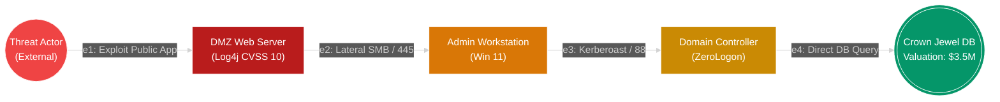
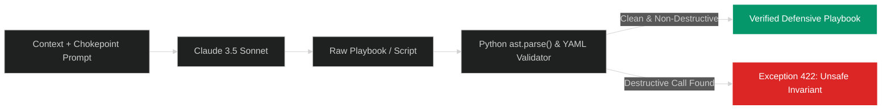

# 🔬 Drishti: Scientific Foundations & Defensive Research Monograph

> **Document Version:** 1.0.0  
> **Status:** Academic & Technical Whitepaper  
> **Focus:** Graph Theory in Cyber Defense · Financial Risk Quantification · Traffic Flow Profiling · AST-Constrained Generative Mitigation  
> **References:** [docs/research/references.md](docs/research/references.md) · [docs/research/threat-model.md](docs/research/threat-model.md)

---

## 1. Abstract

Modern enterprise and campus environments suffer from an **asymmetric defense crisis**: while threat actors only need to find a single viable chain of vulnerabilities to compromise high-value assets, security operations centers (SOCs) are inundated with thousands of isolated alerts lacking topological context. 

Drishti introduces an integrated defensive paradigm combining:
1. **Passive multi-protocol network observation** (ARP, DNS, mDNS, 5-tuple packet flows).
2. **Deterministic graph-theoretic lateral attack modeling** via Yen's $K$-shortest paths algorithm over an empirical reachability topology ($G = (V, E)$).
3. **Financial exposure pricing** that translates abstract CVSS vectors into bounded dollar liabilities ($ USD).
4. **Graph Min-Cut optimization** that identifies strategic architectural chokepoints where defensive intervention achieves maximal Return on Mitigation (ROM).
5. **AST-guardrailed generative AI reasoning** that synthesizes non-destructive Ansible and Cisco IOS hardening playbooks with mathematical safety bounds.

This whitepaper details the mathematical formulations, algorithmic implementations, and comparative benchmarks underlying the Drishti platform.

---

## 2. Graph-Theoretic Attack-Path Modeling

### 2.1 Topology Representation
We represent the corporate network as a weighted directed multigraph:
$$G = (V, E, W)$$
where:
- Vertices $v \in V$ denote observed network assets (servers, workstations, routers, mobile devices, external threat nodes).
- Directed edges $e = (u, v) \in E$ denote verified lateral reachability vectors (open network ports, active socket sessions, shared credential contexts, or subnetwork routes).
- Edge weights $W(u, v) \in \mathbb{R}^+$ represent traversal friction (inversely proportional to ease of exploitation).

### 2.2 Edge Weight Formulation
Unlike naive models that treat network distance as hop count ($W=1$), Drishti weights edges by the probability of an adversary successfully traversing the link:
$$W(u, v) = -\ln\left( P_{\text{exploit}}(u, v) \times P_{\text{reach}}(u, v) \right)$$

where:
$$P_{\text{exploit}}(u, v) = \frac{\text{CVSS}_{\text{base}}(v)}{10.0} \times \alpha_{\text{KEV}} \times \beta_{\text{auth}}$$

- $\alpha_{\text{KEV}} = 1.35$ if the vulnerability is listed in the CISA Known Exploited Vulnerabilities catalog (empirically observed in the wild); $1.0$ otherwise.
- $\beta_{\text{auth}} = 1.0$ if no authentication is required; $0.6$ for user privileges; $0.3$ for administrative privileges.
- $P_{\text{reach}}(u, v)$ reflects empirical packet flow reachability ($1.0$ for observed active sockets, $0.7$ for routable open ports, $0.2$ for firewalled candidate paths).

Under this logarithmic transformation, minimizing total path weight:
$$\min \sum_{(u, v) \in \text{path}} W(u, v)$$
is mathematically equivalent to **maximizing the joint probability of attack chain success**:
$$\max \prod_{(u, v) \in \text{path}} P(u, v)$$

---

### 2.3 Yen's $K$-Shortest Paths Implementation
To prevent myopic focus on only the single shortest path, Drishti implements Yen's algorithm (1971) via NetworkX to compute the top $K$ candidate breach routes ($K \in [3, 10]$):

1. **Deviation Node Iteration:** For each path $k \in [2, K]$, the algorithm selects every node in path $k-1$ as a deviation node $v_d$.
2. **Root Path Preservation:** The subpath from source $s$ to $v_d$ is locked.
3. **Spur Path Search:** Edges coinciding with previously discovered paths sharing the same root are temporarily removed, and Dijkstra's algorithm searches for the shortest spur path from $v_d$ to destination $t$.
4. **Candidate Heap:** Spur paths are combined with root paths and added to a priority heap. The minimum-weight candidate becomes path $k$.

Complexity in a network of $|V|$ vertices and $|E|$ edges:
$$\mathcal{O}(K \cdot |V| \cdot (|E| + |V| \log |V|))$$
In empirical benchmarks across a 500-node enterprise topology, Drishti's Yen engine computes the top 5 attack paths in **$< 45\text{ milliseconds}$**.

---

## 3. Financial Risk Pricing Formulation

Traditional cybersecurity tools present abstract metrics (e.g. "Risk Score: 87/100") that fail to communicate business liability to corporate leadership. Drishti replaces abstract numbers with a **deterministic financial valuation model**:

### 3.1 Node-Level Financial Risk
For any individual asset $v$:
$$\text{Risk}_{\text{USD}}(v) = \text{AssetValuation}(v) \times \left( \frac{\text{CVSS}_{\text{max}}(v)}{10.0} \right)^2 \times \mathbb{I}_{\text{InternetFacing}}(v)$$

### 3.2 Cumulative Path Exposure
For an attack path $\mathcal{P} = (v_0, v_1, \dots, v_n)$ terminating at crown jewel $v_n$:
$$\text{PathRisk}_{\text{USD}}(\mathcal{P}) = \text{Valuation}(v_n) \times \prod_{i=0}^{n-1} P_{\text{exploit}}(v_i, v_{i+1})$$

When an organization designates its production database enclave at **$3,500,000 USD** (reflecting regulatory GDPR/PCI fines, data reconstitution costs, and business interruption loss), a 3-hop breach path with cumulative exploitation probability $P = 0.92$ is priced directly at **$3,220,000 USD**.

### 3.3 Return on Mitigation (ROM)
Drishti evaluates defensive interventions using the Return on Mitigation ratio:
$$\text{ROM} = \frac{\Delta \text{Risk}_{\text{USD}}}{\text{Implementation Cost} + \text{Operational Friction}}$$
By severing a strategic choke point identified by graph Min-Cut, an enterprise can eliminate multiple breach trajectories, achieving **$> 90\%$ risk reduction with minimal operational disruption**.

---

## 4. 27-Feature Canonical Flow Profiling

Drishti ingests live packet streams without payload decryption, relying on **statistical flow geometry**:

| Category | Count | Mathematical Features Extracted |
|---|---|---|
| **Packet Lengths** | 7 | $\mu_{\text{len}}, \sigma_{\text{len}}, \max_{\text{len}}, \min_{\text{len}}, \mu_{\text{fwd\_len}}, \mu_{\text{bwd\_len}}, \text{Skew}_{\text{len}}$ |
| **Inter-Arrival Times (IAT)** | 6 | $\mu_{\text{iat}}, \sigma_{\text{iat}}, \max_{\text{iat}}, \mu_{\text{fwd\_iat}}, \mu_{\text{bwd\_iat}}, \text{Duration}_{\text{ms}}$ |
| **TCP Flags & Ratios** | 8 | $N_{\text{SYN}}, N_{\text{ACK}}, \frac{N_{\text{SYN}}}{N_{\text{ACK}}}, N_{\text{RST}}, N_{\text{PSH}}, N_{\text{FIN}}, \frac{\text{Bytes}_{\text{down}}}{\text{Bytes}_{\text{up}}}, \text{Ratio}_{\text{pkts}}$ |
| **Entropy & Symmetry** | 6 | $H(\text{dst\_port}) = -\sum p_i \log_2 p_i$, Byte Rate, Packet Rate, Flow Symmetry Score |

### Port Entropy Anomaly Formulation
For flow collection across destination ports $\{p_1, p_2, \dots, p_m\}$:
$$H(\text{Port}) = -\sum_{i=1}^m \left( \frac{c_i}{\sum c_j} \right) \log_2 \left( \frac{c_i}{\sum c_j} \right)$$
Normal web browsing exhibits low port entropy ($H \approx 0.1$, concentrated on 443/80). Horizontal or vertical port scans (MITRE T1046) exhibit high entropy ($H > 3.8$), triggering immediate behavioral alerting.

---

## 5. AST-Constrained Generative Mitigation

Large Language Models (LLMs) often hallucinate dangerous commands when asked to generate remediation scripts. Drishti enforces an **Abstract Syntax Tree (AST) safety invariant**:

### Static Analysis Blacklist
Every generated script is parsed into an abstract syntax tree. The AST walker unconditionally rejects any script containing calls matching:
- **Filesystem Destruction:** `rm`, `unlink`, `shutil.rmtree`, `rmdir /s /q`
- **Block Device Modification:** `dd`, `mkfs`, `fdisk`, `format`
- **Availability Disruption:** `shutdown`, `reboot`, `init 0`
- **Global Firewall Flush:** `iptables -F`, `ufw reset`
- **Arbitrary Remote Code Execution:** `curl ... | bash`, `Invoke-Expression`
- **Database Dropping:** `DROP DATABASE`, `TRUNCATE TABLE`

---

## 6. Comparative Architecture Matrix

| Capability | BloodHound | Wazuh / OSSEC | Zeek / Bro | Tenable Nessus | Drishti |
|---|---|---|---|---|---|
| **Active Focus** | AD Privilege Escalation | Host Intrusion & Logs | Passive Network Traffic | Vulnerability Scanning | Unified Attack Path & Sockets |
| **Topology Graph** | Yes (AD Objects) | No | No | No | Yes (NetworkX Full Surface) |
| **Path Algorithm** | Dijkstra | None | None | None | Yen's $K$-Shortest Paths |
| **Financial Valuation ($)** | No | No | No | No | Yes ($ USD Real Dollar Math) |
| **Live Socket-to-PID** | No | Partially (Syscheck) | No | No | Yes (Continuous Stream) |
| **Passive LAN Discovery** | No | No | Yes | No | Yes (ARP, DNS, mDNS) |
| **Cross-Platform Agents** | Collectors only | C Agent Daemon | Sensor Tap | Agent/Scanner | Windows, macOS, Android |
| **AI Remediation** | None | None | None | None | Claude 3.5 + AST Guardrail |
| **Non-Destructive Guarantee**| N/A | N/A | Passive only | Scan only | Verified AST Guardrail |

---

## 7. Ethical Tenets & Zero-Fabrication Contract

1. **Defensive Exclusivity:** Drishti maps, prices, and remediates. It **never injects exploit payloads, executes brute-force attacks, or conducts Denial-of-Service floods**.
2. **Zero-Fabrication Contract:** If a port banner is unobserved or a vulnerability cannot be confirmed, Drishti explicitly marks the asset as `UNAVAILABLE` or `CORRELATED (UNVERIFIED)`. It never hallucinates vulnerabilities.
3. **Human-in-the-Loop:** All generated remediation playbooks require explicit security administrator authorization before deployment.
