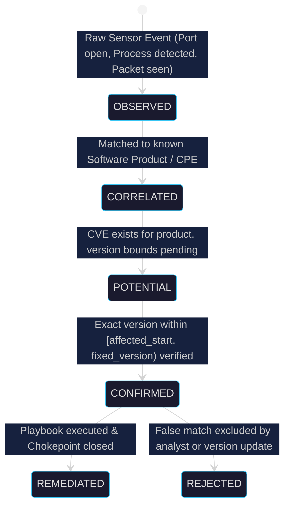
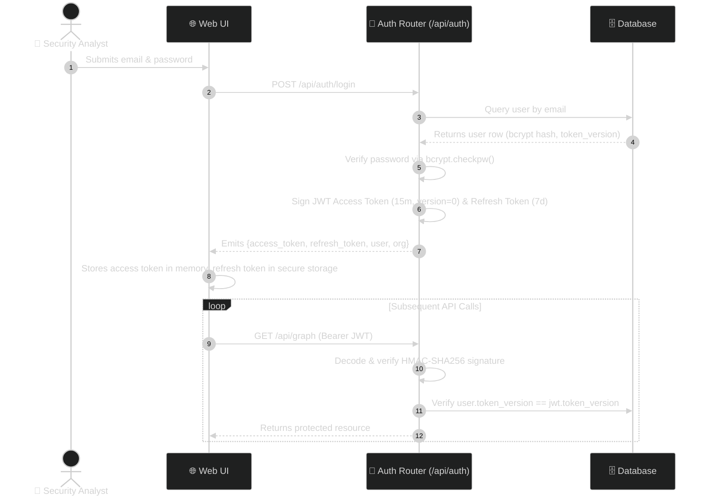

# 🛡️ Drishti: Security Architecture, Threat Model & Zero-Fabrication Contract

> **Document Version:** 1.0.0  
> **Target Release:** Drishti Enterprise v1.0 / Hackathon Championship Edition  
> **Status:** Approved & Active  
> **Security Mandate:** *Defensive only. Maps, prices, and remediates. Never attacks.*  
> **Zero-Fabrication Clause:** *Every claim must retain a deterministic evidence trace. No hallucinations.*

---

## 1. Security Philosophy & Non-Negotiable Tenets

Drishti is designed from the ground up for deployment in high-security, regulated enterprise and defense environments. The platform is governed by five absolute security invariants:

1. **Strictly Defensive (Non-Invasive):** Drishti discovers, models, prices, and remediates. It **never injects exploit payloads, executes brute-force attacks, conducts denial-of-service floods, or alters network configurations without explicit human authorization**.
2. **The Zero-Fabrication Contract:** Security analysts make mission-critical financial and operational decisions based on Drishti. Hallucinating a CVE, fabricating an active process, or guessing an open port is catastrophic. If data is unobserved, Drishti explicitly labels it `UNAVAILABLE`.
3. **Four-Tier Evidence Hierarchy:** Telemetry progresses through four distinct evidentiary gates:
   $$\text{OBSERVED} \;\longrightarrow\; \text{CORRELATED} \;\longrightarrow\; \text{POTENTIAL} \;\longrightarrow\; \text{CONFIRMED}$$
   The UI preserves these distinctions and never presents a correlated product as a confirmed active vulnerability.
4. **Least-Privilege Endpoint Observation:** The endpoint agent operates strictly in read-only user space where possible, querying public OS process lists, network tables, and installed registry/application folders. It requires no dangerous kernel-level drivers.
5. **Zero Client-Side Secret Exposure:** No API keys, Telegram bot tokens, database credentials, or long-lived private keys are ever shipped in client JavaScript bundles or the browser extension.



---

## 2. Threat Modeling & STRIDE Analysis

A comprehensive STRIDE threat model was conducted across all system interfaces:

```mermaid
%%{init: {'theme': 'dark'}}%%
flowchart TB
    subgraph ZONE_UNTRUSTED ["Zone 0: Untrusted External Environment"]
        ATTACKER["External Threat Actor / Attacker"]
        MAL_URL["Malicious / Phishing Domains"]
    end

    subgraph ZONE_ENDPOINT ["Zone 1: Corporate Workstations & Edge"]
        WORKSTATION["Endpoint Host (macOS / Windows)"]
        AGENT["Drishti Endpoint Agent Daemon"]
        EXTENSION["Drishti Chrome Guard MV3"]
        WORKSTATION --- AGENT & EXTENSION
    end

    subgraph ZONE_DMZ ["Zone 2: Ingress & Server Gateway"]
        GATEWAY["Reverse Proxy / Starlette Middleware<br/>[CORS, Rate Limiting, 50MB Cap]"]
        AUTH_SVC["Auth & Token Service<br/>[JWT, bcrypt, Version Revocation]"]
        GATEWAY --- AUTH_SVC
    end

    subgraph ZONE_CORE ["Zone 3: Core Micro-Services & Datastores"]
        SERVICES["Drishti Domain Engines<br/>(Risk, AI, Traffic, Scanner)"]
        DATABASE[("SQL Datastore & Vuln Cache<br/>[Encrypted at Rest, Tenant Scoped]")]
        SERVICES --- DATABASE
    end

    subgraph ZONE_EXTERNAL ["Zone 4: External Trusted SaaS"]
        TELEGRAM["Telegram Bot API"]
        NVD_API["NVD / CISA KEV Feeds"]
    end

    ATTACKER -.->|STRIDE: Spoofing / Tampering / DoS| GATEWAY
    MAL_URL -.->|STRIDE: Info Disclosure| EXTENSION
    AGENT ==>|HTTPS + Token (STRIDE: Replay, Tamper)| GATEWAY
    EXTENSION ==>|HTTPS + Token (STRIDE: Intercept)| GATEWAY
    GATEWAY ==>|Internal Protected Pipe| SERVICES
    SERVICES -.->|Outbound HTTPS| TELEGRAM
    SERVICES -.->|Outbound HTTPS| NVD_API

    classDef unStyle fill:#e94560,stroke:#fff,color:#fff;
    classDef epStyle fill:#16213e,stroke:#38c6f4,color:#fff;
    classDef gwStyle fill:#0f3460,stroke:#f4d03f,color:#fff;
    classDef corStyle fill:#1a1a2e,stroke:#00ffcc,color:#fff;
    classDef extStyle fill:#2c1b4d,stroke:#fff,color:#fff;

    class ATTACKER,MAL_URL unStyle;
    class WORKSTATION,AGENT,EXTENSION epStyle;
    class GATEWAY,AUTH_SVC gwStyle;
    class SERVICES,DATABASE corStyle;
    class TELEGRAM,NVD_API extStyle;
```

### STRIDE Mitigation Matrix

| Threat Category | Threat Scenario | System Component | Drishti Technical Countermeasure / Mitigation |
|---|---|---|---|
| **Spoofing** | Rogue agent submits fabricated telemetry to pollute the attack graph. | `/api/endpoint/telemetry` | Cryptographic OTP pairing handshake; agent tokens issued via `secrets.token_urlsafe(32)`; token hashed at rest; MAC/GUID hardware verification. |
| **Spoofing** | Unauthorized user accesses administrative console. | `/api/auth/login` | Passwords hashed using `bcrypt` (12 rounds); JWT access tokens signed with HMAC-SHA256; role-based access control (RBAC). |
| **Tampering** | Man-in-the-middle adversary modifies telemetry in transit. | Edge-to-Server Gateway | Strict TLS 1.3 encryption enforced in transit; CORS header strict origin whitelisting; JSON payload validation via strict Pydantic schemas. |
| **Repudiation** | Operator denies executing an aggressive network scan or modifying an ACL. | Administrative API | Immutable `audit_logs` table recording `user_id`, `org_id`, 8-character `request_id`, client IP, exact action, and timestamp. |
| **Information Disclosure** | Leakage of corporate device names, open ports, or CVE details. | Multi-tenant Database | Strict organizational tenant isolation enforced at the SQL query level (`WHERE org_id = :org_id`); zero cross-organization leakage. |
| **Information Disclosure** | Chrome extension exposes browsing history or credentials. | Chrome Extension MV3 | Extension is restricted to active tab URL/domain metadata only; prohibited from reading cookies, DOM, passwords, forms, or keystrokes. |
| **Denial of Service** | Malicious agent floods backend with massive telemetry JSON payloads. | Server Gateway | Starlette `MaxBodySizeMiddleware` terminates requests $> 50\text{ MB}$; in-memory bounded ring buffers prevent memory exhaustion. |
| **Elevation of Privilege** | Endpoint agent exploits system vulnerabilities to obtain root/SYSTEM. | Endpoint Agent Daemon | Agent runs with standard user-level permissions; POSIX `sysctl` and Win32 process enumeration require no administrative elevation. |

---

## 3. Authentication & Authorization Architecture

### 3.1 Token Lifecycle & Cryptographic Specifications
- **Access Tokens:** Signed JWT containing `sub` (User UUID), `org_id`, `role`, and `token_version`. Valid for **15 minutes**.
- **Refresh Tokens:** High-entropy cryptographic tokens stored with 7-day expiration. Rotating refresh token strategy invalidates old tokens upon renewal.
- **Immediate Global Revocation:** Incrementing a user’s `token_version` in the database immediately invalidates all active access and refresh tokens globally without waiting for expiration.



### 3.2 Role-Based Access Control (RBAC)
Drishti enforces three granular privilege tiers:

```
┌─────────────────────────────────────────────────────────────┐
│                      ROLE PRIVILEGE MATRIX                  │
├──────────────────────┬─────────────┬───────────┬────────────┤
│ Capability           │ Admin       │ Analyst   │ Viewer     │
├──────────────────────┼─────────────┼───────────┼────────────┤
│ View Attack Graph    │ Full        │ Full      │ Read-Only  │
│ View Live Telemetry  │ Full        │ Full      │ Read-Only  │
│ Pair Endpoint Agent  │ Yes         │ Yes       │ No         │
│ Trigger DeepScan     │ Yes         │ Yes       │ No         │
│ Generate Playbooks   │ Yes         │ Yes       │ No         │
│ Apply Remediations   │ Yes         │ No        │ No         │
│ Manage Users & Orgs  │ Yes         │ No        │ No         │
└──────────────────────┴─────────────┴───────────┴────────────┘
```

---

## 4. Endpoint Agent Cryptographic Pairing Protocol

To prevent rogue devices or unauthorized endpoints from connecting to an enterprise tenant, Drishti utilizes an out-of-band one-time pairing protocol:

```mermaid
%%{init: {'theme': 'dark'}}%%
sequenceDiagram
    autonumber
    participant Agent as 💻 Local Endpoint Agent
    actor Admin as 👤 SOC Administrator
    participant Dashboard as 🌐 Drishti Console
    participant Server as 🖥️ Server API
    participant DB as 🗄️ Database

    Agent->>Server: POST /api/endpoint/pairing/request {device_id, hostname, os}
    Server->>Server: Generate high-entropy 6-char OTP: "AB7X-92KF" (TTL: 300s)
    Server->>DB: Store pairing record (hashed OTP, device_id, expires_at)
    Server-->>Agent: Returns {pairing_code: "AB7X-92KF", expires_in: 300}
    Agent->>Agent: Prints pairing code on local workstation console

    Admin->>Dashboard: Views physical agent screen or receives code via trusted channel
    Admin->>Dashboard: Enters "AB7X-92KF" and selects target device
    Dashboard->>Server: POST /api/endpoint/pairing/claim {code: "AB7X-92KF", device_id}
    Server->>DB: Validates unexpired code, marks claimed=true
    Server-->>Dashboard: Pairing successfully claimed

    Agent->>Server: POST /api/endpoint/pairing/confirm {device_id}
    Server->>Server: Generate cryptographically secure Agent Bearer Token (256-bit)
    Server->>DB: Store agent_token_hash; set agent.is_active = true
    Server-->>Agent: Returns {agent_token: "dsh_sec_..."}
    Agent->>Agent: Stores token in local protected state file
```

---

## 5. Vulnerability Intelligence Governance & Non-Fabrication

Drishti guarantees **zero fabricated CVEs** through deterministic matching rules:

### 5.1 Deterministic Matching Algorithm
1. **Product Normalization:** Software strings (e.g., `"Apache Tomcat 9.0.45"`) are parsed into distinct Vendor (`"apache"`), Product (`"tomcat"`), and Semantic Version (`"9.0.45"`).
2. **Version Range Validation:** A vulnerability is only marked `CONFIRMED` if the observed version strictly satisfies:
   $$\text{version} \ge \text{version\_start\_including} \quad \text{AND} \quad \text{version} < \text{version\_end\_excluding}$$
3. **Fixed Version Handling:** If the observed version equals or exceeds the documented `fixed_version`, the CVE is discarded.
4. **CISA KEV Enrichment:** Confirmed CVEs are cross-referenced against the CISA Known Exploited Vulnerabilities catalog. Only exact CVE matches receive the `KNOWN EXPLOITED` tag.

---

## 6. Alerting Security & Secret Isolation

```mermaid
%%{init: {'theme': 'dark'}}%%
flowchart LR
    FINDING["Confirmed Finding<br/>(Asset IP, Port, CVE, Severity)"] --> FINGERPRINT["Deduplication Fingerprint Engine<br/>Hash(device_id + cve_id + version + sev)"]
    FINGERPRINT --> CACHE_CHECK{"Fingerprint Exists<br/>in Redis Cache?"}

    CACHE_CHECK -->|Yes (Duplicate)| SUPPRESS["Suppress Alert<br/>(Prevent Alert Fatigue)"]
    CACHE_CHECK -->|No (New Event)| FORMATTER["Alert Normalizer<br/>(Factual Markdown Assembly)"]

    FORMATTER --> SERVER_ENV["Server-Side Environment<br/>TELEGRAM_BOT_TOKEN & CHAT_ID"]
    SERVER_ENV --> HTTPS_DISPATCH["Outbound HTTPS POST<br/>https://api.telegram.org/bot..."]
    HTTPS_DISPATCH --> TG_BOT["Authorized Telegram SOC Chat"]
```

### Alerting Safeguards
- **Zero Client-Side Secrets:** The Telegram bot token is configured strictly via server environment variables (`TELEGRAM_BOT_TOKEN`). It is never passed to browsers or agents.
- **Deduplication Fingerprinting:** Alerts generate a deterministic hash (`device_id + finding_id + version + severity`). Repeated occurrences within the alert window are suppressed, eliminating notification storms.
