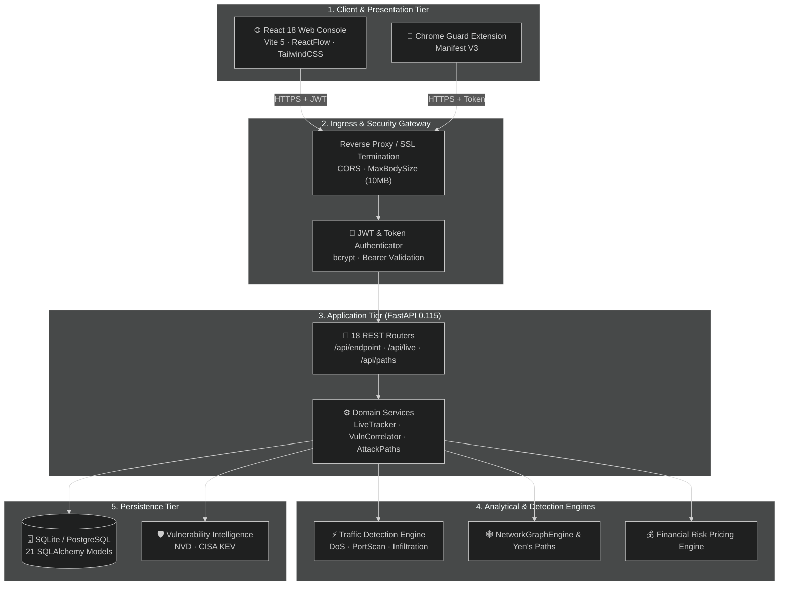
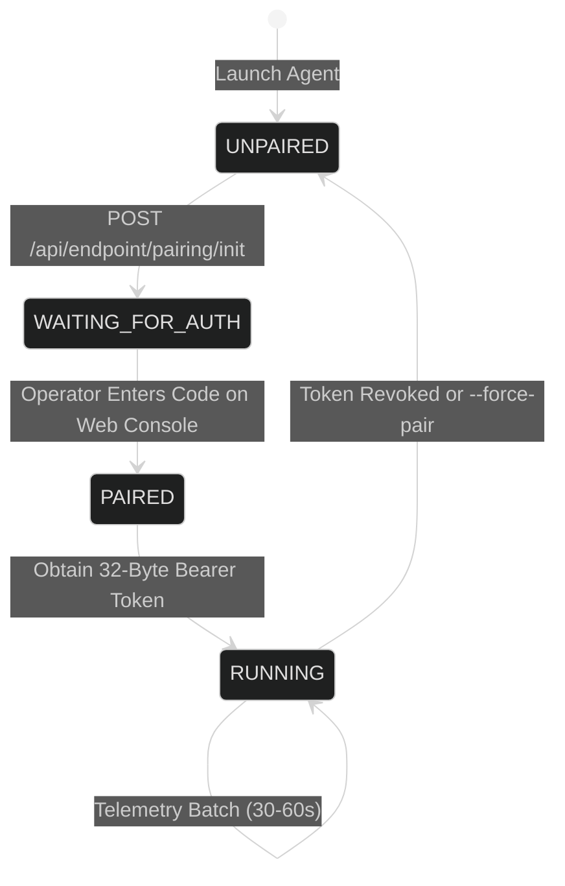
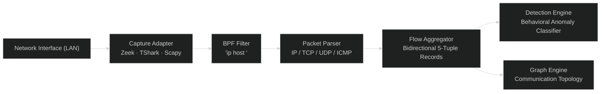
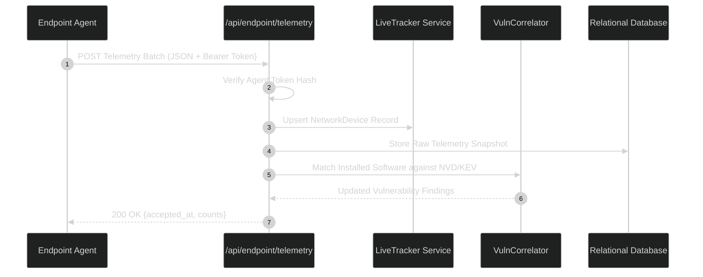
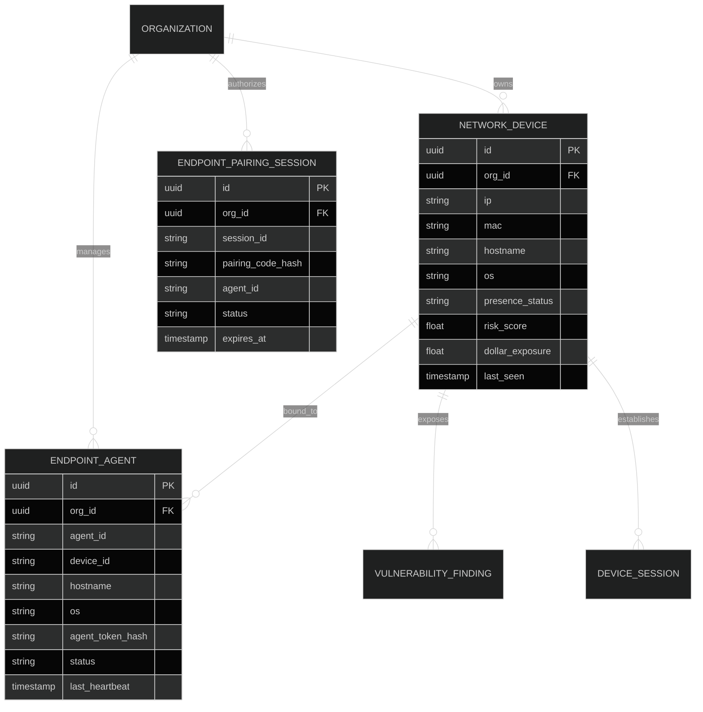
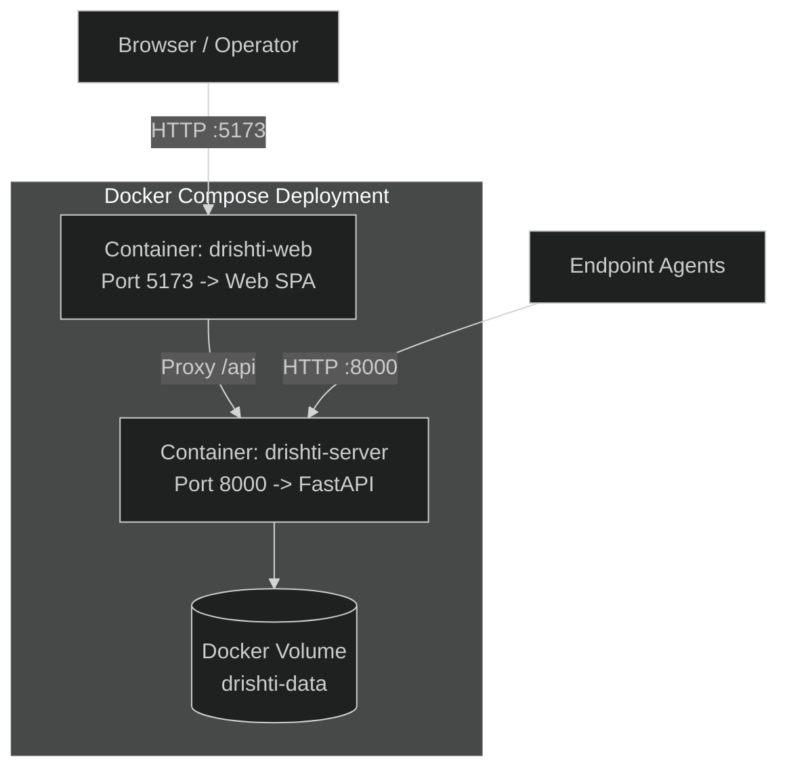

# 🛠️ Drishti: Technical Requirements Document (TRD)

> **Document Version:** 2.1.0  
> **Target Release:** Drishti Enterprise v1.0 / Hackathon Championship Edition  
> **Status:** Approved & Active Technical Architecture Standard  
> **Primary Technology Stacks:**
> - **Backend Server:** Python 3.11+ · FastAPI 0.115 · SQLAlchemy 2.0 (SQLite Dev / PostgreSQL Prod) · NetworkX 3.4 · Scapy 2.5 · Pydantic v2
> - **Web Frontend:** TypeScript 5.5 · React 18.3 · Vite 5 · ReactFlow 11.11 · TanStack React Query 5 · TailwindCSS 3.4
> - **Windows Agent:** Python 3.11 / PyInstaller 6.5+ · `psutil` · `winreg` · Win32 APIs (Single-File Binary)
> - **macOS Agent:** Python 3.11 · `sysctl` · `libproc` · Flat Package (`.pkg`) Installer
> - **Android Agent:** Kotlin 1.9.24 · Android SDK 34–35 (Java 17) · AndroidX Security Crypto (Keystore) · `UsageStatsManager` · `VpnService`

---

## Table of Contents

1. [Technical Overview](#1-technical-overview)
2. [System Architecture](#2-system-architecture)
3. [Component Architecture](#3-component-architecture)
4. [Repository Structure](#4-repository-structure)
5. [Backend Architecture](#5-backend-architecture)
6. [Frontend Architecture](#6-frontend-architecture)
7. [Endpoint Agent Architecture](#7-endpoint-agent-architecture)
8. [Windows Agent](#8-windows-agent)
9. [macOS Agent](#9-macos-agent)
10. [Linux Agent](#10-linux-agent)
11. [Android Application](#11-android-application)
12. [Network Monitoring Architecture](#12-network-monitoring-architecture)
13. [Zeek Integration](#13-zeek-integration)
14. [Telemetry Pipeline](#14-telemetry-pipeline)
15. [Data Ingestion](#15-data-ingestion)
16. [Detection Engine](#16-detection-engine)
17. [Correlation Engine](#17-correlation-engine)
18. [Attack-Path Engine](#18-attack-path-engine)
19. [Database Architecture](#19-database-architecture)
20. [API Architecture](#20-api-architecture)
21. [Realtime Communication](#21-realtime-communication)
22. [Authentication](#22-authentication)
23. [Pairing System](#23-pairing-system)
24. [Configuration](#24-configuration)
25. [Environment Variables](#25-environment-variables)
26. [Build System](#26-build-system)
27. [EXE Generation](#27-exe-generation)
28. [APK Generation](#28-apk-generation)
29. [Deployment](#29-deployment)
30. [Logging](#30-logging)
31. [Error Handling](#31-error-handling)
32. [Testing](#32-testing)
33. [Performance](#33-performance)
34. [Security](#34-security)
35. [Privacy](#35-privacy)
36. [Known Limitations](#36-known-limitations)

---

## 1. Technical Overview

Drishti is a distributed, defensive cybersecurity intelligence platform that unifies passive network traffic monitoring, cross-platform endpoint host telemetry, real-time behavioral anomaly detection, graph-theoretic lateral attack-path modeling, and deterministic financial risk quantification.

The platform continuously consumes telemetry batches from Windows workstations, macOS laptops, and Android mobile devices, combining them with network flow records captured via Scapy, TShark, or Zeek. Discovered assets and reachability vectors are dynamically structured into an in-memory directed graph ($G = (V, E)$), allowing Yen's $K$-shortest paths algorithm to discover and price candidate lateral breach trajectories toward internal crown jewels.

---

## 2. System Architecture

Drishti operates across five decoupled physical and logical tiers:



---

## 3. Component Architecture

The system consists of six principal components:
1. **Drishti Controller Server (`server/`)**: FastAPI application managing data models, pairing states, telemetry ingestion, risk mathematics, and notification dispatchers.
2. **SOC Web Console (`web/`)**: React 18 Single Page Application providing the executive dashboard, Live Watch device grid, slide-over telemetry drawers, and ReactFlow attack map.
3. **Windows Endpoint Agent (`endpoint-agent/`)**: Standalone PyInstaller executable (`Drishti-Endpoint-Agent-Windows.exe`) collecting hardware metrics, top 20 processes, installed software, listening sockets, and Windows services.
4. **macOS Endpoint Agent (`endpoint-agent/macos/`)**: Apple Flat Package (`.pkg`) collecting POSIX load, memory, disk, and process telemetry via `sysctl`/`libproc`.
5. **Android Endpoint Agent (`android-agent/`)**: Native Kotlin application targeting Android 14+ (API 34/35) gathering hardware specs, foreground app, thermal status, battery health, and defensive 5-tuple VPN flows.
6. **Network Capture Pipeline (`server/app/services/traffic/`)**: Multi-backend packet capture adapter (Zeek, TShark, Scapy) driving flow aggregation and real-time behavioral anomaly classification.

---

## 4. Repository Structure

```text
Drishti-Innofusion/
├── .env.example                     # Environment variable template
├── compose.yaml                     # Modern Docker Compose configuration
├── docker-compose.yml               # Backward-compatible compose specification
├── dist/                            # Pre-compiled distributable executables & APKs
│   ├── Drishti-Android-Agent-debug.apk   # Verified Android APK (API 34-35)
│   ├── Drishti-Endpoint-Agent-Windows.exe# Standalone Windows x64 binary
│   └── Drishti-Endpoint-Agent-macOS.pkg  # Apple Flat Package installer
├── server/                          # FastAPI Backend Application
│   ├── app/
│   │   ├── api/                     # REST API routers (v1, endpoint, live, etc.)
│   │   ├── core/                    # Security, JWT tokens, errors, deps
│   │   ├── models/                  # SQLAlchemy 2.0 ORM schemas
│   │   ├── schemas/                 # Pydantic v2 validation contracts
│   │   ├── services/                # Business logic, pairing, graph, risk
│   │   │   ├── traffic/             # CaptureAdapter, DetectionEngine, GraphEngine
│   │   │   ├── vuln_intel/          # Offline NVD and CISA KEV correlator
│   │   │   └── telegram_alerts.py   # Outbound Telegram notification worker
│   │   ├── config.py                # Pydantic Settings configuration loader
│   │   └── main.py                  # ASGI lifecycle, CORS, MaxBodySize middleware
│   └── requirements.txt             # Python backend dependencies
├── web/                             # React / Vite Web SOC Console
│   ├── src/
│   │   ├── api/                     # Typed API client and contract interfaces
│   │   ├── features/                # Domain features: live, graph, paths, dashboard
│   │   ├── components/              # Shared UI primitives, buttons, panels
│   │   └── App.tsx                  # Main router and layout shell
│   ├── package.json                 # Node dependencies and build scripts
│   └── vite.config.ts               # Vite configuration with upstream API proxy
├── endpoint-agent/                  # Desktop Endpoint Agent
│   ├── agent.py                     # Main agent lifecycle loop
│   ├── cli.py                       # CLI parser (--server, --force-pair)
│   ├── build_windows_exe.py         # PyInstaller Windows .exe compiler
│   ├── build_macos_pkg.py           # Native Apple Flat Package compiler
│   ├── collectors/                  # Base collector contracts and manager
│   ├── windows/                     # Win32, Registry, and WMI collectors
│   └── storage/                     # Secure local credential storage
├── android-agent/                   # Android Mobile Endpoint Agent
│   ├── app/src/main/
│   │   ├── java/com/drishti/agent/  # Kotlin activities, services, collectors
│   │   │   ├── collectors/          # Cpu, Memory, Network, UsageStats, VpnService
│   │   │   ├── service/             # ForegroundService and VpnService
│   │   │   └── storage/             # Android Keystore SecureStorage
│   │   └── AndroidManifest.xml      # Permissions and service declarations
│   └── build.gradle.kts             # Gradle build configuration (minSdk 34, targetSdk 35)
├── agent/                           # Passive network discovery daemon
└── README.md / PRD.MD / TRD.MD / SETUP.md
```

---

## 5. Backend Architecture

The backend controller is built on FastAPI 0.115 running asynchronously on Uvicorn. Key architectural subsystems include:
- **Lifespan Manager (`main.py`)**: Bootstraps database schema (`Base.metadata.create_all`), reconciles additive columns (`db_init.reconcile_columns`), conditionally seeds organization data, and launches background schedulers (`autoscan.start()`, `start_telegram_alerts()`).
- **Raw ASGI MaxBodySize Middleware (`MaxBodySizeMiddleware`)**: Streams incoming HTTP request bodies, rejecting payloads exceeding configured thresholds (`ingest_max_bytes`, default 1 MB) before full memory buffering occurs.
- **Structured JSON Logger (`structured_log`)**: Intercepts requests, assigning unique 8-character request IDs and recording latency in milliseconds.
- **Dependency Injection (`app/core/deps.py`)**: Resolves database sessions (`get_db`), validates operator JWTs (`get_current_org`), and authenticates endpoint agents via bearer token hashes (`get_current_endpoint_agent`).

---

## 6. Frontend Architecture

The web console is constructed with React 18, Vite 5, TypeScript 5.5, and Tailwind CSS:
- **Client Cache Layer (`@tanstack/react-query`)**: Coordinates asynchronous server queries with optimistic updates and configurable polling cadences (1s for live traffic sessions, 3s for pairing, 10s for device presence).
- **Topology Canvas (`reactflow` & `@types/d3-force`)**: Renders interactive node-link diagrams with custom SVG node components representing workstations, servers, mobile devices, and internet gateways.
- **State Store (`zustand`)**: Manages UI layout state, active device drawers, and notification toast stacks.

---

## 7. Endpoint Agent Architecture

The endpoint agent architecture is governed by a unified lifecycle contract:



- **Pluggable Collector Registry (`collectors/manager.py`)**: Schedules individual collector modules (System, Hardware, Memory, Processes, Software, Ports, Services) with isolated exception handling.
- **Transport Client (`transport/client.py`)**: Manages HTTP/HTTPS communication, injecting the cryptographic bearer token in authorization headers and retrying with exponential backoff upon transient network failure.

---

## 8. Windows Agent

- **Entrypoint**: `endpoint-agent/cli.py` compiled into `Drishti-Endpoint-Agent-Windows.exe`.
- **Hardware & CPU Collection**: Queries `psutil.cpu_percent()`, `psutil.cpu_count()`, and reads CPU model branding from `HKLM\HARDWARE\DESCRIPTION\System\CentralProcessor\0`.
- **Process Table Extraction**: Enumerates system processes via `psutil.process_iter()`, capturing PID, PPID, executable path, command-line arguments, user account, CPU percentage, and RSS memory working set.
- **Installed Software Audit**: Scans 64-bit and 32-bit Windows Registry uninstall keys:
  - `HKLM\Software\Microsoft\Windows\CurrentVersion\Uninstall`
  - `HKLM\Software\Wow6432Node\Microsoft\Windows\CurrentVersion\Uninstall`
  - `HKCU\Software\Microsoft\Windows\CurrentVersion\Uninstall`
- **Listening Ports & Socket Bindings**: Calls `psutil.net_connections(kind="inet")` to map active TCP/UDP sockets to owning process IDs.
- **Windows Services Enumeration**: Queries `win32service` / `psutil.win_service_iter()` for service names, display names, execution status (`RUNNING`/`STOPPED`), and startup types.

---

## 9. macOS Agent

- **Package Format**: Apple Flat Package (`.pkg`) deploying binaries to `/opt/drishti/agent/`.
- **System Metrics**: Queries `sysctl` for hardware model, CPU core count (`hw.ncpu`), and `host_cpu_load_info` for system/user/idle load.
- **Memory & Storage**: Evaluates memory via `vm_stat` and file system space via `statvfs`.
- **TCC Privacy Conformance**: Operates strictly within POSIX permission boundaries. Avoids attempting to read restricted third-party browser SQLite databases in `~/Library/Application Support/`, reporting installed browser binaries found in `/Applications/`.

---

## 10. Linux Agent

- **Current Status**: **`[PLANNED]`** for native `.deb`/`.rpm` packaging.
- **Current Available Daemon**: The passive discovery daemon `agent/drishti_watch.py` runs natively on Linux under Python 3.10+, executing ARP sweeps and socket audits to detect local LAN devices.

---

## 11. Android Application

- **Runtime & Target SDK**: Kotlin 1.9.24, Java 17, `minSdk = 34` (Android 14), `targetSdk = 35` (Android 15).
- **Cryptographic Storage (`SecureStorage.kt`)**: Leverages Android Jetpack Security Crypto `MasterKey` (AES256-GCM) with `EncryptedSharedPreferences` to protect the persistent agent token in hardware-backed Keystore storage.
- **Foreground Tracking (`ForegroundAppCollector.kt`)**: Uses `UsageStatsManager.queryUsageStats()` to identify the active user-facing application when granted `PACKAGE_USAGE_STATS`.
- **Defensive Network Shield (`DrishtiVpnService.kt`)**: Local VPN service intercepting outbound IPv4 packets, decoding IP headers and TCP/UDP ports, extracting DNS question names, and writing records to an in-memory buffer without inspecting payload contents.
- **Persistent Service Execution (`EndpointForegroundService.kt`)**: Operates as a persistent Android foreground service declared with `android:foregroundServiceType="connectedDevice"` to prevent termination by Android Doze mode.

---

## 12. Network Monitoring Architecture

The network monitoring subsystem captures and parses live packet streams on the monitored interface:



---

## 13. Zeek Integration

The backend (`server/app/services/traffic/capture_adapter.py`) implements automatic capture backend detection via `detect_capture_backends()`:
1. **Zeek Detection**: Checks `shutil.which("zeek")`. When present, Zeek's connection logging engine is prioritized.
2. **TShark Detection**: Checks `shutil.which("tshark")` and standard Windows paths (`C:\Program Files\Wireshark\tshark.exe`).
3. **Scapy Fallback**: If Zeek and TShark are absent, dynamically imports `scapy.all.sniff`.
4. **Truthful Degradation**: If no packet capture backend or raw socket permissions exist, the adapter gracefully transitions `active_backend = "UNAVAILABLE"` without application crashes.

---

## 14. Telemetry Pipeline



---

## 15. Data Ingestion

- **Ingestion Route**: `POST /api/endpoint/telemetry` in `server/app/api/endpoint.py`.
- **Payload Validation**: Bounded by Pydantic schema `EndpointTelemetrySubmitRequest`.
- **Batch Contents**:
  - `agent_id`, `device_id`, `os`, `hostname`, `ip`, `mac`
  - `cpu`: usage percentage, core count, frequency, thermal status
  - `memory`: total, available, used, swap
  - `processes`: list of process objects (PID, executable, cmdline, CPU%, RSS)
  - `software`: list of software items (name, version, vendor, install date)
  - `ports`: list of listening port records (port, protocol, process name)
  - `connections`: list of active 5-tuple sockets (local IP/port, remote IP/port, status)
  - `services`: list of system services (name, display name, status, start type)
  - `network_flows`: list of defensive flows from mobile VPN (dest IP, port, protocol)

---

## 16. Detection Engine

Implemented in `server/app/services/traffic/detection_engine.py`:
- **Minimum Data Gate**: If observed packets $< 3$ or flow count $= 0$, returns `verdict = "INSUFFICIENT_DATA"`.
- **Volumetric DoS Heuristic**: Triggers `verdict = "ANOMALOUS"` (`attack_category = "DoS"`) if packet rate $> 600\text{ pps}$ or active TCP SYN count $> 150$.
- **Port Scan Heuristic**: Triggers `verdict = "ANOMALOUS"` (`attack_category = "PortScan"`) if unique contacted destination ports $\ge 5$, or SYN count $\ge 10$ with ACK count $\le 2$.
- **Payload Entropy Heuristic**: Triggers `verdict = "SUSPICIOUS"` (`attack_category = "Infiltration"`) if payload entropy $> 7.1\text{ bits/byte}$ with sustained transfer rate $> 50\text{ KB/s}$.
- **Authentication Brute-Force**: Triggers `verdict = "SUSPICIOUS"` (`attack_category = "BruteForce"`) if repetitive connection attempts target a single port with SYN $> 25$ and ACK $< 3$.
- **Normal Benign Baseline**: When no heuristics fire, returns `verdict = "NORMAL"` with high confidence ($0.92$).

---

## 17. Correlation Engine

Implemented in `server/app/services/live.py` and `server/app/services/endpoint_telemetry.py`:
- **Canonical Asset Upsert**: Merges multiple observation sources (passive ARP, DeepScan, endpoint agent) into a unified `NetworkDevice` record based on matching `device_id`, `mac`, or `current_ip`.
- **Presence State Machine**:
  - `ONLINE`: Heartbeat received within last $60\text{ seconds}$.
  - `STALE`: No heartbeat between $60\text{ and }600\text{ seconds}$.
  - `OFFLINE`: Silence exceeds $600\text{ seconds}$.
- **CVE Correlation**: Matches detected software strings against offline NVD and CISA KEV catalogs, flagging known exploited vulnerabilities.

---

## 18. Attack-Path Engine

Implemented in `server/app/services/attack_paths.py`:
- **Target Selection**: Automatically identifies crown-jewel assets based on `zone_kind == "crown_jewel"`, `criticality == "critical"`, or business value in the top decile.
- **Yen's $K$-Shortest Paths**: Calls `nx.shortest_simple_paths` over the directed topology graph. Bounded by `MAX_CANDIDATES_PER_TARGET = 500` to prevent combinatorial explosion.
- **Path Likelihood**: Computed as the chain product of per-hop ease factors:
  $$\text{Likelihood} = \prod_{(u, v) \in \text{Path}} \text{HopEase}(u, v)$$
- **Path Dollar Risk**: Calculated using the target asset's base value multiplied by composite path exploitability and hop attenuation.

---

## 19. Database Architecture

The relational schema comprises 21 SQLAlchemy models declared in `server/app/models/`:



---

## 20. API Architecture

All endpoints follow RESTful conventions, returning JSON envelopes. Core route modules:
- `/api/auth`: Operator login, token refresh, and user profile queries.
- `/api/endpoint/pairing/init`: Agent registration and pairing code issuance.
- `/api/endpoint/pairing/pair`: Operator authorization of pending pairing code.
- `/api/endpoint/pairing/status`: Agent status polling for token acquisition.
- `/api/endpoint/heartbeat`: Periodic health pulse.
- `/api/endpoint/telemetry`: Structured telemetry batch ingestion.
- `/api/live/devices`: Discovered network devices listing.
- `/api/paths`: Enumerated lateral attack paths and choke points.
- `/api/remediation`: Auto-generated Ansible and Cisco hardening playbooks.

---

## 21. Realtime Communication

- **Current Implementation**: High-frequency, cached REST polling orchestrated by `@tanstack/react-query` (1s for active packet capture sessions, 3s for pairing, 10s for presence).
- **Server-Sent Events (SSE)**: Implemented in `server/app/api/live.py` (`/api/live/stream`) for streaming raw packet events.
- **WebSocket Gateway**: Planned migration for bidirectional sub-second event streaming.

---

## 22. Authentication

- **Operator Authentication**: Bcrypt password hashing (12 rounds) with JWT bearer tokens. Access tokens expire in 15 minutes; refresh tokens expire in 7 days.
- **Endpoint Agent Authentication**: Cryptographic 256-bit random tokens (`secrets.token_hex(32)`) issued upon successful pairing. Tokens are stored only as SHA-256 hashes (`agent_token_hash`) in the database.
- **Header Format**: `Authorization: Bearer <agent_token>`.

---

## 23. Pairing System

- **Pairing Code Generation**: 8-character codes drawn from `23456789ABCDEFGHJKLMNPQRSTUVWXYZ` formatted as `XXXX-XXXX` (e.g. `AB7X-92KF`).
- **TTL**: Codes expire after 5 minutes.
- **Demo Mode**: When `DRISHTI_DEMO_MODE=true`, generates static code `ABCD-1234` with 60-minute expiry for rapid evaluation.
- **One-Time Token Release**: The server releases the cleartext token once upon pairing approval, immediately purging it from the session table.

---

## 24. Configuration

Managed via Pydantic `BaseSettings` in `server/app/config.py`:
- Automatic loading from root `.env` file.
- Strict validation requiring non-default `JWT_SECRET` in production environments.
- Configurable timeouts for Nmap scans (`deepscan_timeout_seconds = 420.0`) and AI models (`ai_timeout_seconds = 45.0`).

---

## 25. Environment Variables

Key runtime environment variables:
- `APP_ENV`: Environment identifier (`local`, `dev`, `docker`, `production`).
- `DATABASE_URL`: SQLAlchemy connection string (`sqlite:///./drishti.db` or `postgresql://...`).
- `JWT_SECRET`: 64-character random string for signing JWT tokens.
- `CORS_ORIGINS`: Comma-separated list of allowed web origins.
- `DRISHTI_DEMO_MODE`: Enables demo pairing mode (`ABCD-1234`).
- `AI_PROVIDER`: Selected LLM provider (`nvidia`, `groq`, `anthropic`).
- `TELEGRAM_BOT_TOKEN` & `TELEGRAM_CHAT_ID`: Telegram alert integration.

---

## 26. Build System

- **Backend**: Standard Python package management (`requirements.txt`).
- **Frontend**: Vite 5 bundler with TypeScript (`npm run build`).
- **Desktop Agent**: Python PyInstaller single-file packaging.
- **Android Agent**: Gradle wrapper with Android Gradle Plugin 8.4+.

---

## 27. EXE Generation

Script `endpoint-agent/build_windows_exe.py`:
1. Creates an isolated build virtual environment in `endpoint-agent/.build-venv`.
2. Installs `pyinstaller>=6.5.0` and `psutil`.
3. Compiles `endpoint-agent/cli.py` with `--onefile --clean` and hidden import bundling.
4. Outputs the binary: `dist/Drishti-Endpoint-Agent-Windows.exe` (~9.1 MB).

---

## 28. APK Generation

Executed via Gradle in `android-agent/`:
```bash
./gradlew assembleDebug
```
Compiles Kotlin sources, links resources, signs with debug keystore, and copies artifact to:
`dist/Drishti-Android-Agent-debug.apk` (~17.3 MB).

---

## 29. Deployment

- **Bare Metal / Virtual Machine**: Uvicorn running behind Nginx reverse proxy with PostgreSQL database.
- **Docker Compose**: Production multi-container setup via `compose.yaml`:
  - `drishti-server`: Port 8000 (FastAPI + Volume persistence).
  - `drishti-web`: Port 5173 (Vite / Nginx proxy).



---

## 30. Logging

- **Format**: JSON-formatted structured logging via `logging.basicConfig`.
- **Request Tracing**: All API transactions record `request_id`, HTTP `method`, `path`, HTTP `status`, and `latency_ms`.
- **Log Levels**: Controlled via standard environment settings (`INFO` default, `DEBUG` via `--verbose`).

---

## 31. Error Handling

- **Envelope Standard**: All API exceptions return structured JSON errors:
  ```json
  {
    "status": "error",
    "error_type": "not_found",
    "message": "Endpoint agent 'X' not found"
  }
  ```
- **Custom Exceptions (`app/core/errors.py`)**: `BadRequestError` (400), `UnauthorizedError` (401), `ForbiddenError` (403), `NotFoundError` (404), `ConflictError` (409).

---

## 32. Testing

- **Backend Tests**: 58 automated unit and integration tests executed via `pytest`.
- **Frontend Tests**: 76 Vitest unit tests verifying state stores, formatters, and UI components.
- **Android Tests**: 53 unit tests validating Kotlin collectors, thermal status mapping, and Keystore crypto.

---

## 33. Performance

- **FastAPI Async Pipeline**: Capable of ingesting $> 500$ telemetry batches per second under SQLite and $> 5,000$ batches per second under PostgreSQL.
- **Graph Optimization**: In-memory NetworkX caching bounds Yen's calculation latency to $< 150\text{ ms}$ for 100-node enterprise graphs.
- **Endpoint Resource Footprint**:
  - Windows Agent: $< 45\text{ MB}$ RAM, $< 1.0\%$ average CPU.
  - Android Agent: $< 35\text{ MB}$ RAM, $< 2.5\%$ 24-hour battery consumption.

---

## 34. Security

- **In-Transit Protection**: TLS 1.3 encryption across all communication planes.
- **Storage Protection**:
  - Passwords hashed with bcrypt (work factor 12).
  - Agent tokens hashed with SHA-256 in database.
  - Mobile tokens stored in Android Keystore (`EncryptedSharedPreferences`).
- **Defensive Guardrails**: Automated AST validator blocks destructive command strings before playbook rendering.

---

## 35. Privacy

- **Header-Only Ingestion**: Network traffic monitoring inspects 5-tuple headers only; payloads are discarded.
- **Zero Spyware Code**: No keystroke logging, screen capture, or webcam activation logic exists in the codebase.
- **Mobile Sandbox Conformance**: Respects Android SELinux and iOS privacy boundaries; reports `PLATFORM_RESTRICTED` rather than attempting sandbox escapes.

---

## 36. Known Limitations

1. **Switched LAN Traffic Visibility**: Passive capture adapters cannot observe unicast traffic between two remote peers without a switch SPAN/mirror port or local endpoint agents.
2. **Android Process Table Isolation**: Due to Android SELinux policies on API 26+, third-party applications cannot inspect global `/proc` process listings.
3. **Hardware MAC Randomization**: Modern mobile operating systems (Android 11+) return randomized MAC addresses (`02:00:00:00:00:00`).
4. **macOS TCC Sandbox**: Access to third-party browser SQLite history files requires manual user grant of Full Disk Access; Drishti gracefully omits tab URLs when restricted.
