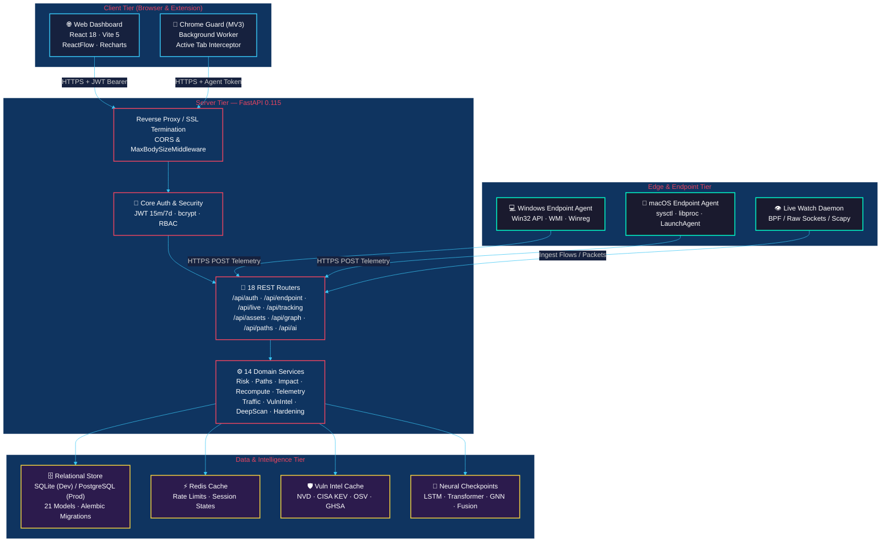
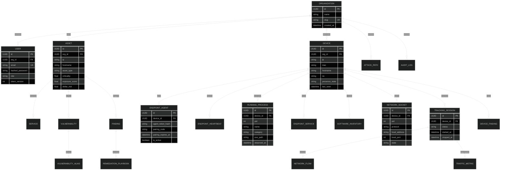
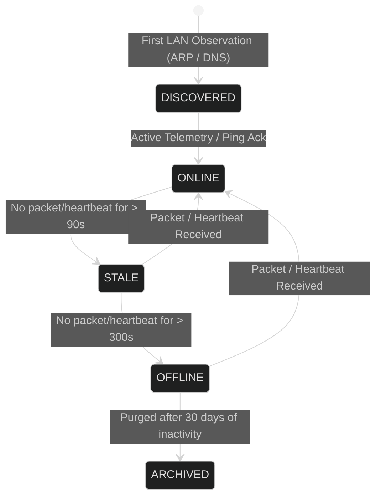
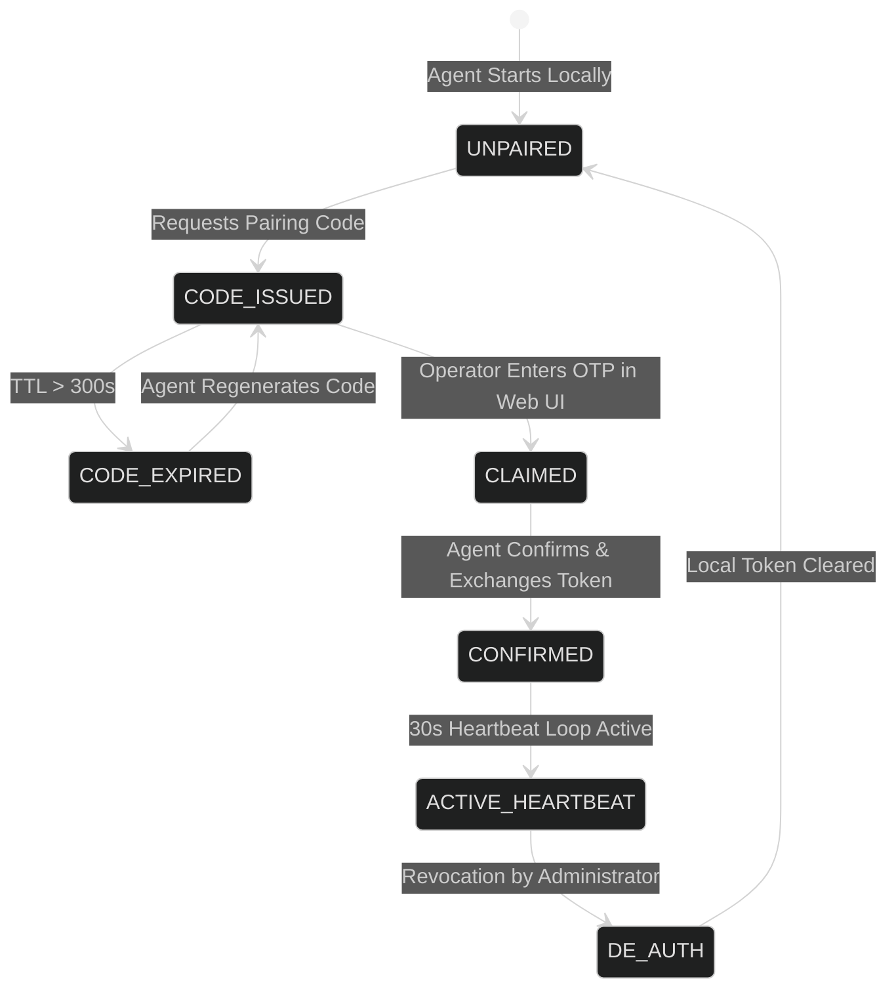

# 🛠️ Drishti: Technical Requirements Document (TRD)

> **Document Version:** 1.0.0  
> **Target Release:** Drishti Enterprise v1.0 / Hackathon Championship Edition  
> **Status:** Approved & Active  
> **Frameworks:** FastAPI 0.115 · React 18.3 · TypeScript 5 · PyTorch 2.x · NetworkX 3.4 · TailwindCSS 3.4  
> **Database:** SQLAlchemy 2.0 (SQLite Dev / PostgreSQL Production) · Alembic

---

## 1. System Architecture & Component Topology

Drishti operates across four decoupled runtime tiers:
1. **Client Tier:** React 18 SPA (Vite 5) + Chrome Extension (MV3).
2. **Backend Server Tier:** FastAPI 0.115 REST API + WebSocket/SSE streaming + asynchronous threadpool workers.
3. **Edge / Endpoint Tier:** Standalone cross-platform daemon (`endpoint-agent/`) + passive network watcher (`agent/drishti_watch.py`).
4. **Data & Intelligence Tier:** Relational Database (21 tables) + In-memory Redis cache + PyTorch neural checkpoints + Local Vulnerability DB.



---

## 2. Exhaustive API Specifications

All server endpoints adhere to standard REST semantics, accepting and returning JSON. Standard envelope formatting is enforced across responses:
```json
{
  "data": { ... },
  "error": null
}
```
Errors return standardized error envelopes:
```json
{
  "error": {
    "code": "validation_error | unauthorized | forbidden | not_found | conflict | server_error",
    "message": "Human readable explanation"
  }
}
```

### 2.1 Authentication & Session (`/api/auth`)

| Method | Path | Auth | Request Body | Response Body / Status | Description |
|---|---|---|---|---|---|
| `POST` | `/api/auth/login` | None | `{ "email": str, "password": str }` | `200 OK`: `{ "access_token": str, "refresh_token": str, "token_type": "bearer", "user": { ... }, "org": { ... } }` | Authenticates user via bcrypt, returns 15m JWT access + 7d refresh token. |
| `POST` | `/api/auth/refresh` | Bearer | `{ "refresh_token": str }` | `200 OK`: `{ "access_token": str, "refresh_token": str }` | Refreshes access token while rotating refresh token. |
| `GET` | `/api/auth/me` | Bearer | None | `200 OK`: `{ "id": UUID, "email": str, "name": str, "role": str, "org_id": UUID }` | Retrieves authenticated user profile and organizational context. |

### 2.2 Endpoint Agent Lifecycle & Telemetry (`/api/endpoint`)

| Method | Path | Auth | Request Body | Response Body / Status | Description |
|---|---|---|---|---|---|
| `POST` | `/api/endpoint/pairing/request` | None | `{ "device_id": str, "hostname": str, "os": str }` | `200 OK`: `{ "pairing_code": str, "expires_in": int }` | Generates a 6-8 character OTP valid for 300 seconds. |
| `POST` | `/api/endpoint/pairing/claim` | Bearer | `{ "pairing_code": str, "device_id": str }` | `200 OK`: `{ "status": "paired", "agent_id": str }` | Operator claims pairing code from web dashboard to bind device. |
| `POST` | `/api/endpoint/pairing/confirm` | None | `{ "device_id": str }` | `200 OK`: `{ "token": str, "agent_id": str }` | Endpoint verifies claim and receives its unique agent bearer token. |
| `POST` | `/api/endpoint/heartbeat` | Agent Token | `{ "agent_id": str, "device_id": str, "version": str, "status": str }` | `200 OK`: `{ "status": "acknowledged", "server_time": float }` | Updates presence state to `ONLINE`; triggers TTL extension. |
| `POST` | `/api/endpoint/telemetry` | Agent Token | `{ "device_id": str, "processes": [...], "services": [...], "sockets": [...], "software": [...] }` | `200 OK`: `{ "processed": int, "staged": int }` | Ingests real endpoint processes, bound ports, services, and software. |

### 2.3 Live Traffic & AI Forecasting (`/api/live` & `/api/tracking`)

| Method | Path | Auth | Request Body | Response Body / Status | Description |
|---|---|---|---|---|---|
| `POST` | `/api/tracking/start` | Bearer | `{ "device_id": str, "target_ip": str, "interface": str }` | `200 OK`: `{ "session_id": str, "status": "RECORDING" }` | Spawns packet capture thread, initializes flow table and sliding windows. |
| `GET` | `/api/tracking/results/{device_id}` | Bearer | None | `200 OK`: `TrackingResultsOut` (packet count, top dests, 27 features, AI verdict, forecast) | Returns live traffic metrics, current detection, and multi-step predictions. |
| `POST` | `/api/tracking/stop/{device_id}` | Bearer | None | `200 OK`: `{ "status": "STOPPED", "summary": { ... } }` | Terminates capture thread, flushes flow table, preserves historical timeline. |
| `GET` | `/api/live/devices` | Bearer | Query: `?status=all` | `200 OK`: `DeviceBatchOut` (list of devices with telemetry summaries) | Returns active LAN devices with presence badges and capability states. |
| `POST` | `/api/live/devices/observe` | Bearer | `DeviceBatch` | `200 OK`: `{ "accepted": int }` | Ingests passive discovery batches from edge agents. |

### 2.4 Attack Graph, Paths & Risk (`/api/graph`, `/api/paths`, `/api/dashboard`)

| Method | Path | Auth | Request Body | Response Body / Status | Description |
|---|---|---|---|---|---|
| `GET` | `/api/graph` | Bearer | None | `200 OK`: `{ "nodes": [...], "edges": [...], "metrics": { ... } }` | Exports NetworkX DiGraph representation formatted for ReactFlow. |
| `GET` | `/api/paths` | Bearer | Query: `?target_id=UUID` | `200 OK`: `list[AttackPathOut]` | Returns Yen's $k$-shortest attack paths with dollar pricing and hop breakdown. |
| `GET` | `/api/dashboard` | Bearer | None | `200 OK`: `DashboardMetricsOut` | Aggregates high-level KPIs: total exposure $, asset count, critical finding count. |
| `POST` | `/api/ai/remediate` | Bearer | `{ "finding_id": UUID, "playbook_type": "ansible|cisco" }` | `200 OK`: `{ "playbook": str, "summary": str, "actions": [...] }` | Generates validated remediation playbooks using deterministic evidence context. |

---

## 3. Database Schema & Entity-Relationship Model (21 Tables)

The data model is built on SQLAlchemy 2.0 and supports SQLite (development) and PostgreSQL (production).



### Table Structure Specifications

1. **`organizations`**: Multi-tenant isolation boundary (`id`, `name`, `slug`, `created_at`).
2. **`users`**: Enterprise operators (`id`, `org_id`, `email`, `hashed_password`, `role`, `token_version`).
3. **`assets`**: Discovered infrastructure nodes (`id`, `org_id`, `ip`, `hostname`, `criticality`, `exposure_score`, `dollar_risk`).
4. **`services`**: Network listeners on assets (`id`, `asset_id`, `port`, `protocol`, `service_name`, `banner`, `version`).
5. **`vulnerabilities`**: Known CVEs (`id`, `cve_id`, `title`, `cvss_score`, `severity`, `is_kev`, `description`).
6. **`findings`**: Asset-to-vulnerability mappings (`id`, `asset_id`, `vulnerability_id`, `status`, `remediation_id`).
7. **`attack_paths`**: Calculated breach paths (`id`, `org_id`, `start_node`, `target_node`, `hops`, `cumulative_cost`, `exposure_usd`).
8. **`devices`**: LAN endpoint and peripheral assets (`id`, `org_id`, `ip`, `mac`, `hostname`, `os`, `presence_state`, `last_seen`).
9. **`endpoint_agents`**: Agent bindings (`id`, `device_id`, `agent_token_hash`, `pairing_code`, `pairing_expires_at`, `is_active`).
10. **`endpoint_heartbeats`**: Agent health log (`id`, `agent_id`, `device_id`, `version`, `status`, `timestamp`).
11. **`running_processes`**: Real processes (`id`, `device_id`, `pid`, `name`, `category`, `details`, `observed_at`).
12. **`endpoint_services`**: Background daemons (`id`, `device_id`, `name`, `display_name`, `status`, `observed_at`).
13. **`software_inventory`**: Read-only installed apps (`id`, `device_id`, `name`, `version`, `publisher`, `observed_at`).
14. **`network_sockets`**: Local listening ports (`id`, `device_id`, `pid`, `protocol`, `local_ip`, `local_port`, `state`).
15. **`browser_tabs`**: Extension telemetry (`id`, `device_id`, `url`, `domain`, `title`, `observed_at`).
16. **`tracking_sessions`**: Live packet sessions (`id`, `device_id`, `interface`, `status`, `started_at`, `stopped_at`).
17. **`network_flows`**: 5-tuple flow aggregations (`id`, `session_id`, `src_ip`, `dst_ip`, `src_port`, `dst_port`, `proto`, `packets`, `bytes`).
18. **`traffic_metrics`**: Time-window vectors (`id`, `session_id`, `window_idx`, `features_json`, `verdict`, `forecast_json`).
19. **`vulnerability_cache`**: Local NVD/KEV store (`id`, `identifier`, `source`, `cpe`, `version_start`, `version_end`, `cvss`, `is_kev`).
20. **`remediation_playbooks`**: Generated scripts (`id`, `finding_id`, `playbook_type`, `content`, `status`).
21. **`audit_logs`**: Immutable operations log (`id`, `org_id`, `user_id`, `request_id`, `action`, `resource`, `timestamp`).

---

## 4. Hardware, Operating System & Network Requirements

### 4.1 Server Requirements
- **OS:** Linux (Ubuntu 22.04 LTS+, Debian 12, Arch, Fedora) or macOS 13+ (Apple Silicon M-Series or Intel).
- **CPU:** Minimum 2 cores (4+ cores recommended for concurrent Nmap sweeps and neural inference).
- **Memory (RAM):** Minimum 4 GB RAM (8 GB recommended when PyTorch GPU/MPS acceleration is enabled).
- **Disk:** 10 GB SSD storage (accommodates local NVD cache and PyTorch model checkpoints).
- **Network Privileges:** Capability to bind raw sockets or execute Nmap (`setcap cap_net_raw,cap_net_admin,cap_net_bind_service+eip`).

### 4.2 Endpoint Agent Requirements
- **macOS:**
  - macOS 13.0 (Ventura), 14.0 (Sonoma), or 15.0 (Sequoia).
  - Executable uses POSIX `sysctl`, `lsof`, and `ps` APIs. No kernel extensions required.
  - Optional `LaunchAgent` plist for user-space autostart persistence.
- **Windows:**
  - Windows 10 / 11 (64-bit) or Windows Server 2019/2022.
  - Uses `WMI` / `Win32_Process`, `GetExtendedTcpTable` via `ctypes`, and read-only Registry inspection (`HKLM\Software\Microsoft\Windows\CurrentVersion\Uninstall`).
  - Optional Registry autostart under `HKCU\Software\Microsoft\Windows\CurrentVersion\Run`.

---

## 5. System State Machines

### 5.1 Device Presence State Machine
Every discovered or paired device transitions through three presence states based on heartbeat and ARP/packet timestamps:



### 5.2 Endpoint Pairing State Machine
The pairing handshake guarantees that agents can never be hijacked or spoofed:



---

## 6. Performance, Scaling & Bounded Memory Policy

To ensure high availability and prevent memory leaks or denial-of-service in long-running deployments, Drishti enforces strict bounded buffers:

1. **Sliding Time Window Budget:**
   - Maximum 5 sequence windows retained per device ($W(t-4) \dots W(t)$).
   - Window size: $10.0\text{ seconds}$; Stride: $5.0\text{ seconds}$.
   - Windows exceeding 5 steps are dropped via FIFO queue.
2. **Flow Aggregator Boundaries:**
   - Flows inactive for $> 60\text{ seconds}$ are automatically purged from active tracking tables.
   - Maximum concurrent flows per target device capped at $10,000$.
3. **Endpoint Telemetry TTL:**
   - Running processes: 60s TTL (stale processes pruned on subsequent heartbeat).
   - Listening sockets: 60s TTL.
   - Installed software inventory: 15-minute refresh cycle.
4. **HTTP Payload Bounds:**
   - Ingestion payloads strictly limited to $50\text{ MB}$ via Starlette `MaxBodySizeMiddleware` to eliminate buffer-exhaustion attacks.

---

## 7. Testing & Verification Matrix

| Test Module | Coverage Scope | Execution Command | Criteria |
|---|---|---|---|
| **Backend Unit Tests** | Core math, risk pricing, auth tokens, database sessions | `pytest tests/test_scoring.py tests/test_impact.py` | 100% assertions pass |
| **Endpoint Agent Tests** | Pairing lifecycle, process collection, Windows/macOS collectors | `pytest tests/test_endpoint_agent.py` | OTP expiration & token issuance verified |
| **Traffic AI Tests** | 27 canonical features, 5 time-windows, LSTM/GNN pipeline | `pytest tests/test_live_tracking.py` | Features match canonical mathematical formulas |
| **Vulnerability Tests** | Semantic version range checks, NVD/KEV non-fabrication | `pytest tests/test_vuln_correlator.py` | Zero hallucinated CVEs; boundary matches verified |
| **Frontend Unit Tests** | Live Watch cards, ReactFlow graph, Traffic Panel components | `npm run test -- --run` in `web/` | 68/68 Vitest assertions pass |
| **Full Server Suite** | Entire 318-test backend test suite | `pytest` in `server/` | 314 passed, 4 skipped (torch absent in basic venv) |
