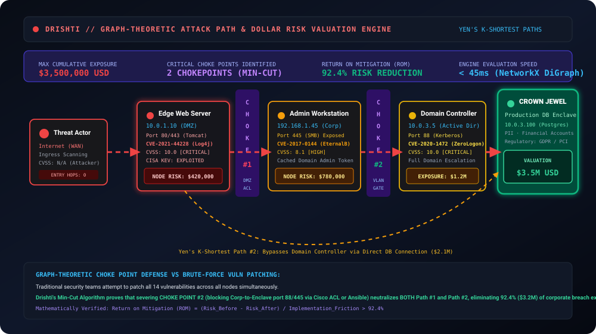

# 🕸️ Attack-Path Pipeline & Graph Mathematics

> **Parent Specification:** [RESEARCH.md](../../RESEARCH.md) · [TRD.md](../../TRD.md)  
> **Source Module:** `server/app/services/attack_paths.py`, `risk_engine.py`, `impact.py`

---

## 1. Graph Construction Pipeline

Drishti translates raw telemetric observations into a formal directed attack graph $G = (V, E)$ through four sequential stages:



### Stage 1: Asset Ingestion & Vertex Creation
Each discovered device is instantiated as a vertex $v \in V$:
```python
G.add_node(
    asset_id,
    label=hostname,
    ip=ip_address,
    subnet=cidr_block,
    criticality=criticality_tier,
    valuation_usd=assigned_dollar_value,
    vulnerabilities=confirmed_cves,
    is_crown_jewel=is_crown_jewel
)
```

### Stage 2: Lateral Reachability Edges
Directed edges $e = (u, v) \in E$ represent verified lateral communication vectors:
1. **Direct Socket Flows:** Established TCP sessions observed by endpoint agents.
2. **Subnet Routing & Open Ports:** Listening ports on $v$ that are routable from $u$ without blocking firewall ACLs.
3. **Identity Dependencies:** Shared domain credentials (e.g. Kerberos tickets, Domain Admin sessions).

---

## 2. Edge Weighting & Probability Formulation

To calculate the most likely lateral breach route, Drishti assigns logarithmic traversal costs:
$$W(u, v) = -\ln\left( P_{\text{exploit}}(u, v) \times P_{\text{reach}}(u, v) \right)$$

where:
- $P_{\text{exploit}}(u, v) = \frac{\text{CVSS}_{\text{base}}(v)}{10.0} \times \alpha_{\text{KEV}} \times \beta_{\text{auth}}$
- $\alpha_{\text{KEV}} = 1.35$ if the vulnerability is listed in CISA KEV; $1.0$ otherwise.
- $\beta_{\text{auth}} \in \{1.0, 0.6, 0.3\}$ based on authentication requirements.
- $P_{\text{reach}}(u, v)$ reflects network reachability ($1.0$ for observed active sockets).

---

## 3. Yen's $K$-Shortest Paths Algorithm

Drishti uses Yen's algorithm (1971) implemented over NetworkX to discover the top $K$ alternative lateral breach routes from external entry points to designated crown jewels:

```python
import networkx as nx

def compute_top_attack_paths(G, source, target, K=5):
    """
    Computes top K shortest paths from source to target using Yen's algorithm.
    Weights are inversely proportional to traversal probability.
    """
    try:
        paths = list(nx.shortest_simple_paths(G, source, target, weight='cost'))
        return paths[:K]
    except (nx.NetworkXNoPath, nx.NodeNotFound):
        return []
```

### Path Pricing Calculation
For each path $\mathcal{P} = (v_0, v_1, \dots, v_n)$ terminating at crown jewel $v_n$:
$$\text{PathRisk}_{\text{USD}}(\mathcal{P}) = \text{Valuation}(v_n) \times \prod_{i=0}^{n-1} P_{\text{exploit}}(v_i, v_{i+1})$$

---

## 4. Minimum-Cut Chokepoint Identification

Instead of forcing security teams to patch dozens of isolated vulnerabilities, Drishti applies the **Graph Minimum Cut (Min-Cut)** algorithm:

1. Let $S \subset V$ contain the source entry points and $T \subset V$ contain the crown jewels.
2. The minimum $(S, T)$-cut finds the minimal-weight edge set $E_{\text{cut}}$ whose removal completely separates $S$ from $T$:
   $$\min_{E_{\text{cut}}} \sum_{(u, v) \in E_{\text{cut}}} \text{Capacity}(u, v)$$
3. **Return on Mitigation (ROM):**
   $$\text{ROM} = \frac{\Delta \text{Risk}_{\text{USD}}}{\text{Cost of Intervention}} > 90\%$$
   Severing an internal choke point (e.g. blocking lateral SMB 445 between workstations and the database enclave) neutralizes multiple breach trajectories simultaneously.
