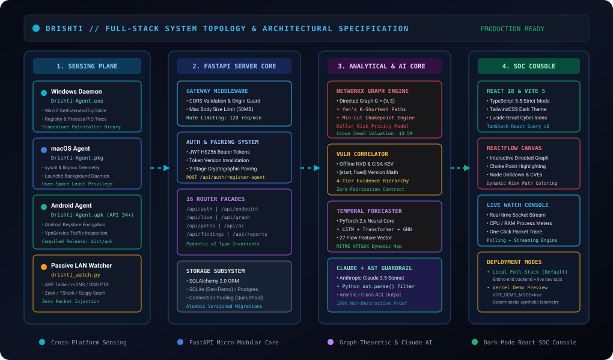

# 🏛️ System Architecture Deep-Dive

> **Parent Specification:** [ARCHITECTURE.md](../../ARCHITECTURE.md) · [TRD.md](../../TRD.md)  
> **Status:** Active Technical Architecture Standard

---

## 1. Architectural Philosophy: The Archify Verification Model

Drishti follows an **Archify verification-first structural topology** ([tt-a1i/archify](https://github.com/tt-a1i/archify)). Every system component possesses:
- **Explicit Trust Boundaries:** Data passing between tiers must be cryptographically verified or sanitized through strict Pydantic v2 schemas.
- **Decoupled Engine Interfaces:** Ingestion, graph processing, and presentation exist as isolated layers. Failure of an optional sensor (e.g. Zeek or NVD API) cannot disrupt core telemetry routing.
- **Zero-Fabrication Contract:** No synthetic or hallucinated assets are generated. Unobserved properties are marked `UNAVAILABLE`.

---

## 2. Micro-Modular Layer Specifications

### 2.1 Sensing & Telemetry Tier (`endpoint-agent/`, `agent/`)
- **Windows Daemon (`endpoint-agent/`):** Standalone PyInstaller executable (`Drishti-Endpoint-Agent-Windows.exe`, ~9.1MB) querying `GetExtendedTcpTable`, `psutil`, and registry installed software. Requires no kernel driver.
- **macOS Daemon (`endpoint-agent/macos/`):** Apple Flat Package (`Drishti-Endpoint-Agent-macOS.pkg`, ~17.9KB) collecting POSIX system metrics and socket lists via `sysctl` and `libproc`.
- **Android Agent (`android-agent/`):** Native Kotlin application (`Drishti-Android-Agent-debug.apk`, ~17.3MB) targeting Android 14+ (API 34/35) with Android Keystore encryption and opt-in local `VpnService` capturing outbound 5-tuple flows.
- **Passive LAN Watcher (`agent/drishti_watch.py`):** Background thread listening to broadcast ARP traffic, mDNS announcements, and reverse DNS lookups.

### 2.2 Server Gateway & Authentication (`server/app/api/`)
- **Starlette Gateway Middleware:** Enforces strict CORS origin validation, limits request streaming payloads to 50MB, and applies IP-based rate limiting (120 req/min).
- **Authentication Core:** Implements bcrypt password hashing (12 rounds) and HMAC-SHA256 signed JWT bearer tokens. Tokens include a `token_version` claim enabling instantaneous revocation.

### 2.3 Analytical Core & Attack Graph Engine (`server/app/services/`)
- **NetworkX DiGraph:** Holds the directed asset reachability topology in memory.
- **Yen's $K$-Shortest Paths Engine:** Enumerates alternative breach trajectories from perimeter entry points to internal crown jewels.
- **Dollar Risk Engine:** Converts topological risk into real dollar exposure using CVSS v3.1, exploitability, and crown jewel valuations ($3.5M).
- **Min-Cut Chokepoint Engine:** Calculates graph bottlenecks where severing a minimal edge set disconnects maximum financial liability.

### 2.4 Presentation Tier (`web/`)
- **Vite 5 & React 18 SPA:** TypeScript strict mode, TailwindCSS dark SOC styling, and Lucide React icons.
- **ReactFlow Canvas:** Interactive node-link graph with pan, zoom, and chokepoint highlighting.
- **Live Watch Grid:** High-frequency socket-to-PID grid linking network connections directly to running executables.
- **Vercel Demo Mode:** Deterministic synthetic telemetry mode (`VITE_DEMO_MODE=true`) for isolated preview without a live backend.

---

## 3. Communication Protocols

| Channel | Protocol | Security Mechanism | Payload Format |
|---|---|---|---|
| **Agent $\to$ Server** | HTTPS POST | HMAC-SHA256 Token (`X-Agent-Token`) | JSON (Compressed) |
| **Browser $\to$ Server** | HTTPS REST | JWT Bearer (`Authorization: Bearer`) | JSON (Pydantic v2) |
| **Live Watch Stream** | HTTP SSE / Polling | JWT Bearer | Server-Sent Events / JSON |
| **Server $\to$ Telegram** | HTTPS POST | TLS 1.3 + Telegram Bot API Token | Formatted Markdown |
| **Server $\to$ Claude** | HTTPS POST | TLS 1.3 + Anthropic API Key | JSON (Messages API) |
