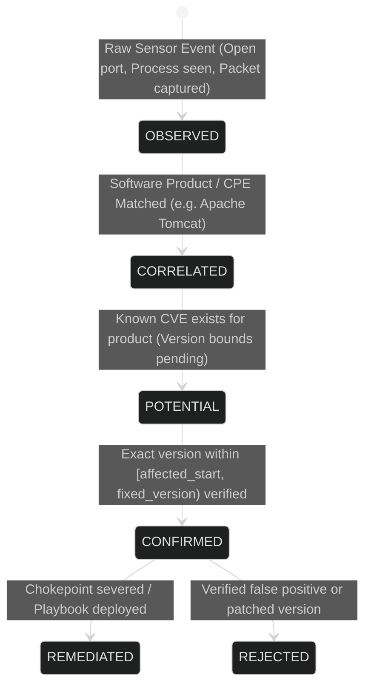
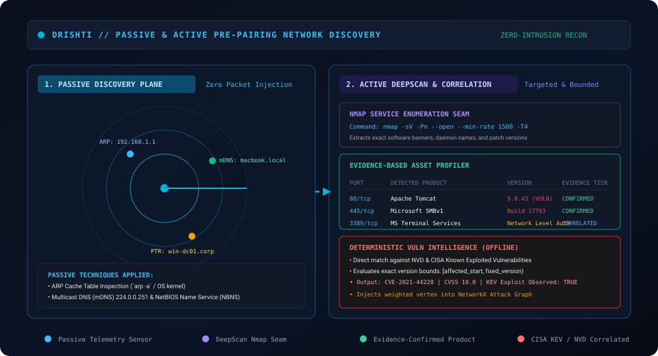

# 🔎 Detection Methodology & Evidence Hierarchy

> **Parent Specification:** [RESEARCH.md](../../RESEARCH.md) · [TRD.md](../../TRD.md)  
> **Source Module:** `server/app/services/vuln_intel/correlator.py`, `deepscan/scanner.py`

---

## 1. The Four-Tier Evidence Hierarchy

Drishti enforces an evidentiary ladder to prevent hallucinated or unverified security alerts:

### Tier Definitions
1. **`OBSERVED`:**
   - Raw telemetric phenomenon directly recorded by an agent or packet sniffer (e.g. Port 8080 listening on `10.0.1.10`, PID 4112 named `tomcat9.exe`).
2. **`CORRELATED`:**
   - The observed entity matches a recognized Common Platform Enumeration (CPE) or software signature (e.g. `cpe:2.3:a:apache:tomcat`).
3. **`POTENTIAL`:**
   - Public vulnerability records (NVD) associate the product with known vulnerabilities, but exact patch level is unverified.
4. **`CONFIRMED`:**
   - The exact installed version (e.g. `9.0.43`) is mathematically proven to lie within the vulnerability interval:
     $$v_{\text{detected}} \in [v_{\text{affected\_start}}, v_{\text{fixed}})$$

---

## 2. Vulnerability Intelligence & CISA KEV Integration

Drishti synchronizes with two core intelligence feeds:
1. **National Vulnerability Database (NVD):** Standard CVSS v3.1 metrics, CWE weakness types, and CPE version bounding rules.
2. **CISA Known Exploited Vulnerabilities (KEV) Catalog:** Actively weaponized vulnerabilities observed in real-world breaches.
   - Any finding listed in CISA KEV receives an automatic **$1.35\times$ exploitability multiplier** in Yen's attack path calculations.

---

## 3. Passive LAN Discovery Methodology

1. **ARP Cache Inspection:**
   - Queries OS neighbor tables (`/proc/net/arp` on Linux, `GetIpNetTable2` on Windows) to discover active IP/MAC pairings on the local subnet without transmitting broadcast frames.
2. **Reverse DNS Lookups (PTR):**
   - Resolves discovered IP addresses to internal hostnames via background asynchronous DNS PTR queries.
3. **Multicast DNS (mDNS) & NetBIOS:**
   - Listens to multicast announcements (`224.0.0.251:5353`, `239.255.255.250:1900`) to profile Apple Bonjour workstations, printers, and smart IoT endpoints.
