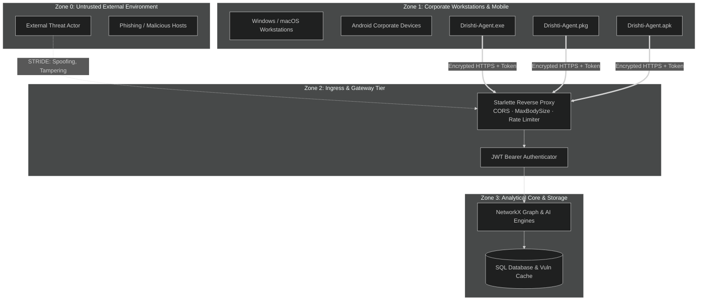

# 🛡️ Drishti: STRIDE Threat Model & Security Architecture

> **Parent Specification:** [RESEARCH.md](../../RESEARCH.md) · [SECURITY.md](../../SECURITY.md)  
> **Classification:** Defensive Architectural Document

---

## 1. System Decomposition & STRIDE Boundaries

Drishti partitions operational environments into four distinct trust boundaries:

---

## 2. STRIDE Threat Analysis Matrix

| Threat Category | Target Interface | Potential Threat Scenario | Drishti Architectural Countermeasure |
|---|---|---|---|
| **Spoofing** | `/api/endpoint/telemetry` | Adversary injects fake telemetry to mislead graph algorithms. | Cryptographic OTP pairing handshake; 32-byte cryptographically secure random bearer tokens; hardware GUID verification. |
| **Spoofing** | `/api/auth/login` | Attacker attempts credential stuffing against console. | bcrypt password hashing (12 rounds); IP rate-limiting (5 attempts/min); 15-minute access JWTs. |
| **Tampering** | Ingress Gateway | MITM attacker alters telemetry batches in transit. | Enforced TLS 1.3 encryption; Pydantic v2 strict schema validation rejecting unauthorized fields. |
| **Repudiation** | Management Console | Administrator denies running a targeted scan or altering ACLs. | Immutable `audit_logs` table tracking user ID, client IP, action, and millisecond timestamp. |
| **Information Disclosure** | Core Database | Multi-tenant data leakage between corporate departments. | Strict tenant scoping enforced at the SQL ORM level (`WHERE org_id = :org_id`); zero cross-tenant leakage. |
| **Denial of Service** | Telemetry Ingestion | Malicious host streams gigantic JSON payloads to exhaust RAM. | Starlette `MaxBodySizeMiddleware` terminates requests exceeding 50MB before buffering. |
| **Elevation of Privilege** | Endpoint Daemon | Agent exploited to gain SYSTEM / root privileges. | Agents run in standard user space; Win32 socket table and POSIX sysctl APIs require no root elevation. |

---

## 3. Cryptographic & Credential Management Standards

1. **Zero Secret Hardcoding:** No API keys, passwords, database URIs, or Telegram bot tokens are embedded in client bundles or git history.
2. **Key Storage:** Android tokens are protected via Android Keystore and `EncryptedSharedPreferences`. Desktop agents store pairing secrets in user-scoped protected memory.
3. **Session Invalidation:** Incrementing `user.token_version` in the database immediately invalidates all active access and refresh tokens globally without waiting for expiration.
